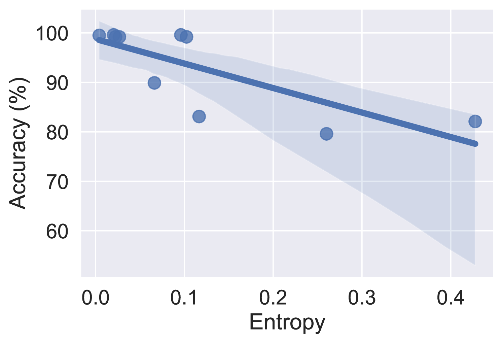
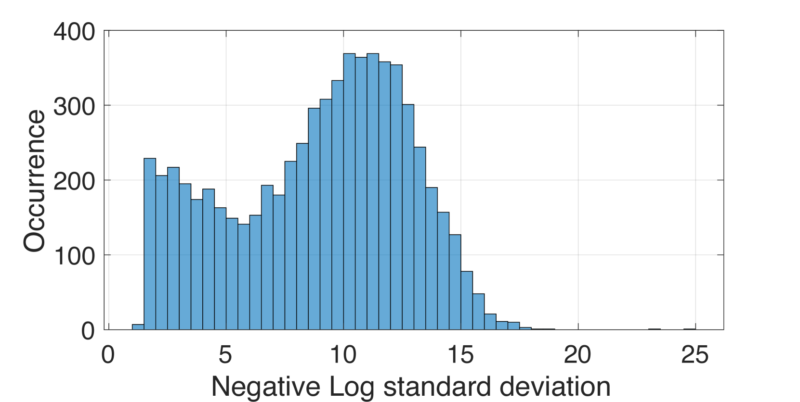
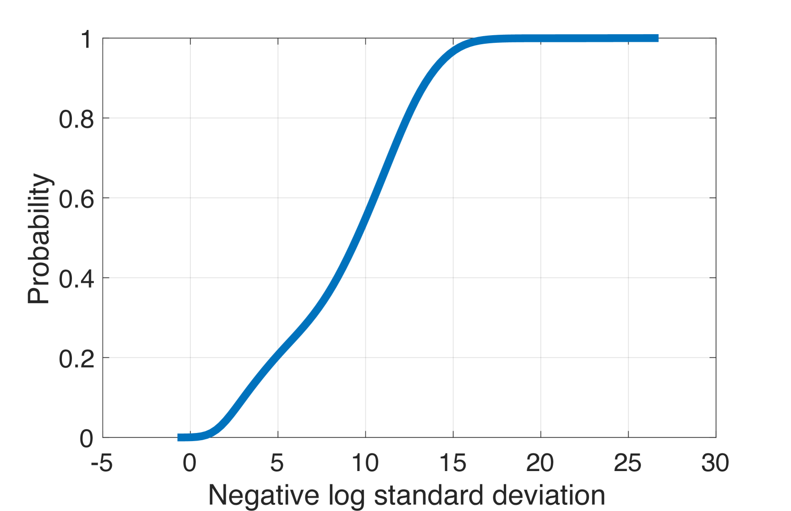
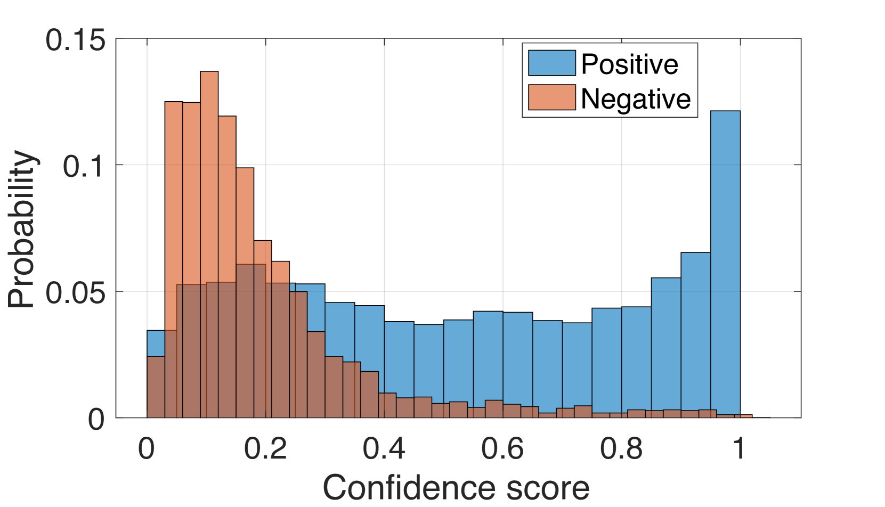
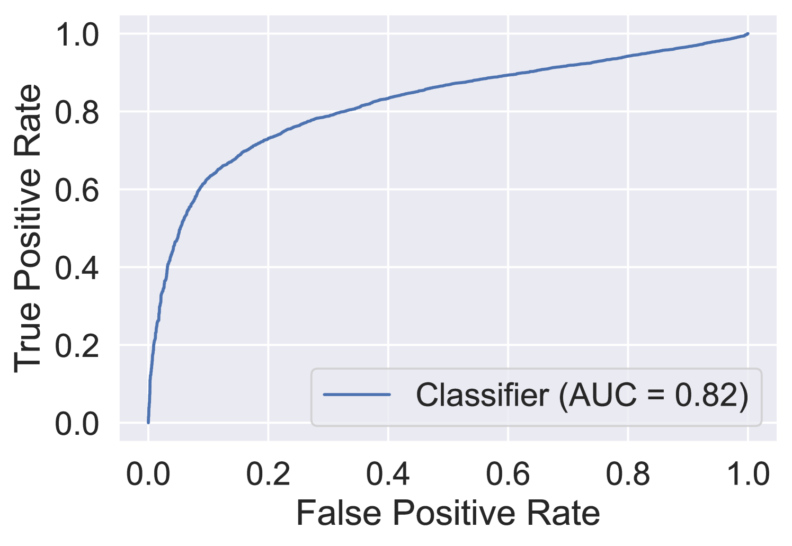
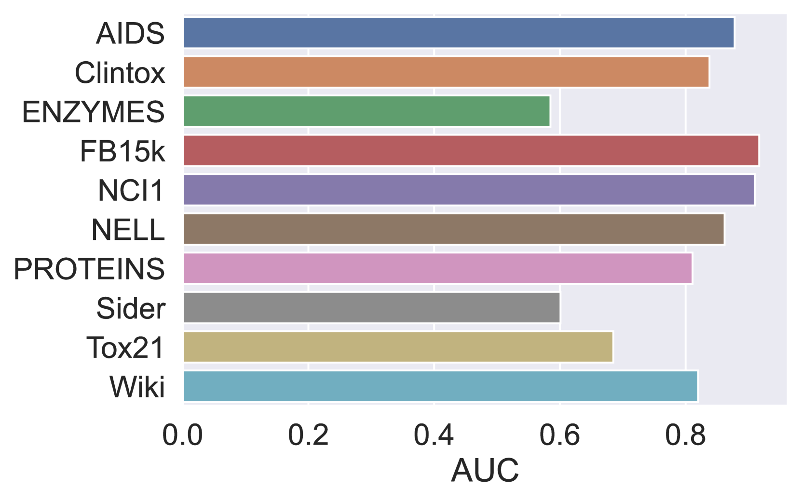

# 借助大型语言模型的能力，实现对图处理中不确定性的感知与应对。

发布时间：2024年03月31日

`LLM应用` `知识图谱` `图数据处理`

> Harnessing the Power of Large Language Model for Uncertainty Aware Graph Processing

# 摘要

> 图数据的处理是一大难题。传统方法，比如基于几何或矩阵分解的技术，往往因为对数据关系的假设而在处理庞大复杂的图数据时力不从心。相较之下，深度学习在处理这类数据上展现了潜力，却鲜少能提供清晰的解释。为了赋予图处理既精确又透明的能力，我们提出了一种创新方法，它结合了大型语言模型（LLM）的计算力和不确定性感知模块，为生成的答案提供信心评分。我们对两种图任务进行了实验：小样本知识图谱补全和图分类。实验结果显示，通过高效的参数微调，LLM在多个不同基准数据集上大幅超越了现有顶尖算法。为了应对可解释性问题，我们还提出了一种基于扰动的不确定性评估方法，并制定了一套量化答案可信度的校准方案。在十个数据集中，我们的信心度量在七个上预测答案正确性的AUC值达到了0.8及以上。

> Handling graph data is one of the most difficult tasks. Traditional techniques, such as those based on geometry and matrix factorization, rely on assumptions about the data relations that become inadequate when handling large and complex graph data. On the other hand, deep learning approaches demonstrate promising results in handling large graph data, but they often fall short of providing interpretable explanations. To equip the graph processing with both high accuracy and explainability, we introduce a novel approach that harnesses the power of a large language model (LLM), enhanced by an uncertainty-aware module to provide a confidence score on the generated answer. We experiment with our approach on two graph processing tasks: few-shot knowledge graph completion and graph classification. Our results demonstrate that through parameter efficient fine-tuning, the LLM surpasses state-of-the-art algorithms by a substantial margin across ten diverse benchmark datasets. Moreover, to address the challenge of explainability, we propose an uncertainty estimation based on perturbation, along with a calibration scheme to quantify the confidence scores of the generated answers. Our confidence measure achieves an AUC of 0.8 or higher on seven out of the ten datasets in predicting the correctness of the answer generated by LLM.

[Arxiv](https://arxiv.org/abs/2404.00589)