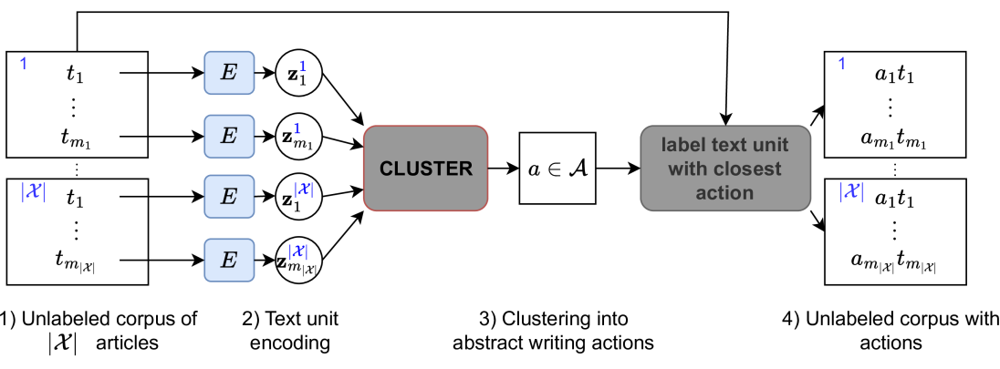
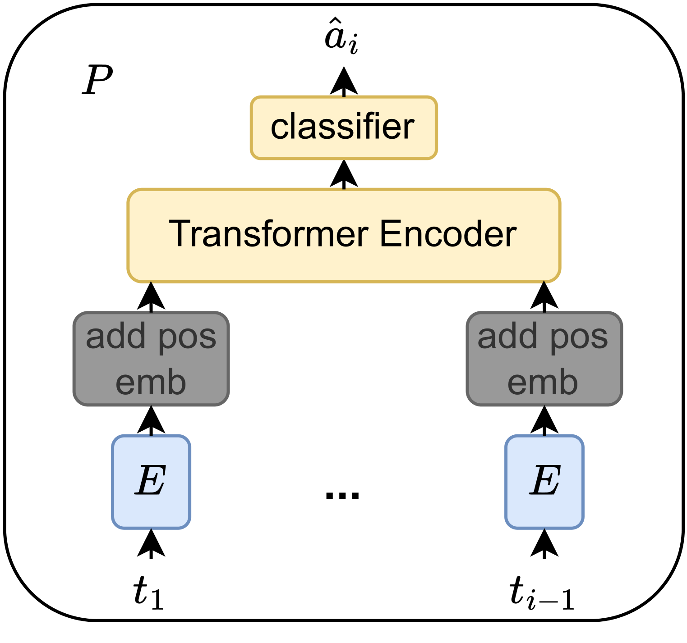
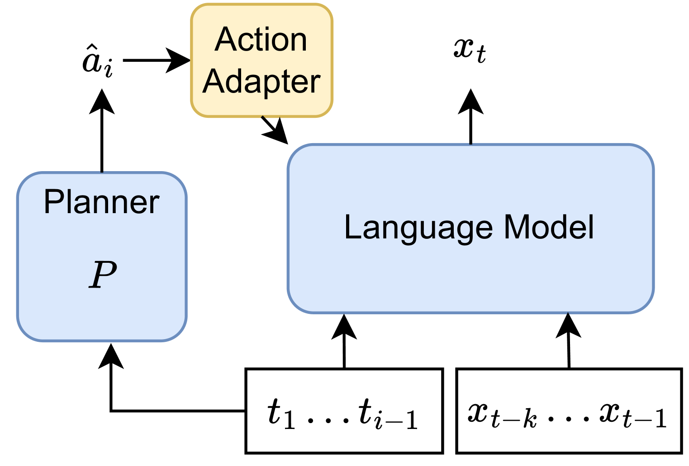
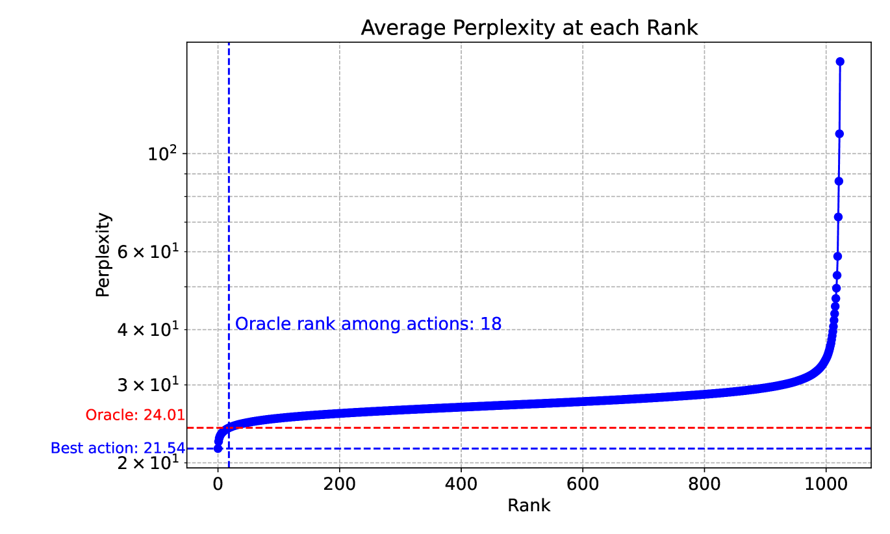
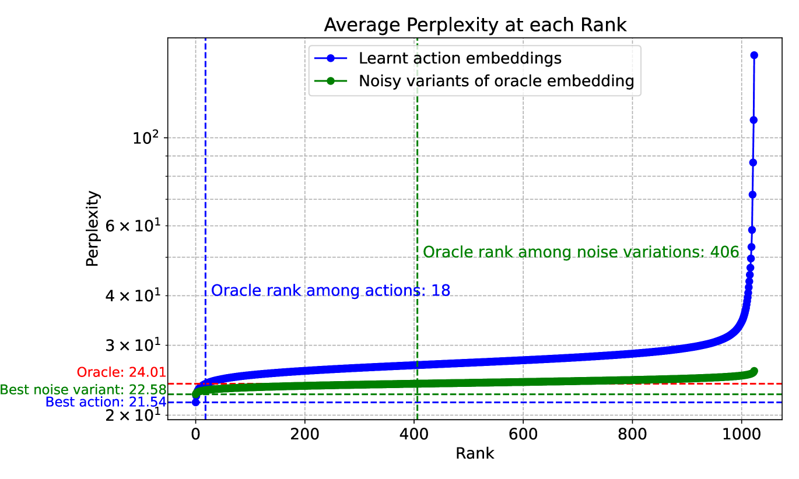

# 在无标注数据的基础上，掌握为语言建模规划的技能

发布时间：2024年03月31日

`LLM理论` `文本生成` `语言模型`

> Learning to Plan for Language Modeling from Unlabeled Data

# 摘要

> 大型语言模型通过预测未标记语料库中的下一个词来学习执行众多任务，无需任何标记数据。但这种预测目标可能限制了它们在需要规划的场景，比如撰写连贯文章时的表现。本文提出了一种新方法，通过自监督学习目标训练模块，以规划未来的写作过程。模型利用生成的潜在计划，将语言模型的成功应用扩展到更高层次的抽象规划，且无需外部监督。实践证明，这种方法全面提升了语言建模的性能，尤其是在文本结构方面表现突出。由于我们的框架采用了独立于语言模型的无监督规划器模块，新的规划器可以大规模训练，并方便地与社区共享。

> By training to predict the next token in an unlabeled corpus, large language models learn to perform many tasks without any labeled data. However, their next-token-prediction objective arguably limits their performance in scenarios that require planning, such as writing a coherent article. In this paper, we train a module for planning the future writing process via a self-supervised learning objective. By conditioning on generated latent plans, our model extends the successful language model formula to more abstract planning in an unsupervised way. Empirically, we demonstrate that our method improves language modeling performance in general, particularly with respect to the text structure. Because our framework uses a planner module that is unsupervised and external to the language model, new planner modules can be trained at large scale and easily be shared with the community.

[Arxiv](https://arxiv.org/abs/2404.00614)