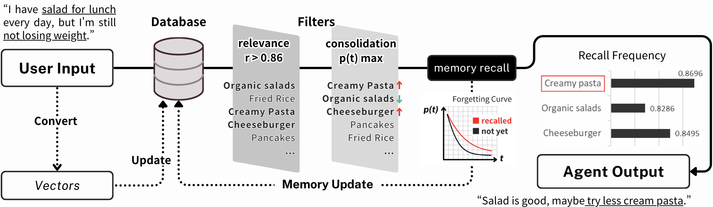
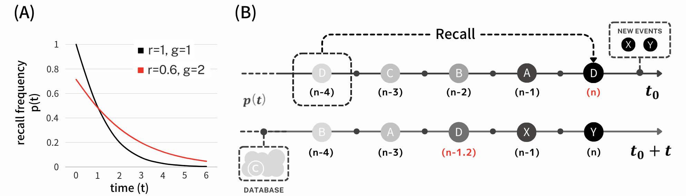
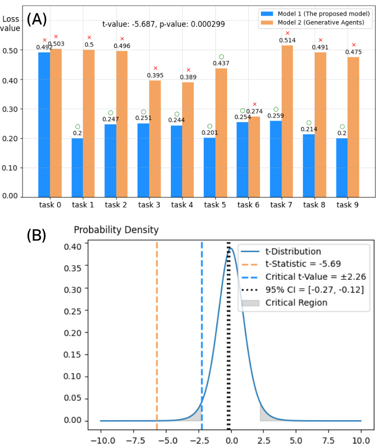

# "我的代理更懂我了"：将动态仿人类记忆的回顾与巩固功能融入大型语言模型驱动的智能代理中。

发布时间：2024年03月31日

`Agent` `人工智能` `对话系统`

> "My agent understands me better": Integrating Dynamic Human-like Memory Recall and Consolidation in LLM-Based Agents

# 摘要

> 本研究提出了一种仿人记忆架构，用以提升大型语言模型对话代理的智能水平。该架构让代理能自动唤起回答问题所需的记忆，有效克服了语言模型时间感知的短板。我们借鉴人类记忆的提示机制，实现更准确、高效的记忆回溯。同时，我们构建了一个数学模型，动态评估记忆的固化程度，综合考虑上下文关联、时间流逝和回忆频率等要素。代理把用户交流历史中的记忆存储于数据库，记录每段记忆的内容与时间背景。这样的策略性记忆存储，让代理能像人类一样，在时间的维度上回忆特定经历，并领会其对用户的深层意义。

> In this study, we propose a novel human-like memory architecture designed for enhancing the cognitive abilities of large language model based dialogue agents. Our proposed architecture enables agents to autonomously recall memories necessary for response generation, effectively addressing a limitation in the temporal cognition of LLMs. We adopt the human memory cue recall as a trigger for accurate and efficient memory recall. Moreover, we developed a mathematical model that dynamically quantifies memory consolidation, considering factors such as contextual relevance, elapsed time, and recall frequency. The agent stores memories retrieved from the user's interaction history in a database that encapsulates each memory's content and temporal context. Thus, this strategic storage allows agents to recall specific memories and understand their significance to the user in a temporal context, similar to how humans recognize and recall past experiences.

[Arxiv](https://arxiv.org/abs/2404.00573)