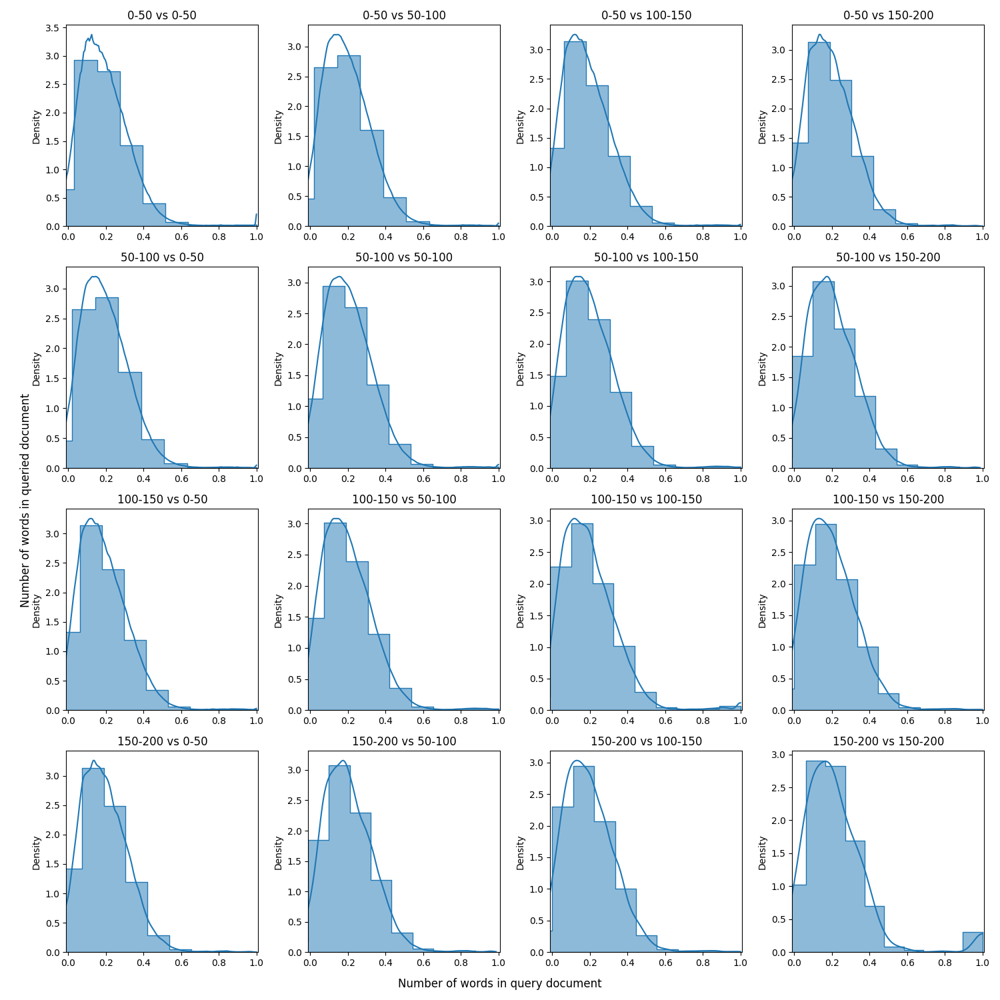

# 构建技术文档的 RAG 系统：观察与洞见

发布时间：2024年03月31日

`RAG` `技术文档` `信息检索`

> Observations on Building RAG Systems for Technical Documents

# 摘要

> 在技术文档领域，检索增强生成（RAG）面临挑战，因为嵌入技术往往难以捕获特定领域的信息。本文回顾了影响 RAG 效果的关键因素，并通过实验探讨了构建高效 RAG 系统的最佳实践和可能遇到的问题。

> Retrieval augmented generation (RAG) for technical documents creates challenges as embeddings do not often capture domain information. We review prior art for important factors affecting RAG and perform experiments to highlight best practices and potential challenges to build RAG systems for technical documents.

[Arxiv](https://arxiv.org/abs/2404.00657)