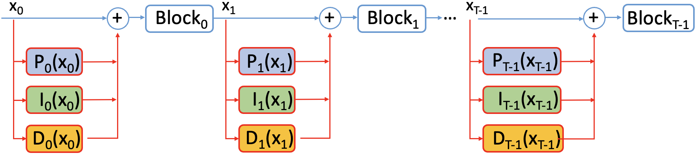
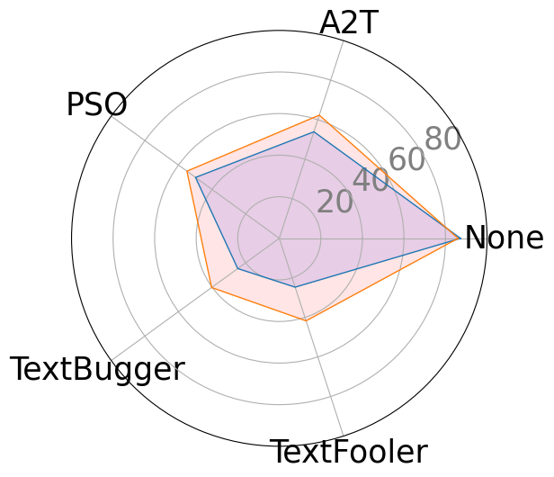
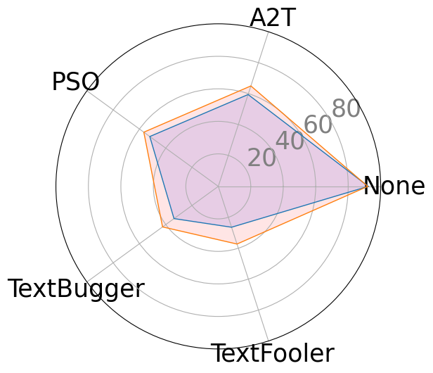

# 采用基于PID控制的自我修复策略，增强大型语言模型的稳健性。

发布时间：2024年03月31日

`LLM理论` `安全性与鲁棒性`

> PID Control-Based Self-Healing to Improve the Robustness of Large Language Models

# 摘要

> 深度神经网络在自然语言处理领域虽然成效显著，但最新研究显示，这些模型在面对微小扰动时容易受到冲击。这些扰动对人类而言似乎并无二致，却能大幅削弱高级语言模型的效能，让人对在关键场合使用它们的安全性产生疑虑。为此，我们开发了一种高效的自我修复计算流程，专门针对在线推理中因输入数据扰动而产生的问题行为进行修正。通过将问题建模为轨迹优化任务，我们利用PID控制机制自动调整神经网络层的内部状态。其中，P控制器负责立即调整状态，I控制器和D控制器则分别基于历史状态和未来动态趋势进行调节。我们借助训练数据的几何特性，设计出高效的线性PID控制器。这种方法减少了计算开销，仅需使用P控制器的成本，而非完整的PID控制体系。此外，我们还提出了一种分析方法，用于近似最优控制方案，从而提升该系统控制下的实时推理性能。我们也对简化环境下的分析解进行了理论上的误差分析。这种基于PID控制的自我修复框架，以低成本提升了预训练大型语言模型的鲁棒性，无论是传统模型还是经过鲁棒性训练的模型，都能抵御各种扰动。具体的实施细节已在GitHub上公开：https://github.com/zhuotongchen/PID-Control-Based-Self-Healing-to-Improve-the-Robustness-of-Large-Language-Models。

> Despite the effectiveness of deep neural networks in numerous natural language processing applications, recent findings have exposed the vulnerability of these language models when minor perturbations are introduced. While appearing semantically indistinguishable to humans, these perturbations can significantly reduce the performance of well-trained language models, raising concerns about the reliability of deploying them in safe-critical situations. In this work, we construct a computationally efficient self-healing process to correct undesired model behavior during online inference when perturbations are applied to input data. This is formulated as a trajectory optimization problem in which the internal states of the neural network layers are automatically corrected using a PID (Proportional-Integral-Derivative) control mechanism. The P controller targets immediate state adjustments, while the I and D controllers consider past states and future dynamical trends, respectively. We leverage the geometrical properties of the training data to design effective linear PID controllers. This approach reduces the computational cost to that of using just the P controller, instead of the full PID control. Further, we introduce an analytical method for approximating the optimal control solutions, enhancing the real-time inference capabilities of this controlled system. Moreover, we conduct a theoretical error analysis of the analytic solution in a simplified setting. The proposed PID control-based self-healing is a low cost framework that improves the robustness of pre-trained large language models, whether standard or robustly trained, against a wide range of perturbations. A detailed implementation can be found in:https://github.com/zhuotongchen/PID-Control-Based-Self-Healing-to-Improve-the-Robustness-of-Large-Language-Models.

[Arxiv](https://arxiv.org/abs/2404.00828)