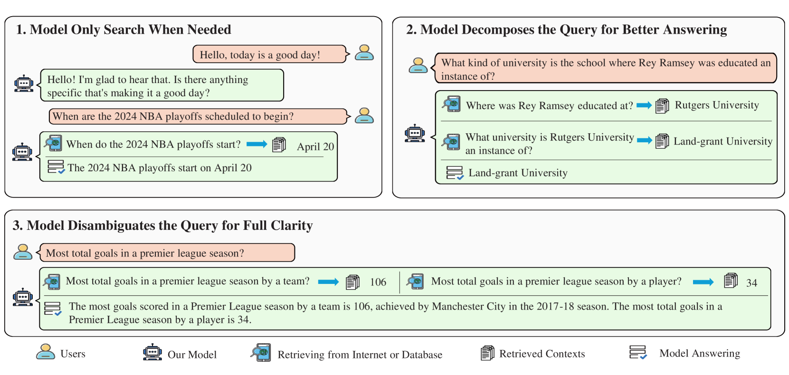
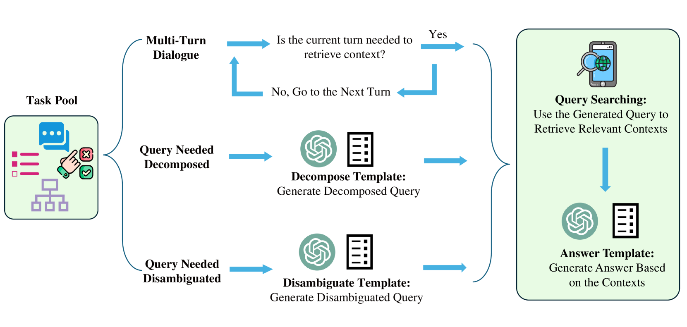
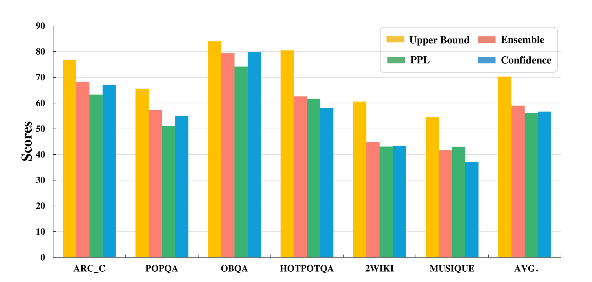
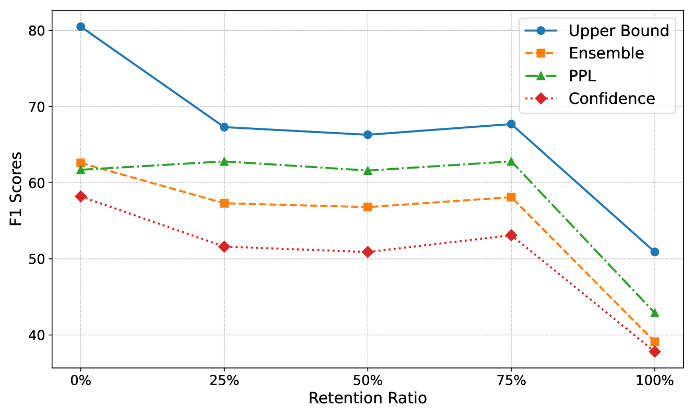
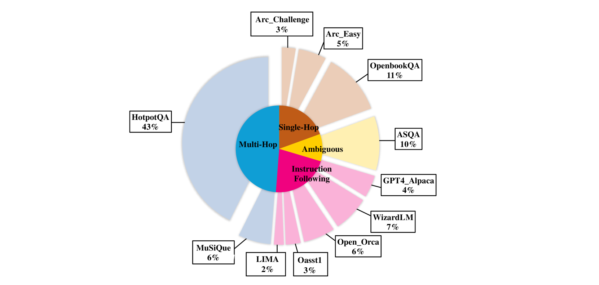
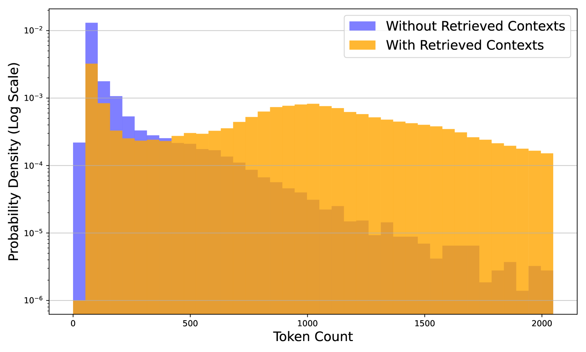
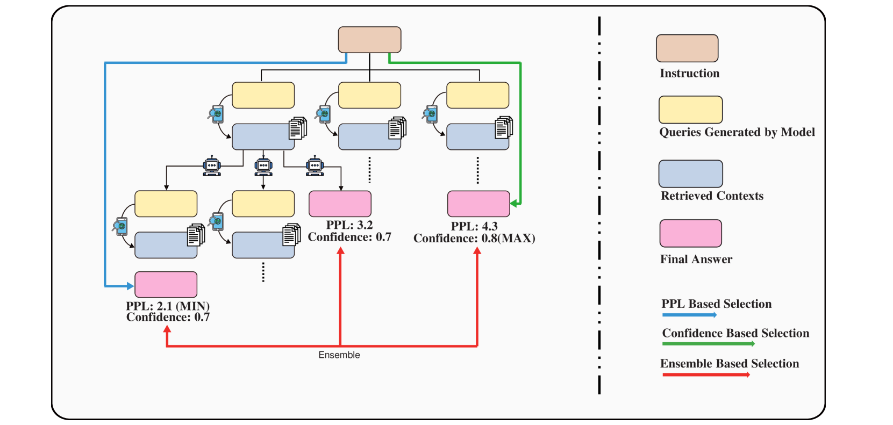
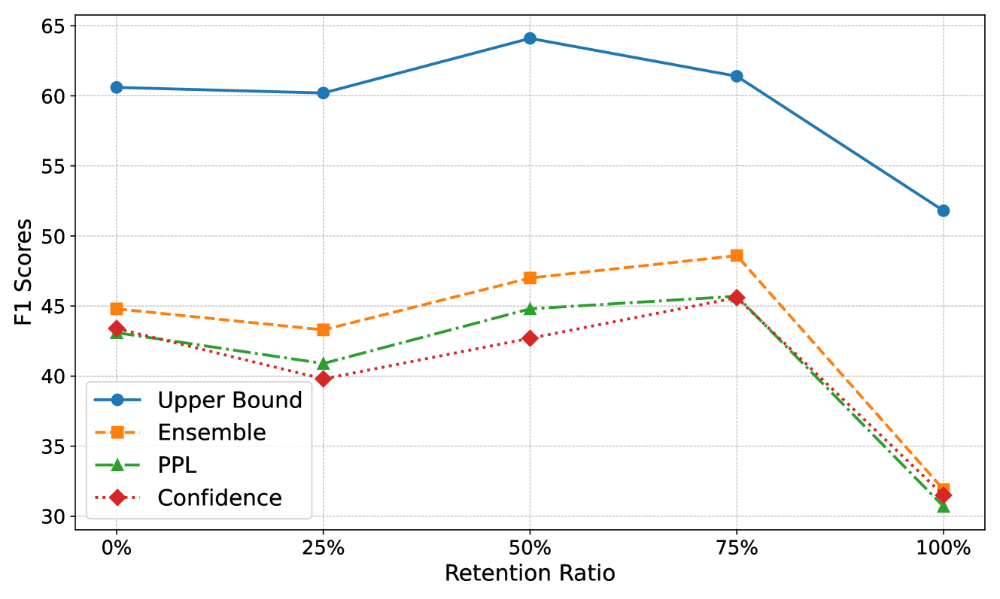
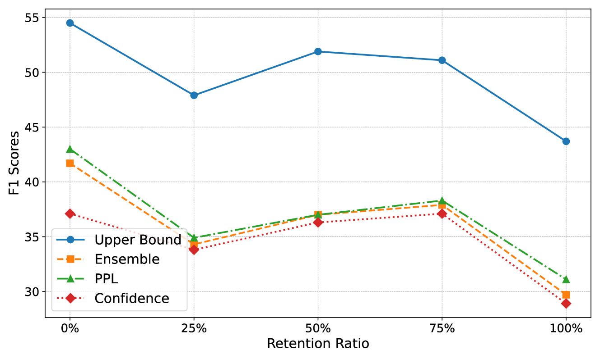

# RQ-RAG：探究如何精炼查询以提升检索辅助生成的效果

发布时间：2024年03月31日

`RAG` `问答系统` `信息检索`

> RQ-RAG: Learning to Refine Queries for Retrieval Augmented Generation

# 摘要

> 大型语言模型（LLMs）虽然能力出众，但有时会产生偏差或幻想的答复。这一问题主要因为它们依赖于庞大的预训练数据集，在面对陌生情境时容易出错。为了克服这些难题，检索增强生成（RAG）通过引入外部相关文档辅助生成回应，利用非参数知识与LLMs的上下文学习能力相结合。然而，目前的RAG主要集中于初始输入的上下文检索，忽略了对于模糊或复杂问题的处理，这些问题需要更深入的阐释或分解才能得到准确的答案。因此，本文提出了一种新的学习方法——检索增强生成的查询优化（RQ-RAG），旨在通过赋予模型明确的重写、分解和消歧义的能力来提升其性能。实验结果显示，当此方法应用于7B Llama2模型时，在三个单跳问答（QA）数据集上平均提升了1.9%的准确率，并且在处理复杂的多跳问答数据集方面也展现出更优的性能。相关代码已在 https://github.com/chanchimin/RQ-RAG 上公布。

> Large Language Models (LLMs) exhibit remarkable capabilities but are prone to generating inaccurate or hallucinatory responses. This limitation stems from their reliance on vast pretraining datasets, making them susceptible to errors in unseen scenarios. To tackle these challenges, Retrieval-Augmented Generation (RAG) addresses this by incorporating external, relevant documents into the response generation process, thus leveraging non-parametric knowledge alongside LLMs' in-context learning abilities. However, existing RAG implementations primarily focus on initial input for context retrieval, overlooking the nuances of ambiguous or complex queries that necessitate further clarification or decomposition for accurate responses. To this end, we propose learning to Refine Query for Retrieval Augmented Generation (RQ-RAG) in this paper, endeavoring to enhance the model by equipping it with capabilities for explicit rewriting, decomposition, and disambiguation. Our experimental results indicate that our method, when applied to a 7B Llama2 model, surpasses the previous state-of-the-art (SOTA) by an average of 1.9\% across three single-hop QA datasets, and also demonstrates enhanced performance in handling complex, multi-hop QA datasets. Our code is available at https://github.com/chanchimin/RQ-RAG.

[Arxiv](https://arxiv.org/abs/2404.00610)