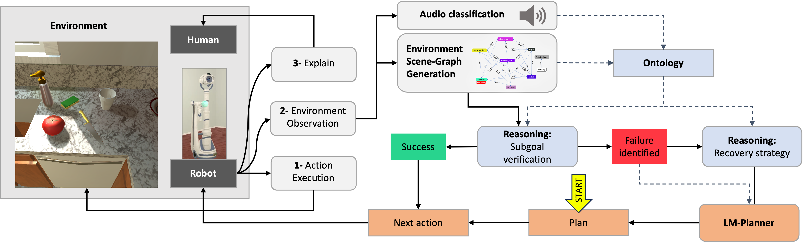
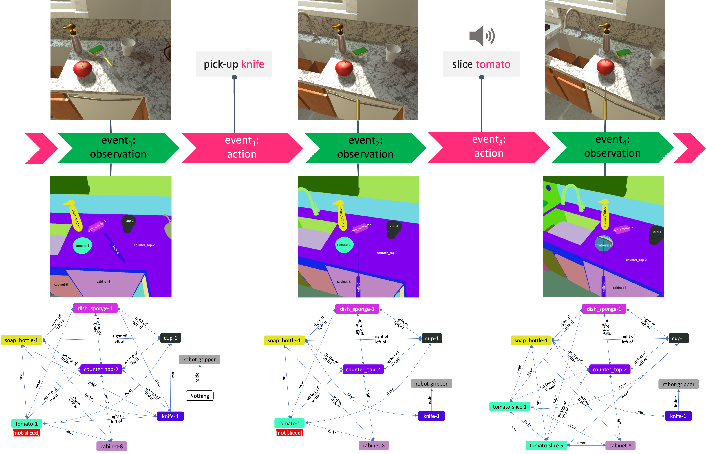
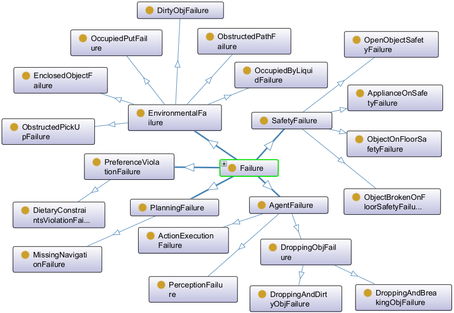

# Recover：一种用于故障侦测与复原的神经符号整合框架

发布时间：2024年03月31日

`Agent` `机器人` `人工智能`

> Recover: A Neuro-Symbolic Framework for Failure Detection and Recovery

# 摘要

> 在机器人任务执行中识别失败并采取恢复措施是一项挑战。传统做法依赖充足的数据或严格的约束，而新兴方法则借助大型语言模型（LLMs）来核实任务步骤并做出相应调整。但这些方法多在离线状态下运行，导致场景需重置，成本高昂。本文提出了Recover，一种在线故障识别与恢复的神经符号框架。它融合了本体论、逻辑规则及基于LLM的规划器，利用符号信息提升LLMs制定恢复方案的能力，并减少成本。为展示该方法在模拟厨房环境中的应用，我们推出了OntoThor本体论，描述AI2Thor模拟器的场景设置。实践证明，OntoThor的逻辑规则能准确捕捉所有任务中的故障，而Recover在故障检测与恢复方面的表现，远超仅依赖LLMs的基本方法。

> Recognizing failures during task execution and implementing recovery procedures is challenging in robotics. Traditional approaches rely on the availability of extensive data or a tight set of constraints, while more recent approaches leverage large language models (LLMs) to verify task steps and replan accordingly. However, these methods often operate offline, necessitating scene resets and incurring in high costs. This paper introduces Recover, a neuro-symbolic framework for online failure identification and recovery. By integrating ontologies, logical rules, and LLM-based planners, Recover exploits symbolic information to enhance the ability of LLMs to generate recovery plans and also to decrease the associated costs. In order to demonstrate the capabilities of our method in a simulated kitchen environment, we introduce OntoThor, an ontology describing the AI2Thor simulator setting. Empirical evaluation shows that OntoThor's logical rules accurately detect all failures in the analyzed tasks, and that Recover considerably outperforms, for both failure detection and recovery, a baseline method reliant solely on LLMs.

[Arxiv](https://arxiv.org/abs/2404.00756)