# 在探讨语音语言模型时，我们关注的是其随着规模扩大而展现出的特性。

发布时间：2024年03月31日

`LLM理论` `语音识别` `语言模型`

> Scaling Properties of Speech Language Models

# 摘要

> 语音语言模型（SLMs）致力于直接从原始音频中学习语言，无需依赖文本资料。尽管进步显著，但现有模型在句法和语义处理上仍显不足。假设神经语言模型的扩展性同样适用于语音领域，随着训练计算资源的增加，这些能力有望得到加强。本文通过模拟扩展趋势，预测达到与文本型大型语言模型（LLMs）相当的英语水平的SLM所需的规模。研究发现，SLMs的预训练损失与后续的句法和语义表现之间存在紧密的联系，使得语言性能的扩展变得可预测。相较于文本型LLMs，SLMs的语言性能提升速度慢达千倍。文章还探讨了合成数据对于提升语义理解的作用，以及粗略语音分割带来的影响。

> Speech Language Models (SLMs) aim to learn language from raw audio, without textual resources. Despite significant advances, our current models exhibit weak syntax and semantic abilities. However, if the scaling properties of neural language models hold for the speech modality, these abilities will improve as the amount of compute used for training increases. In this paper, we use models of this scaling behavior to estimate the scale at which our current methods will yield a SLM with the English proficiency of text-based Large Language Models (LLMs). We establish a strong correlation between pre-training loss and downstream syntactic and semantic performance in SLMs and LLMs, which results in predictable scaling of linguistic performance. We show that the linguistic performance of SLMs scales up to three orders of magnitude more slowly than that of text-based LLMs. Additionally, we study the benefits of synthetic data designed to boost semantic understanding and the effects of coarser speech tokenization.

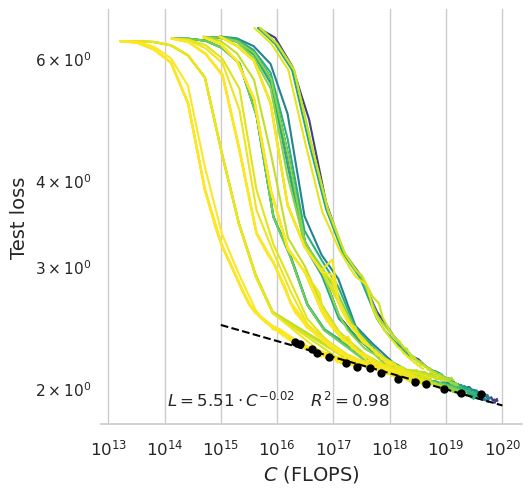

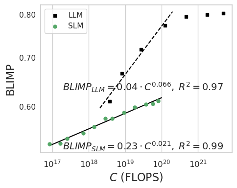

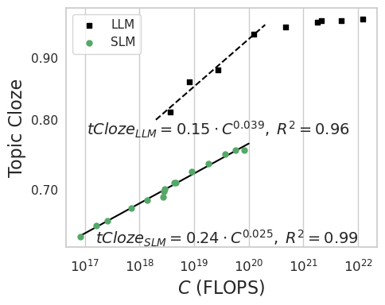

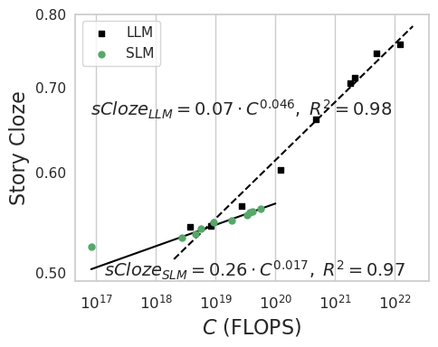

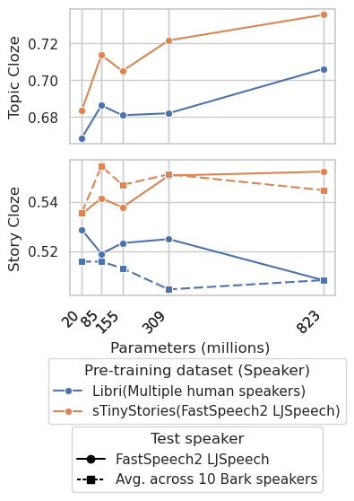

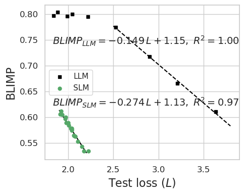

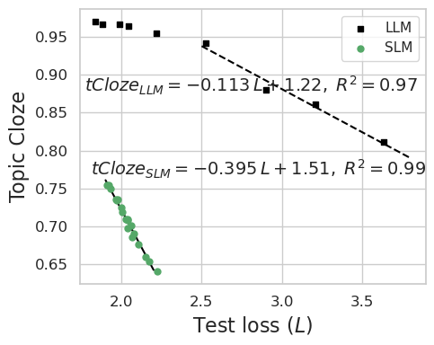

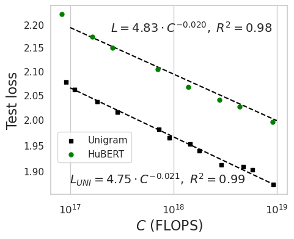

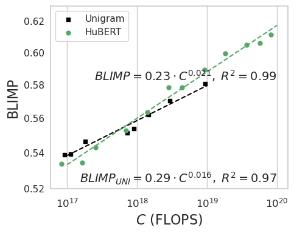

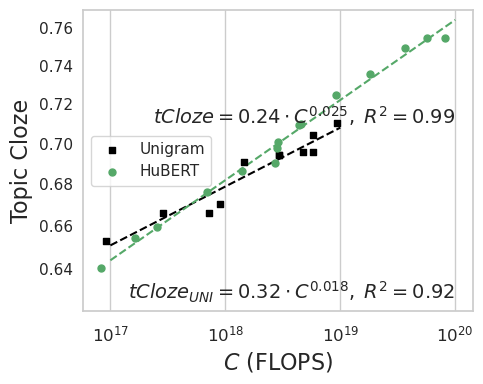

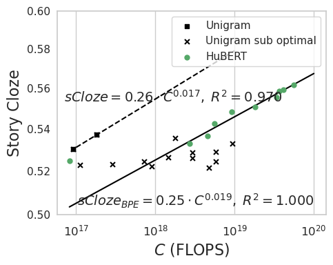

[Arxiv](https://arxiv.org/abs/2404.00685)