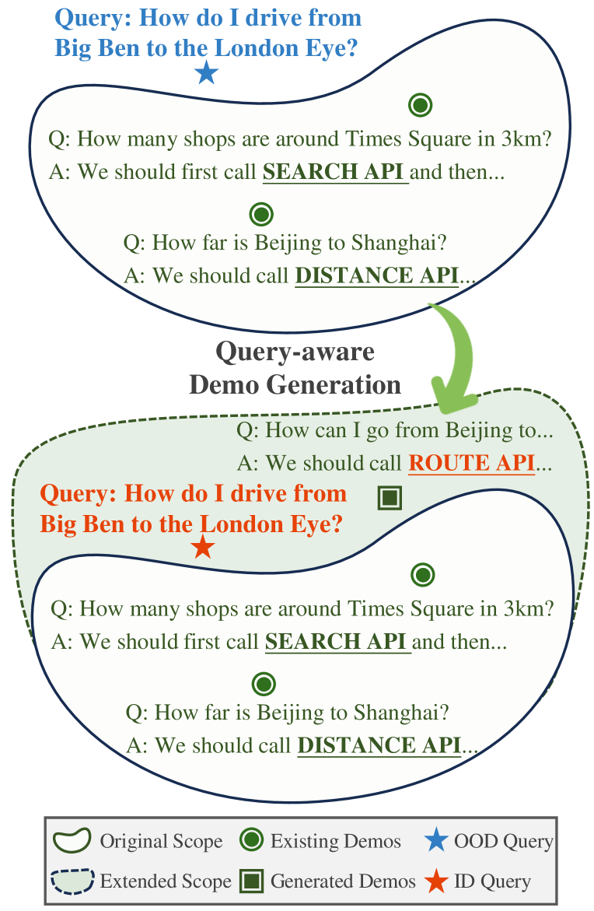
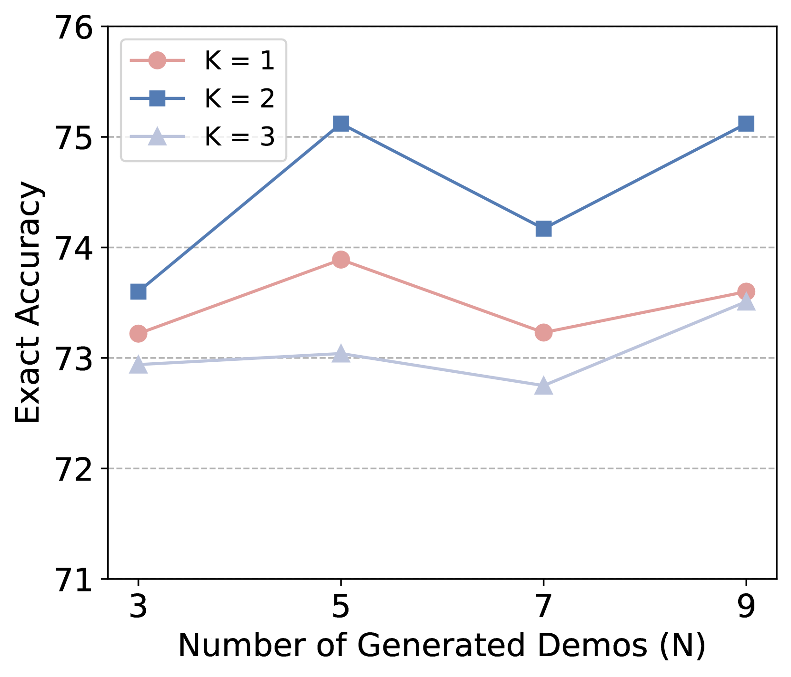
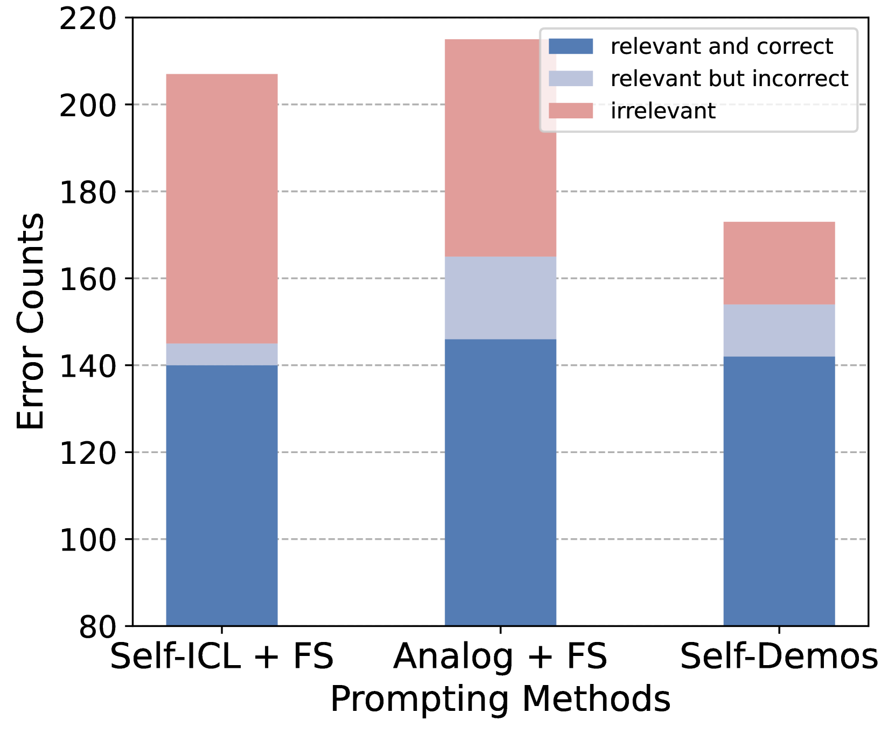

# Self-Demos：激发大型语言模型超越示范的泛化力

发布时间：2024年03月31日

`LLM应用` `人工智能`

> Self-Demos: Eliciting Out-of-Demonstration Generalizability in Large Language Models

# 摘要

> 大型语言模型（LLMs）展现出了令人期待的上下文学习（ICL）能力，它们能够通过少量示例快速适应新任务。然而，现有的少量示例方法往往依赖于难以获得的高质量、特定于查询的示例。面对超出示范范围（OOD）的查询时，依赖手工制作的示例或外部检索器的方法可能会失效。为了缩小有限示例与OOD查询之间的差距，我们提出了一种创新的自我示例提示方法，通过生成与查询相关的示例来激发LLMs的内在泛化能力。这些生成的示例在现有示例与给定查询之间巧妙地穿插，将查询由OOD转变为ID。我们通过构建OOD-Toolset数据集——一个包含300多个真实世界API和1000个实例的工具使用场景数据集，每个实例包含三个工具使用案例作为示例和一个OOD查询——来手动评估我们方法的有效性。在我们自己的数据集以及两个公开的数学基准测试上进行的详尽实验表明，我们的方法在OOD环境下的表现超越了当前最先进的基线。此外，我们还开展了一系列分析，以验证自我示例的泛化能力，并进一步深化了我们的理解。

> Large language models (LLMs) have shown promising abilities of in-context learning (ICL), adapting swiftly to new tasks with only few-shot demonstrations. However, current few-shot methods heavily depend on high-quality, query-specific demos, which are often lacking. When faced with out-of-demonstration (OOD) queries, methods that rely on hand-crafted demos or external retrievers might fail. To bridge the gap between limited demos and OOD queries, we propose Self-Demos, a novel prompting method that elicits the inherent generalizability in LLMs by query-aware demo generation. The generated demos strategically interpolate between existing demos and the given query, transforming the query from OOD to ID. To evaluate the effectiveness of our approach, we manually constructed OOD-Toolset, a dataset in the tool-using scenario with over 300 real-world APIs and 1000 instances, each consisting of three tool-use cases as demos and an OOD query. Thorough experiments on our dataset and two public math benchmarks have shown that our method can outperform state-of-the-art baselines in the OOD setting. Moreover, we conduct a range of analyses to validate Self-Demos's generalization and provide more insights.

[Arxiv](https://arxiv.org/abs/2404.00884)