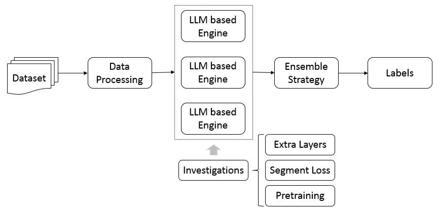

# SemEval-2024 任务 8 的 TM-TREK：探索利用大型语言模型实现人机混合文本自动边界识别。

发布时间：2024年03月31日

`LLM应用` `人工智能` `文本分析`

> TM-TREK at SemEval-2024 Task 8: Towards LLM-Based Automatic Boundary Detection for Human-Machine Mixed Text

# 摘要

> 随着大型语言模型（LLMs）生成的文本日益增多，如何辨别机器文本与人类文本，防止LLMs被用于传播错误信息或学术不端，已成为一个日益突出的问题。以往的研究大多集中于将文本划分为纯人类编写或纯机器生成，却忽略了混合型文本的识别。本研究致力于探索LLMs在识别混合文本中人机内容分界线的能力，通过将其转化为标记分类问题，并以标签转折点作为分界。引人注目的是，我们的LLMs集成模型在SemEval'24竞赛的“人机混合文本检测”任务中荣获首位。我们还深入探讨了影响LLMs检测混合文本边界能力的各种因素，如在LLMs之上增加额外层级、结合分割损失以及预训练的影响等。我们的研究成果旨在为未来相关领域的研究提供宝贵的洞见。

> With the increasing prevalence of text generated by large language models (LLMs), there is a growing concern about distinguishing between LLM-generated and human-written texts in order to prevent the misuse of LLMs, such as the dissemination of misleading information and academic dishonesty. Previous research has primarily focused on classifying text as either entirely human-written or LLM-generated, neglecting the detection of mixed texts that contain both types of content. This paper explores LLMs' ability to identify boundaries in human-written and machine-generated mixed texts. We approach this task by transforming it into a token classification problem and regard the label turning point as the boundary. Notably, our ensemble model of LLMs achieved first place in the 'Human-Machine Mixed Text Detection' sub-task of the SemEval'24 Competition Task 8. Additionally, we investigate factors that influence the capability of LLMs in detecting boundaries within mixed texts, including the incorporation of extra layers on top of LLMs, combination of segmentation loss, and the impact of pretraining. Our findings aim to provide valuable insights for future research in this area.

[Arxiv](https://arxiv.org/abs/2404.00899)