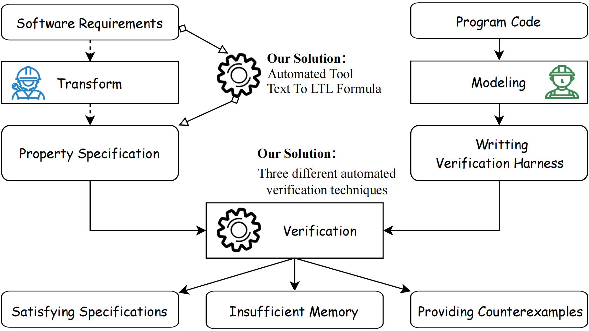
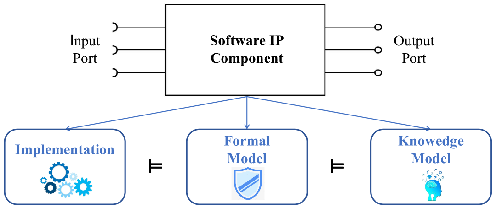
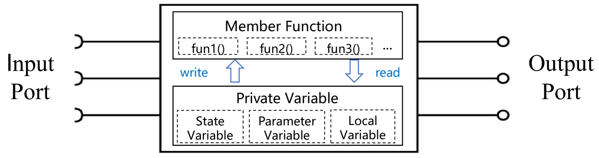

# 实现实用的需求分析与验证：以航空航天嵌入式软件IP组件为例的案例分析

发布时间：2024年03月31日

`RAG` `软件工程`

> Towards Practical Requirement Analysis and Verification: A Case Study on Software IP Components in Aerospace Embedded Systems

# 摘要

> IP基础软件设计致力于通过复用复杂的知识产权（IP）组件提升软件的效率与可靠性。为保障这些组件在安全关键系统中的可复用性，需求分析与形式验证不可或缺。然而，将自然语言描述的需求转换为时序逻辑并进行验证，这一过程既需要专业知识也耗费人力。本研究以航天嵌入式系统中的软件IP组件为例，探索自动化的需求分析与验证流程。研究首先使用大型语言模型将非结构化自然语言转换为规范的形式化描述，再通过三种验证技术确保源代码符合时序逻辑属性。此方法已成功应用于中国空间技术研究院（CAST）的五个实际IP组件。

> IP-based software design is a crucial research field that aims to improve efficiency and reliability by reusing complex software components known as intellectual property (IP) components. To ensure the reusability of these components, particularly in security-sensitive software systems, it is necessary to analyze the requirements and perform formal verification for each IP component. However, converting the requirements of IP components from natural language descriptions to temporal logic and subsequently conducting formal verification demands domain expertise and non-trivial manpower. This paper presents a case study on software IP components derived from aerospace embedded systems, with the objective of automating the requirement analysis and verification process. The study begins by employing Large Language Models to convert unstructured natural language into formal specifications. Subsequently, three distinct verification techniques are employed to ascertain whether the source code meets the extracted temporal logic properties. By doing so, five real-world IP components from the China Academy of Space Technology (CAST) have been successfully verified.

[Arxiv](https://arxiv.org/abs/2404.00795)