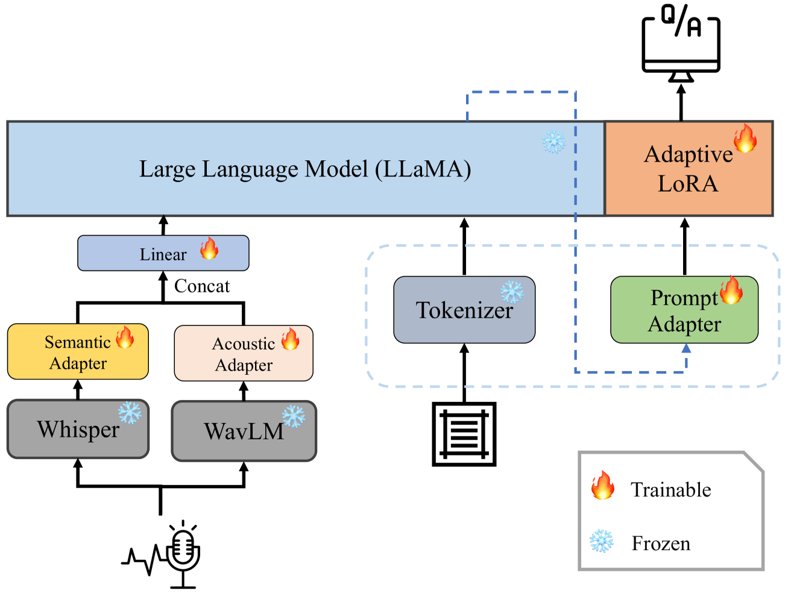
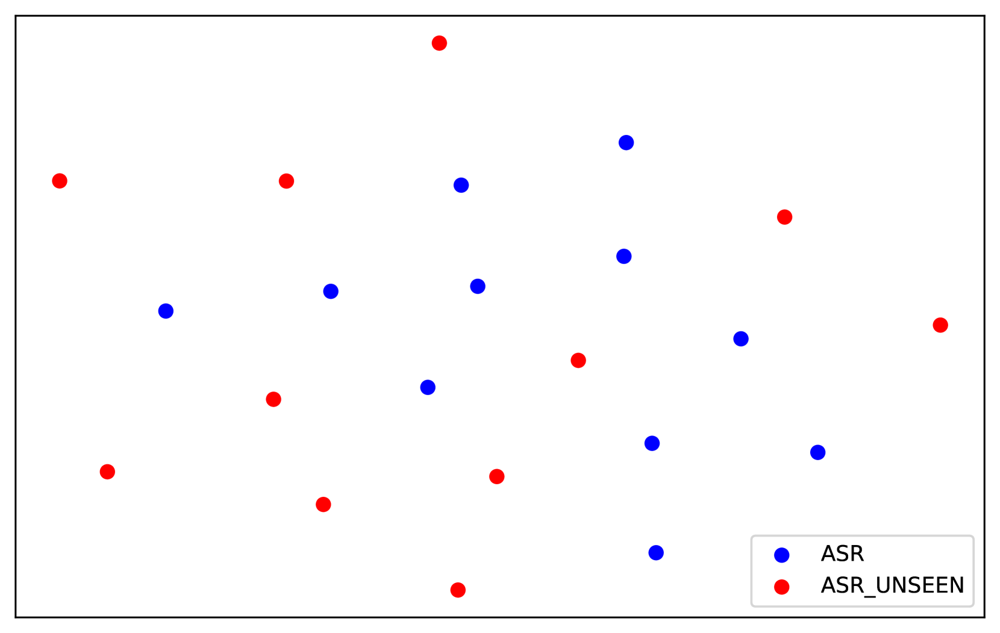
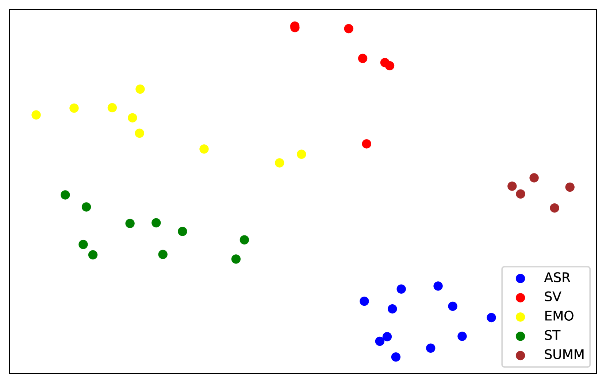
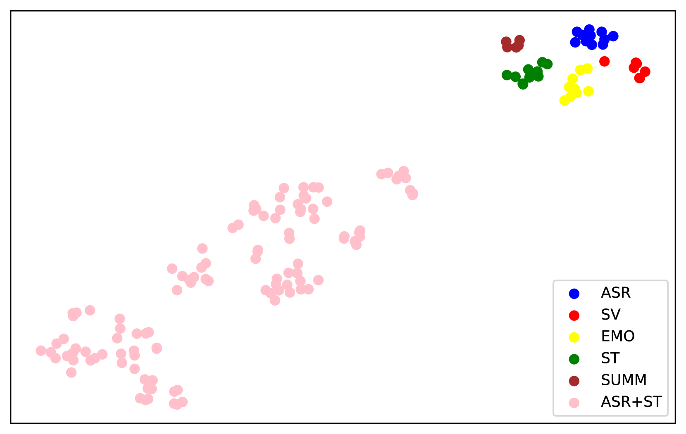
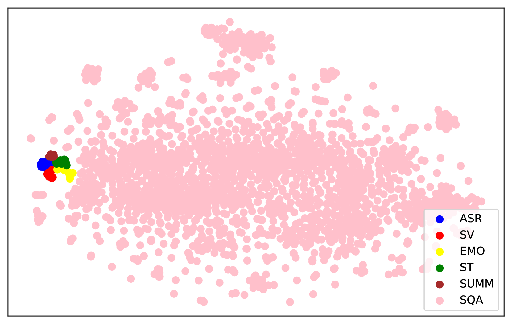
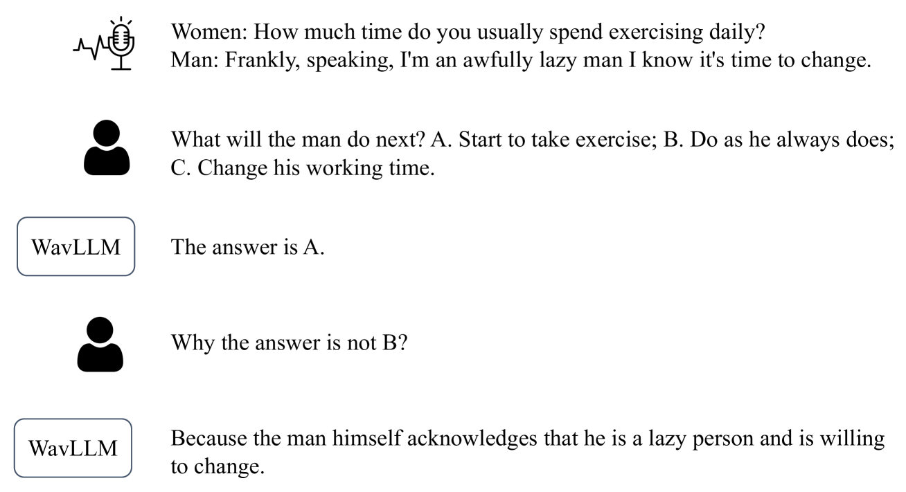

# WavLLM：探索构建强大且能自动调整的语音语言模型

发布时间：2024年03月31日

`LLM应用` `语音识别`

> WavLLM: Towards Robust and Adaptive Speech Large Language Model

# 摘要

> 近期大型语言模型（LLMs）的突破性进展极大地推动了自然语言处理技术的发展，使其逐步涵盖多模态感知与生成。然而，将听知觉能力融入LLMs面临诸多挑战，尤其是在不同情境下的泛化能力和执行复杂听觉任务方面。本研究提出了WavLLM，这是一种结合双编码器和提示感知LoRA权重适配器的鲁棒性语音LLM，通过两阶段课程学习法进行优化。通过双编码器，我们分离了各类语音信息，利用Whisper编码器处理语音的语义内容，WavLM编码器则捕捉说话者身份的独特属性。WavLLM在课程学习框架下，先通过处理基础单一任务构建基础能力，再通过更复杂的任务组合进行高级多任务训练。为提高对不同任务和指令的适应性，第二阶段引入了提示感知的LoRA权重适配器。我们在多个通用语音任务基准上，如ASR、ST、SV、ER等，验证了模型的性能，并将其应用于高考英语听力理解集SQA和语音思维链评估集等专业数据集。实验结果显示，WavLLM在各种语音任务上达到了最先进的水平，展现了执行复杂任务时的强泛化能力。值得一提的是，模型还能在未经特别训练的情况下完成高考题目。相关代码、模型、音频和高考评估集可通过\url{aka.ms/wavllm}获取。

> The recent advancements in large language models (LLMs) have revolutionized the field of natural language processing, progressively broadening their scope to multimodal perception and generation. However, effectively integrating listening capabilities into LLMs poses significant challenges, particularly with respect to generalizing across varied contexts and executing complex auditory tasks. In this work, we introduce WavLLM, a robust and adaptive speech large language model with dual encoders, and a prompt-aware LoRA weight adapter, optimized by a two-stage curriculum learning approach. Leveraging dual encoders, we decouple different types of speech information, utilizing a Whisper encoder to process the semantic content of speech, and a WavLM encoder to capture the unique characteristics of the speaker's identity. Within the curriculum learning framework, WavLLM first builds its foundational capabilities by optimizing on mixed elementary single tasks, followed by advanced multi-task training on more complex tasks such as combinations of the elementary tasks. To enhance the flexibility and adherence to different tasks and instructions, a prompt-aware LoRA weight adapter is introduced in the second advanced multi-task training stage. We validate the proposed model on universal speech benchmarks including tasks such as ASR, ST, SV, ER, and also apply it to specialized datasets like Gaokao English listening comprehension set for SQA, and speech Chain-of-Thought (CoT) evaluation set. Experiments demonstrate that the proposed model achieves state-of-the-art performance across a range of speech tasks on the same model size, exhibiting robust generalization capabilities in executing complex tasks using CoT approach. Furthermore, our model successfully completes Gaokao tasks without specialized training. The codes, models, audio, and Gaokao evaluation set can be accessed at \url{aka.ms/wavllm}.

[Arxiv](https://arxiv.org/abs/2404.00656)