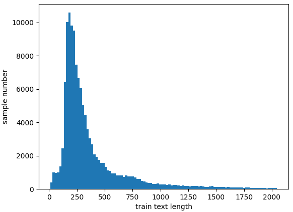
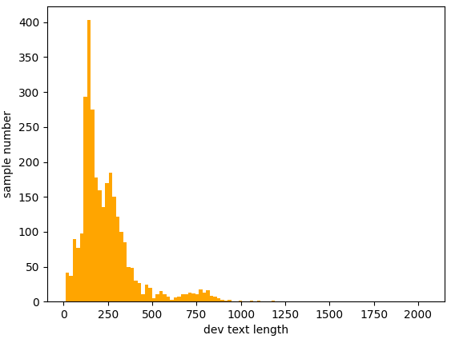
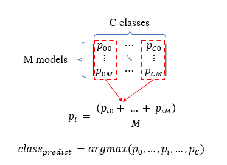

# AISPACE 参与 SemEval-2024 第 8 项任务：构建一个平衡类别的软投票系统，用于识别由多种生成器产生的机器文本。

发布时间：2024年04月01日

`LLM应用` `文本分类` `人工智能`

> AISPACE at SemEval-2024 task 8: A Class-balanced Soft-voting System for Detecting Multi-generator Machine-generated Text

# 摘要

> SemEval-2024 任务 8 旨在挑战人类与机器文本的鉴别能力，涵盖三种不同场景的子任务。本文聚焦于子任务 B，探索一种系统，用以判断文本是出自人类之手还是特定大型语言模型（LLM）的产物，实质上是一项多类别文本分类挑战。AISPACE 团队深入研究了基于变换器的各类模型，包括编码器型、解码器型及编解码器型模型，通过比较它们在任务中的表现，发现编码器型模型表现尤为突出。为应对类别样本数据不平衡问题，我们采用了加权交叉熵损失函数，并运用软投票策略增强多模型集成的预测可靠性。我们的系统在子任务 B 中荣获第一，树立了这一新挑战的最新标杆。

> SemEval-2024 Task 8 provides a challenge to detect human-written and machine-generated text. There are 3 subtasks for different detection scenarios. This paper proposes a system that mainly deals with Subtask B. It aims to detect if given full text is written by human or is generated by a specific Large Language Model (LLM), which is actually a multi-class text classification task. Our team AISPACE conducted a systematic study of fine-tuning transformer-based models, including encoderonly, decoder-only and encoder-decoder models. We compared their performance on this task and identified that encoder-only models performed exceptionally well. We also applied a weighted Cross Entropy loss function to address the issue of data imbalance of different class samples. Additionally, we employed softvoting strategy over multi-models ensemble to enhance the reliability of our predictions. Our system ranked top 1 in Subtask B, which sets a state-of-the-art benchmark for this new challenge.

[Arxiv](https://arxiv.org/abs/2404.00950)