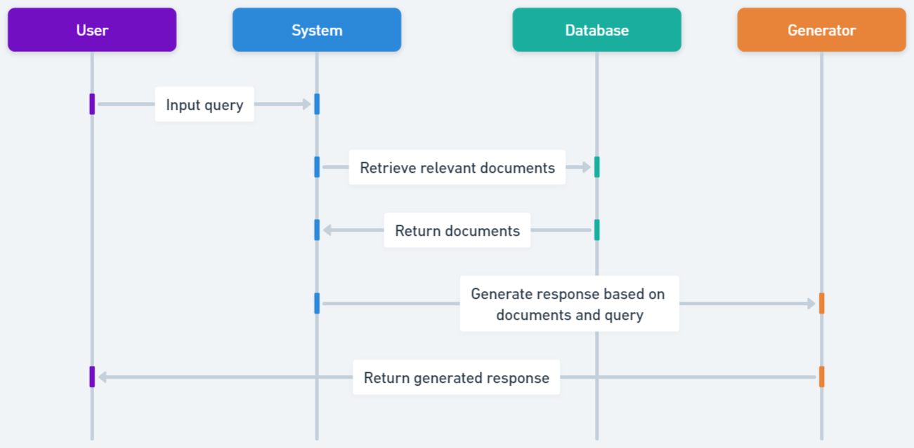
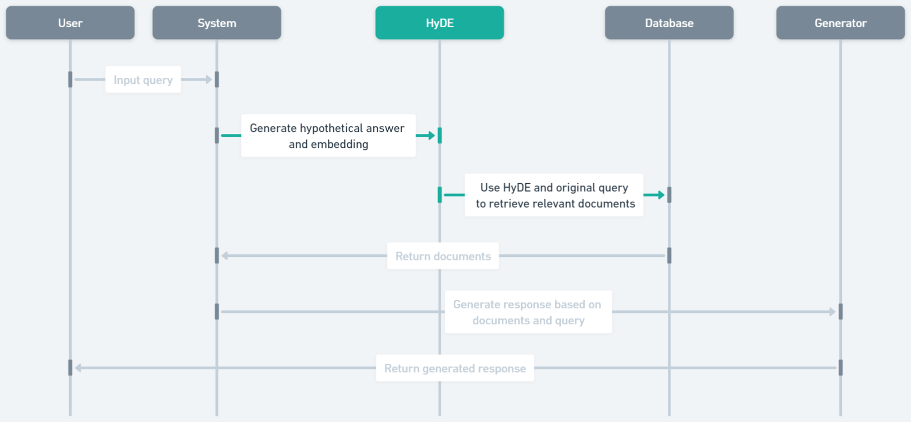
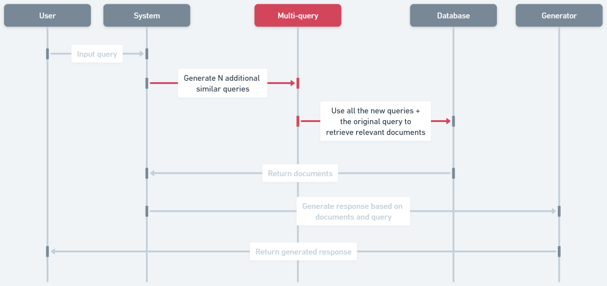
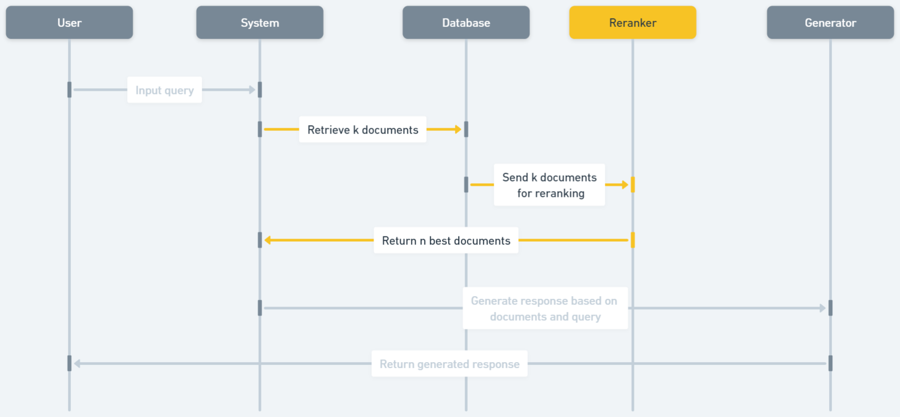
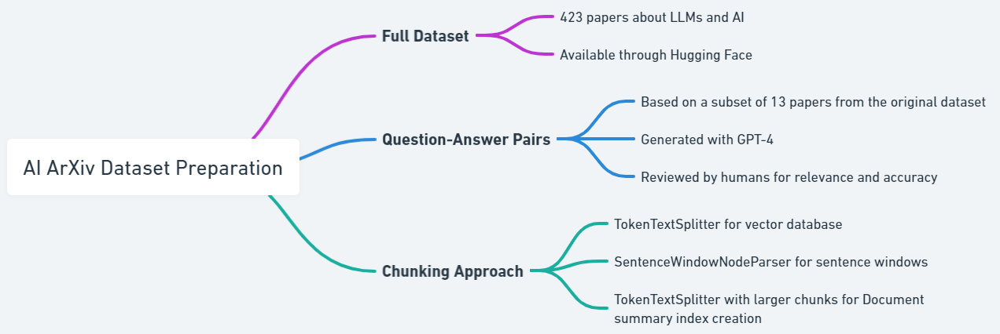
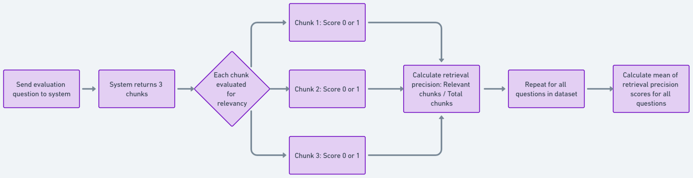
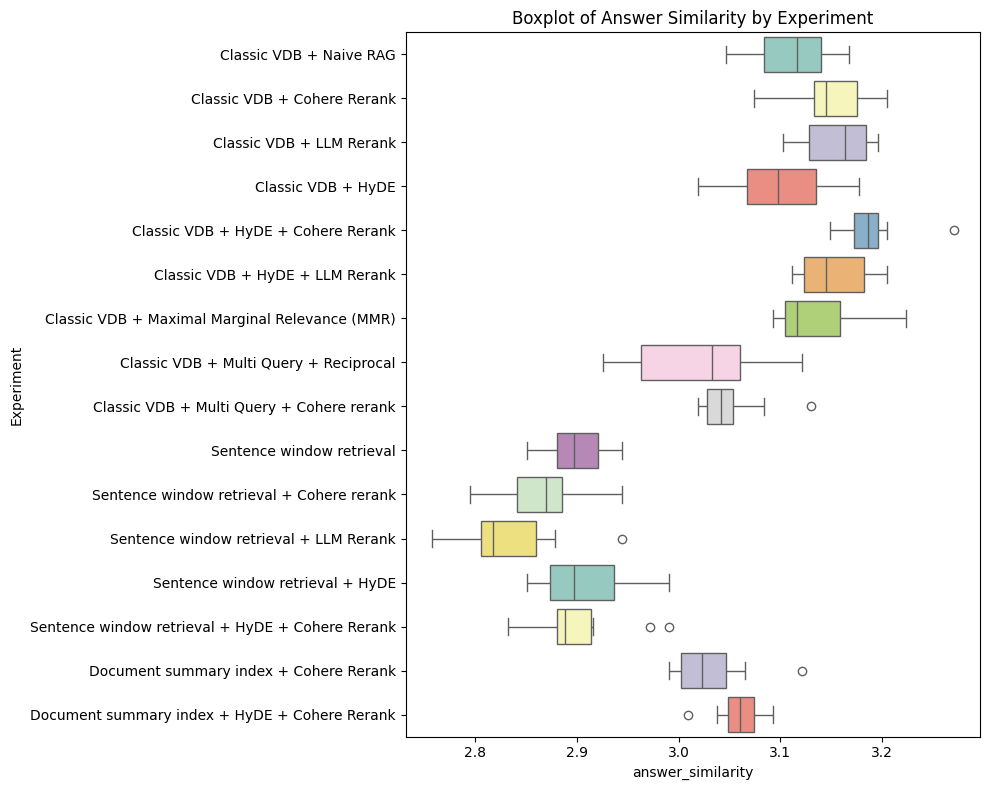

# ARAGOG：精进的RAG成果评定

发布时间：2024年04月01日

`RAG` `信息检索` `知识增强`

> ARAGOG: Advanced RAG Output Grading

# 摘要

> 检索增强生成（RAG）对于将外部知识融入大型语言模型（LLM）输出至关重要。尽管关于RAG的研究日益增多，但现有文献多集中于对新兴顶尖技术（SoTA）与旧技术的系统性回顾与比较，缺乏广泛的实验性对比。本研究旨在填补这一空白，通过评估不同RAG方法对检索精确度和答案相似度的影响。研究发现，假设文档嵌入（HyDE）和LLM重排序能显著提升检索精确度，而最大边际相关性（MMR）和Cohere重排序相较于基础版朴素RAG系统并无显著优势，多查询方法的表现也不尽人意。句子窗口检索在提高检索精确度方面表现最佳，尽管其在答案相似度上的表现有所波动。研究还验证了文档摘要索引作为有效检索手段的潜力。所有相关研究资源已在我们的GitHub仓库ARAGOG（https://github.com/predlico/ARAGOG）上公开，以便进一步研究。我们鼓励社区对RAG系统进行更深入的探索。

> Retrieval-Augmented Generation (RAG) is essential for integrating external knowledge into Large Language Model (LLM) outputs. While the literature on RAG is growing, it primarily focuses on systematic reviews and comparisons of new state-of-the-art (SoTA) techniques against their predecessors, with a gap in extensive experimental comparisons. This study begins to address this gap by assessing various RAG methods' impacts on retrieval precision and answer similarity. We found that Hypothetical Document Embedding (HyDE) and LLM reranking significantly enhance retrieval precision. However, Maximal Marginal Relevance (MMR) and Cohere rerank did not exhibit notable advantages over a baseline Naive RAG system, and Multi-query approaches underperformed. Sentence Window Retrieval emerged as the most effective for retrieval precision, despite its variable performance on answer similarity. The study confirms the potential of the Document Summary Index as a competent retrieval approach. All resources related to this research are publicly accessible for further investigation through our GitHub repository ARAGOG (https://github.com/predlico/ARAGOG). We welcome the community to further this exploratory study in RAG systems.

[Arxiv](https://arxiv.org/abs/2404.01037)