# 针对大型语言模型，本文提出了一个水印的统计学框架，探讨了水印的枢纽作用、检测效率以及如何制定最优规则。

发布时间：2024年04月01日

`LLM应用` `水印技术` `文本分析`

> A Statistical Framework of Watermarks for Large Language Models: Pivot, Detection Efficiency and Optimal Rules

# 摘要

> 自 ChatGPT 于 2022 年 11 月问世以来，将难以察觉的统计信号嵌入由大型语言模型生成的文本中，即水印技术，已成为从人类文本中可靠区分出机器文本的原则性方法。本文提出了一个通用且灵活的框架，旨在评估水印的统计效能和设计高效的检测规则。借鉴水印检测的假设检验方法，框架首先选定文本的关键统计指标和一个由 LLM 提供给验证者的秘密密钥，以控制误报率。随后，该框架通过计算渐近漏检率的封闭形式，评估水印检测规则的效力。此外，框架将确定最优检测规则的问题转化为一个最小最大优化问题。我们将这一框架应用于两种代表性水印，包括 OpenAI 内部采用的一种，并得出多项有助于指导水印实施实践的发现。特别是，我们推演出这些水印在此框架下的最佳检测规则，这些基于理论的规则在数值实验中显示出与现有方法相媲美甚至更优的性能。

> Since ChatGPT was introduced in November 2022, embedding (nearly) unnoticeable statistical signals into text generated by large language models (LLMs), also known as watermarking, has been used as a principled approach to provable detection of LLM-generated text from its human-written counterpart. In this paper, we introduce a general and flexible framework for reasoning about the statistical efficiency of watermarks and designing powerful detection rules. Inspired by the hypothesis testing formulation of watermark detection, our framework starts by selecting a pivotal statistic of the text and a secret key -- provided by the LLM to the verifier -- to enable controlling the false positive rate (the error of mistakenly detecting human-written text as LLM-generated). Next, this framework allows one to evaluate the power of watermark detection rules by obtaining a closed-form expression of the asymptotic false negative rate (the error of incorrectly classifying LLM-generated text as human-written). Our framework further reduces the problem of determining the optimal detection rule to solving a minimax optimization program. We apply this framework to two representative watermarks -- one of which has been internally implemented at OpenAI -- and obtain several findings that can be instrumental in guiding the practice of implementing watermarks. In particular, we derive optimal detection rules for these watermarks under our framework. These theoretically derived detection rules are demonstrated to be competitive and sometimes enjoy a higher power than existing detection approaches through numerical experiments.

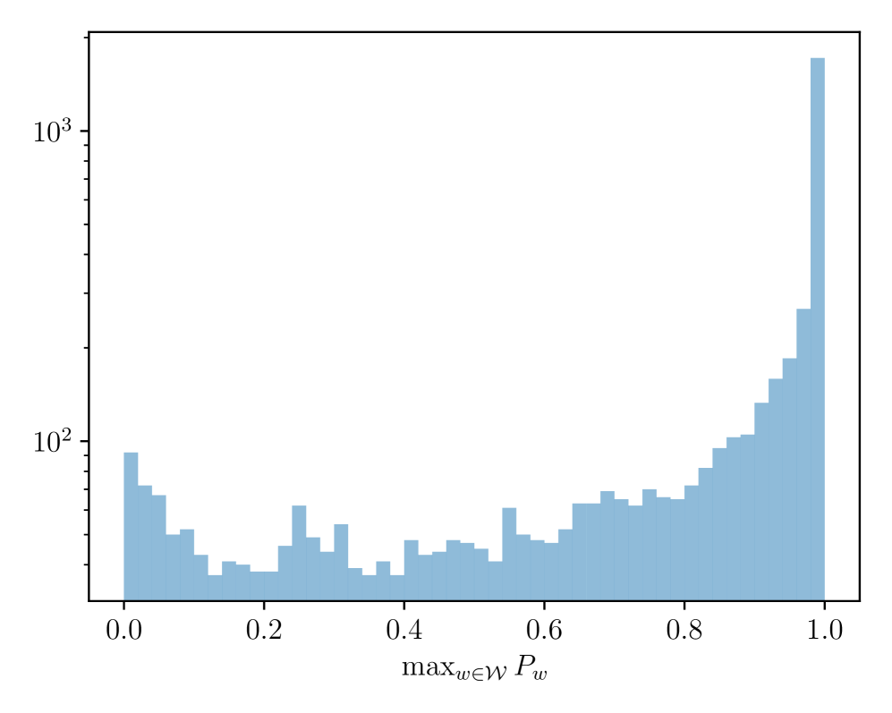

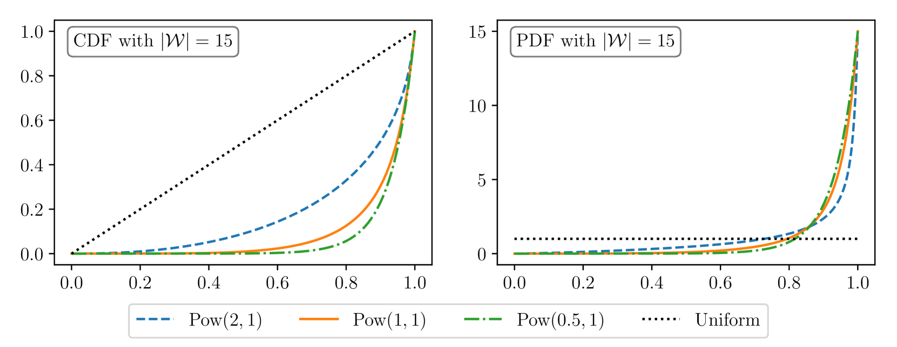

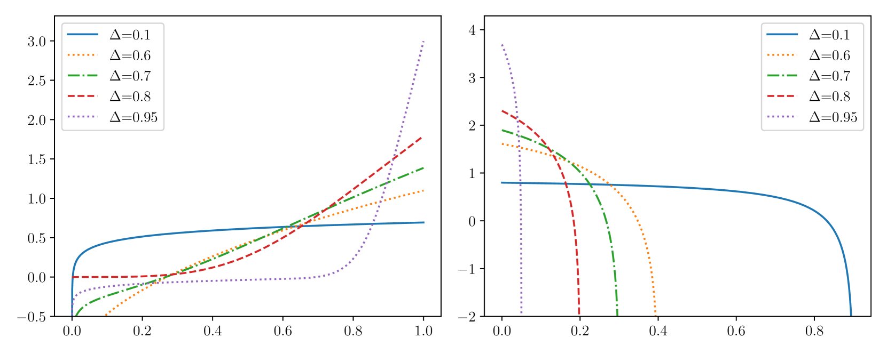

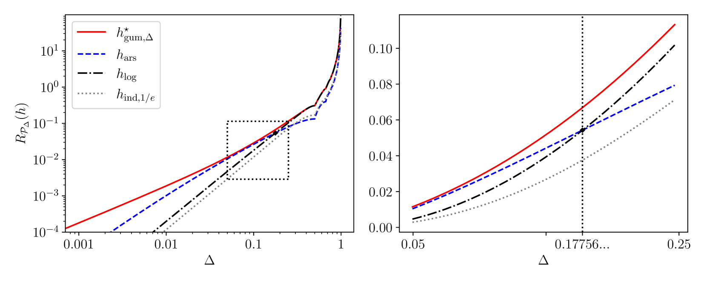

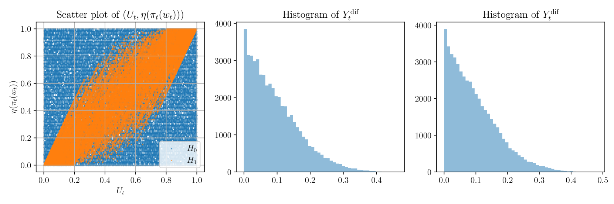

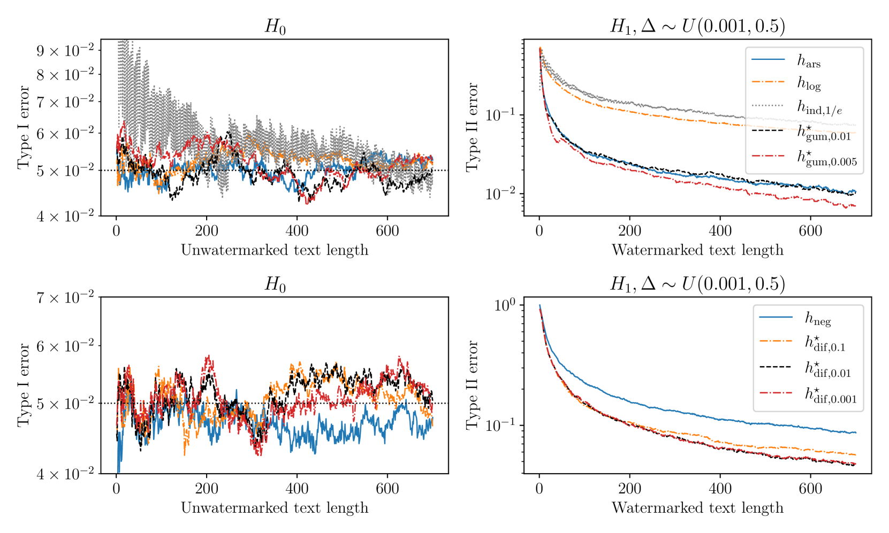

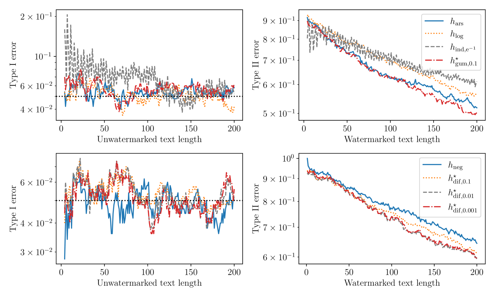

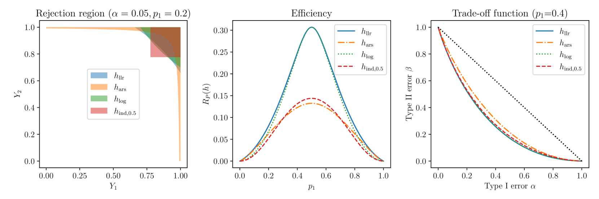

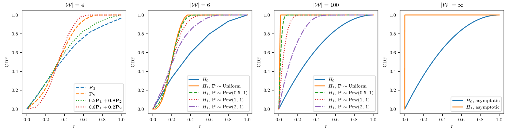

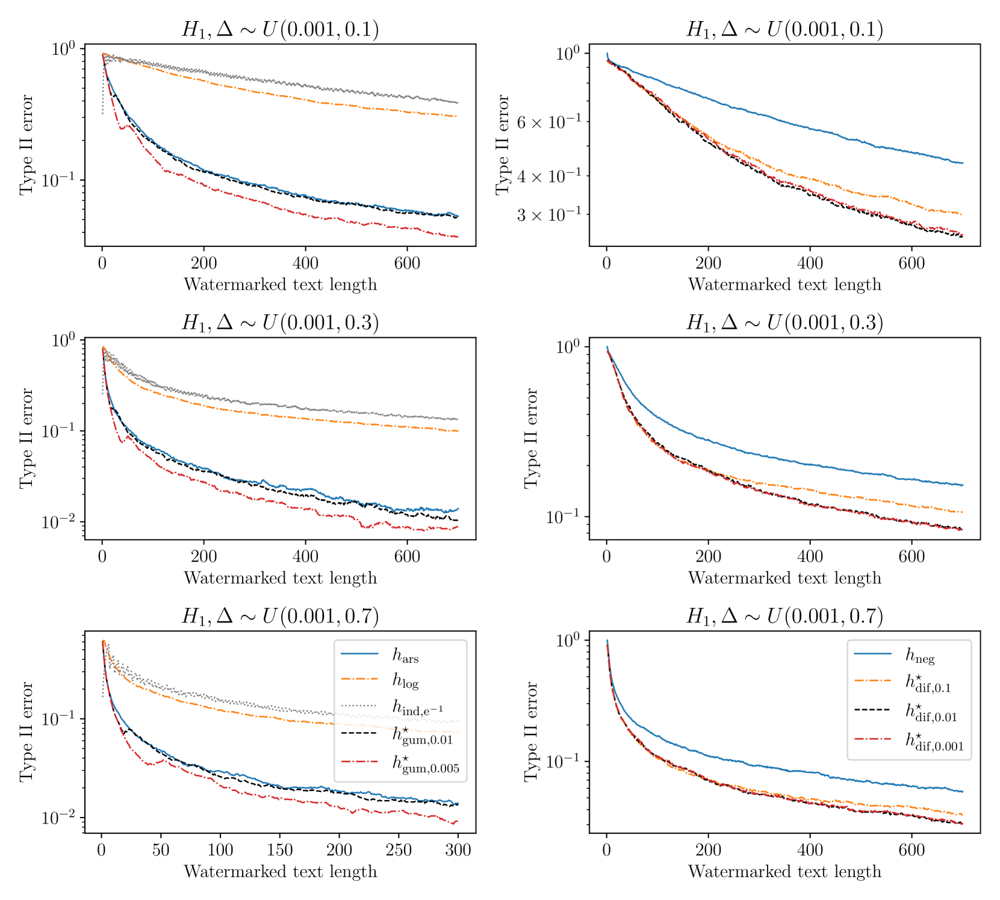

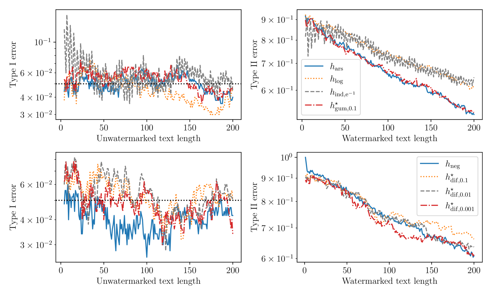

[Arxiv](https://arxiv.org/abs/2404.01245)