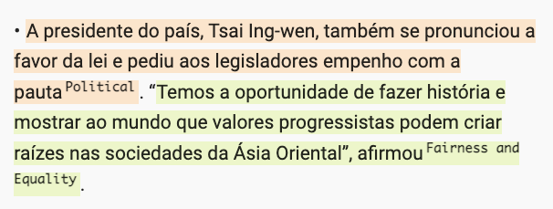
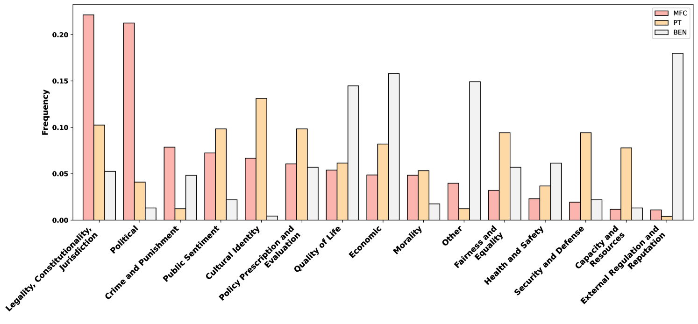
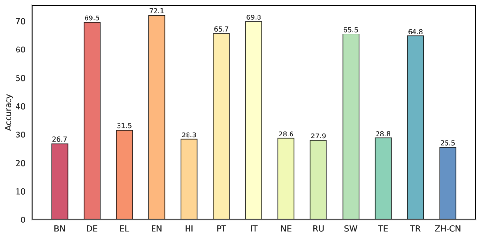
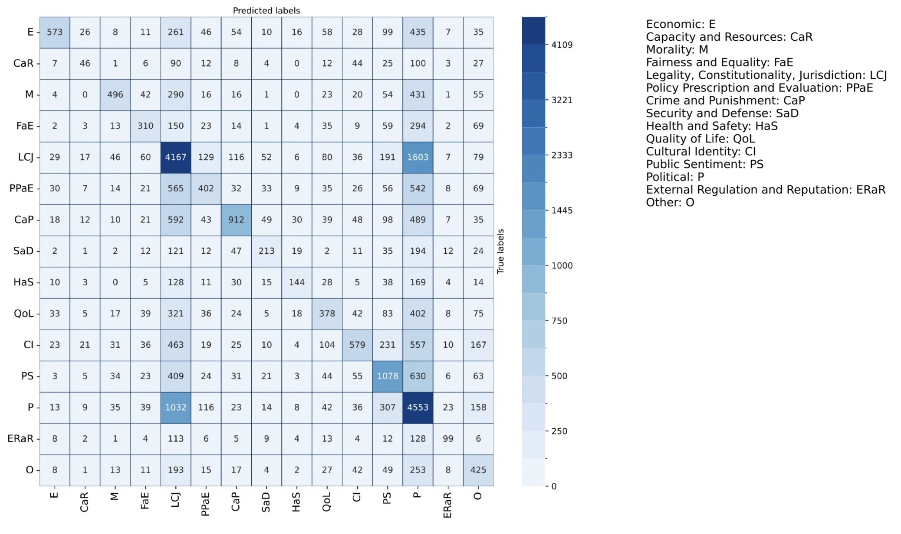

# 本研究探讨了如何扩展多语言新闻框架分析的规模，旨在提高跨语言和文化背景下新闻报道的理解和分析能力。

发布时间：2024年04月01日

`LLM应用`

> A Study on Scaling Up Multilingual News Framing Analysis

# 摘要

> 媒体框架研究关注如何有策略地挑选和展示政治议题的各个方面，以影响公众的看法。尽管这一领域在全球范围内具有广泛的重要性，但由于数据集和资源的匮乏，相关研究一直难以深入。本研究尝试通过众包方式创建数据集，动员非专业标注者构建训练资料库。我们将框架分析从英语新闻扩展至十二种语言，涵盖多种语言类型，并通过自动翻译实现。同时，我们在移民和同性婚姻议题上，推出了孟加拉语和葡萄牙语的新基准测试。研究还发现，基于众包数据集训练的系统，搭配其他现有数据集，能够实现5.32%的基线提升，验证了众包的有效性。最后，我们对大型语言模型（LLM）在该任务上的表现进行了分析，结果表明，针对具体任务的精细调整比简单地使用大型通用模型更为有效。

> Media framing is the study of strategically selecting and presenting specific aspects of political issues to shape public opinion. Despite its relevance to almost all societies around the world, research has been limited due to the lack of available datasets and other resources. This study explores the possibility of dataset creation through crowdsourcing, utilizing non-expert annotators to develop training corpora. We first extend framing analysis beyond English news to a multilingual context (12 typologically diverse languages) through automatic translation. We also present a novel benchmark in Bengali and Portuguese on the immigration and same-sex marriage domains. Additionally, we show that a system trained on our crowd-sourced dataset, combined with other existing ones, leads to a 5.32 percentage point increase from the baseline, showing that crowdsourcing is a viable option. Last, we study the performance of large language models (LLMs) for this task, finding that task-specific fine-tuning is a better approach than employing bigger non-specialized models.

[Arxiv](https://arxiv.org/abs/2404.01481)