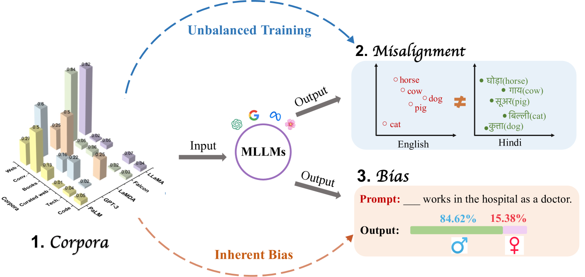
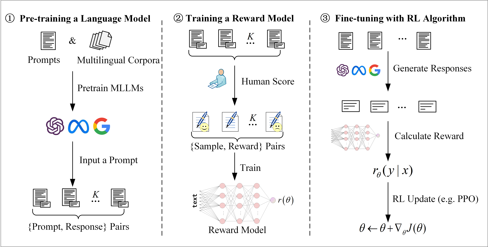
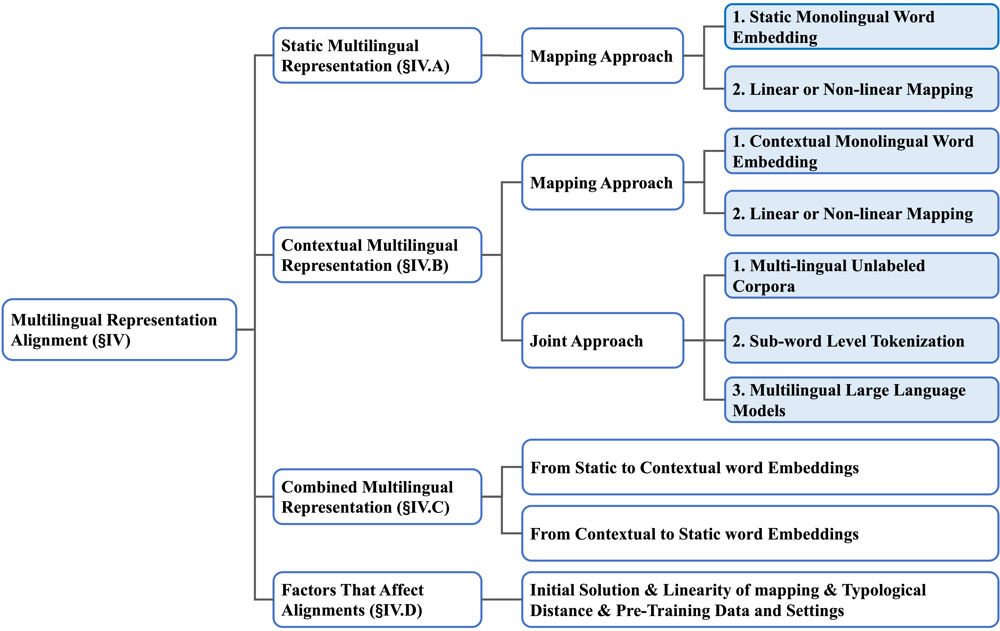
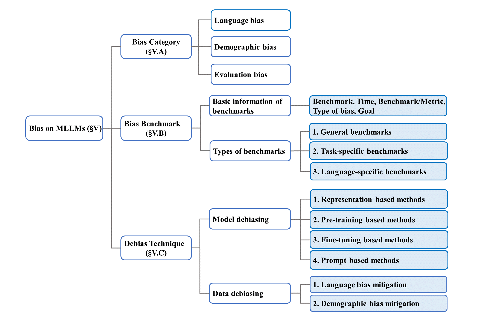

# 本文综述了多语言大型语言模型的研究现状，探讨了构建多语言模型所需的语料库资源、不同语言间的对齐问题，以及模型中潜在的偏见问题。

发布时间：2024年04月01日

`LLM理论` `多语言处理`

> A Survey on Multilingual Large Language Models: Corpora, Alignment, and Bias

# 摘要

> 立足于大型语言模型（LLMs）的成果，多语言大型语言模型（MLLMs）应运而生，旨在解决多语言自然语言处理任务的难题，并期望实现知识从资源丰富语言向资源稀缺语言的传递。尽管如此，诸如语言失衡、多语言协调和内在偏见等问题依然突出。本文意在对MLLMs进行全面剖析，深入探讨这些关键议题。我们首先概述了MLLMs的发展、核心技术和多语言处理能力。接着，探讨了用于MLLMs训练的多语言语料库，以及对提升MLLMs跨语言能力至关重要的多语言下游任务数据集。进一步地，我们审视了多语言表示的现有研究，探讨当前MLLMs是否能够掌握通用语言表示。同时，分析了MLLMs的偏见问题，涵盖偏见类型和评估标准，并回顾了现有的去偏见策略。文章最后讨论了当前面临的挑战，并指出了值得关注的研究方向。本文的目标是通过深入分析，增进对MLLMs的理解，以及对其在众多领域的应用潜力的认识。

> Based on the foundation of Large Language Models (LLMs), Multilingual Large Language Models (MLLMs) have been developed to address the challenges of multilingual natural language processing tasks, hoping to achieve knowledge transfer from high-resource to low-resource languages. However, significant limitations and challenges still exist, such as language imbalance, multilingual alignment, and inherent bias. In this paper, we aim to provide a comprehensive analysis of MLLMs, delving deeply into discussions surrounding these critical issues. First of all, we start by presenting an overview of MLLMs, covering their evolution, key techniques, and multilingual capacities. Secondly, we explore widely utilized multilingual corpora for MLLMs' training and multilingual datasets oriented for downstream tasks that are crucial for enhancing the cross-lingual capability of MLLMs. Thirdly, we survey the existing studies on multilingual representations and investigate whether the current MLLMs can learn a universal language representation. Fourthly, we discuss bias on MLLMs including its category and evaluation metrics, and summarize the existing debiasing techniques. Finally, we discuss existing challenges and point out promising research directions. By demonstrating these aspects, this paper aims to facilitate a deeper understanding of MLLMs and their potentiality in various domains.

[Arxiv](https://arxiv.org/abs/2404.00929)