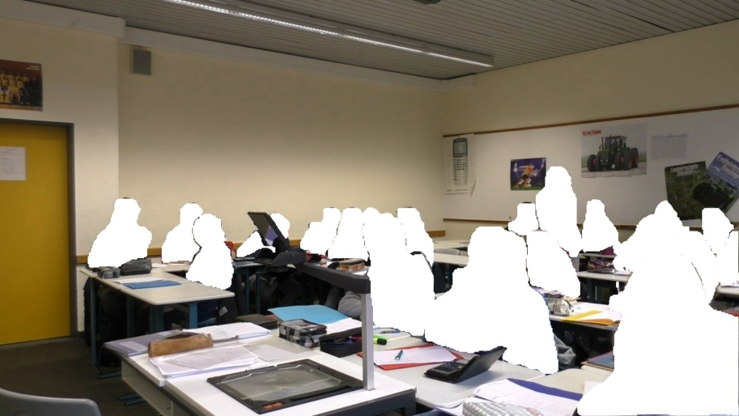
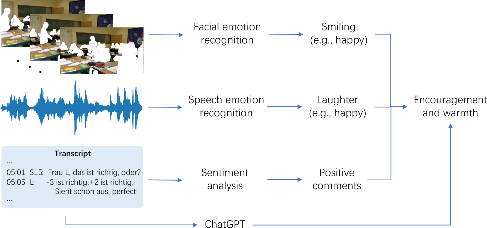
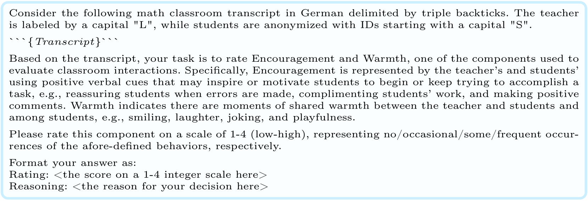
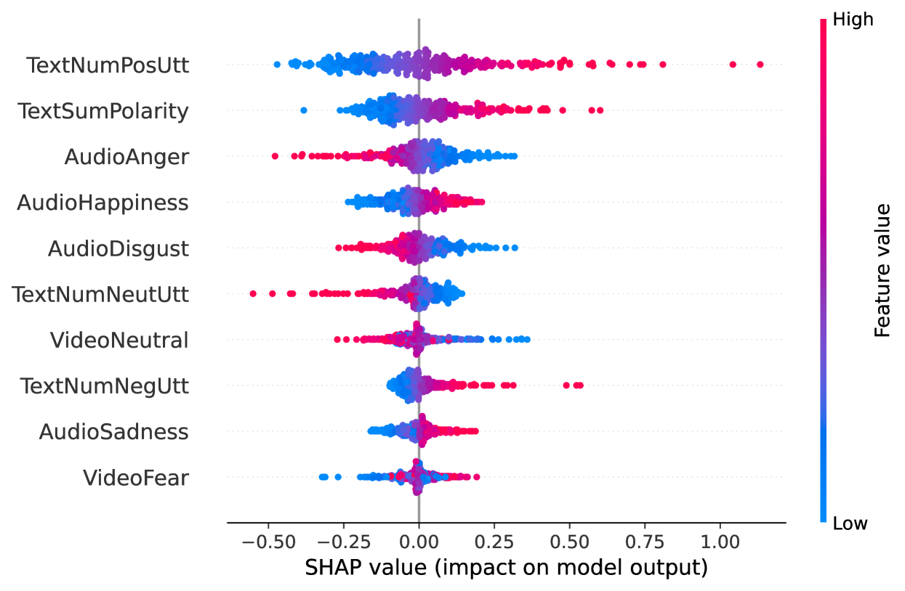

# 通过融合多模态情感特征与ChatGPT技术，实现对课堂中鼓励与温暖的自动化评估。

发布时间：2024年04月01日

`LLM应用` `人工智能`

> Automated Assessment of Encouragement and Warmth in Classrooms Leveraging Multimodal Emotional Features and ChatGPT

# 摘要

> 课堂观察协议不仅统一了教学效果评价标准，还加深了对课堂互动的认识。这些协议虽然能为教师提供针对性的教学反馈，但人工编码过程既费时又可能存在误差。因此，研究者开始探索利用人工智能来自动化这一全面编码过程，以降低成本并提高可靠性。本研究采用了一种结合视觉和语音的多模态方法，旨在自动评估课堂中的关键元素——鼓励与温暖，这也是全球教学洞察研究中观察协议的一部分。我们利用面部和语音情感识别技术，结合情感分析，从视频、音频和文本资料中提取关键特征。研究中同时采用了分类和回归的预测方法。此外，考虑到当前大型语言模型在文本注解上的卓越表现，我们还测试了ChatGPT在没有先验训练的情况下，基于文本资料的评分能力。在GTI数据集上的实验显示，GPT-4和最佳训练模型与人工评分的相关性分别为0.341和0.441。通过整合两种模型的预测结果，我们得到了一个相关性为0.513的集成模型，这一结果与人工评分的一致性相当。模型解释分析揭示了文本情感特征在训练模型决策中起到了关键作用。GPT-4还能够提供逻辑性强、具体的推理，为教师提供潜在的指导。这些发现为利用先进的多模态技术自动化课堂观察提供了新思路，有助于通过持续而有价值的反馈促进教师的专业发展。

> Classroom observation protocols standardize the assessment of teaching effectiveness and facilitate comprehension of classroom interactions. Whereas these protocols offer teachers specific feedback on their teaching practices, the manual coding by human raters is resource-intensive and often unreliable. This has sparked interest in developing AI-driven, cost-effective methods for automating such holistic coding. Our work explores a multimodal approach to automatically estimating encouragement and warmth in classrooms, a key component of the Global Teaching Insights (GTI) study's observation protocol. To this end, we employed facial and speech emotion recognition with sentiment analysis to extract interpretable features from video, audio, and transcript data. The prediction task involved both classification and regression methods. Additionally, in light of recent large language models' remarkable text annotation capabilities, we evaluated ChatGPT's zero-shot performance on this scoring task based on transcripts. We demonstrated our approach on the GTI dataset, comprising 367 16-minute video segments from 92 authentic lesson recordings. The inferences of GPT-4 and the best-trained model yielded correlations of r = .341 and r = .441 with human ratings, respectively. Combining estimates from both models through averaging, an ensemble approach achieved a correlation of r = .513, comparable to human inter-rater reliability. Our model explanation analysis indicated that text sentiment features were the primary contributors to the trained model's decisions. Moreover, GPT-4 could deliver logical and concrete reasoning as potential teacher guidelines. Our findings provide insights into using advanced, multimodal techniques for automated classroom observation, aiming to foster teacher training through frequent and valuable feedback.

[Arxiv](https://arxiv.org/abs/2404.15310)