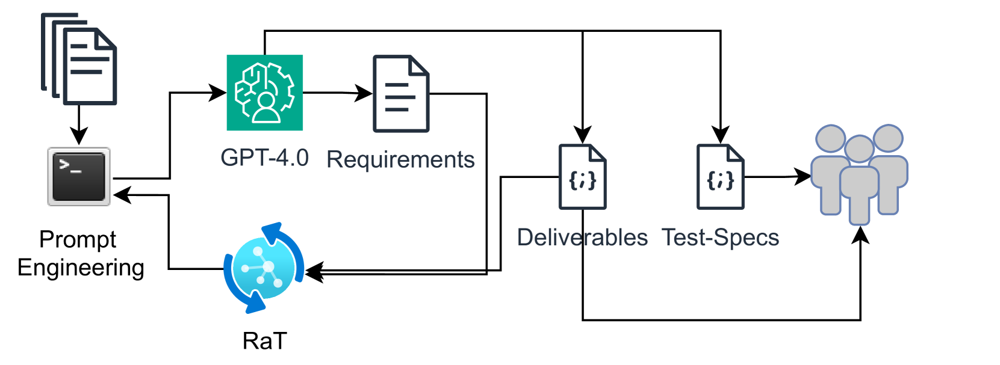
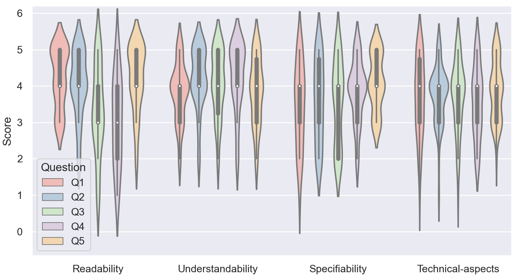
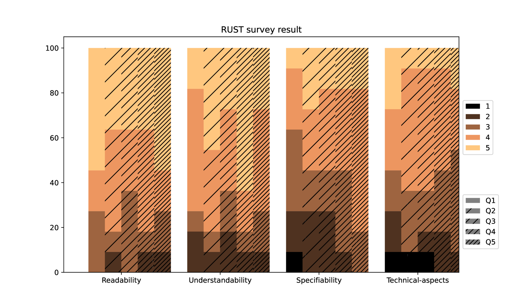

# 借助大型语言模型，实现自动化的用户故事创建，并配备测试用例规范。

发布时间：2024年04月01日

`LLM应用` `软件工程` `自动化工具`

> Automated User Story Generation with Test Case Specification Using Large Language Model

# 摘要

> 随着人工智能（尤其是大型语言模型LLM）的助力，现代软件工程时代正飞速发展。研究者们已在自动化软件开发流程的诸多环节。作为软件开发周期的起点，需求工程（RE）阶段通过多轮讨论，将拟议的工作范围以不同形式记录下来。该阶段最终形成一系列用户故事，这些故事通常是在Jira、AzurDev等项目管理工具中创建和跟进的。在本研究中，我们利用GPT-4.0打造了一个名为"GeneUS"的工具，它能自动从需求工程阶段产出的需求文档中提炼出用户故事，并将成果以JSON格式呈现，便于与主流项目管理工具无缝对接。鉴于分析需求文档往往耗时且需与各方利益相关者进行多次会议，我们相信这一自动化工具将大幅减轻软件工程师的负担，提升工作效率，使他们能将更多时间投入到其他优先级更高的任务中。

> Modern Software Engineering era is moving fast with the assistance of artificial intelligence (AI), especially Large Language Models (LLM). Researchers have already started automating many parts of the software development workflow. Requirements Engineering (RE) is a crucial phase that begins the software development cycle through multiple discussions on a proposed scope of work documented in different forms. RE phase ends with a list of user-stories for each unit task identified through discussions and usually these are created and tracked on a project management tool such as Jira, AzurDev etc. In this research we developed a tool "GeneUS" using GPT-4.0 to automatically create user stories from requirements document which is the outcome of the RE phase. The output is provided in JSON format leaving the possibilities open for downstream integration to the popular project management tools. Analyzing requirements documents takes significant effort and multiple meetings with stakeholders. We believe, automating this process will certainly reduce additional load off the software engineers, and increase the productivity since they will be able to utilize their time on other prioritized tasks.

[Arxiv](https://arxiv.org/abs/2404.01558)