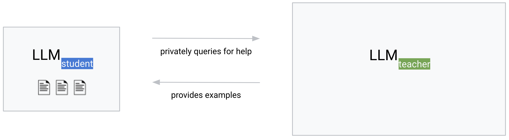
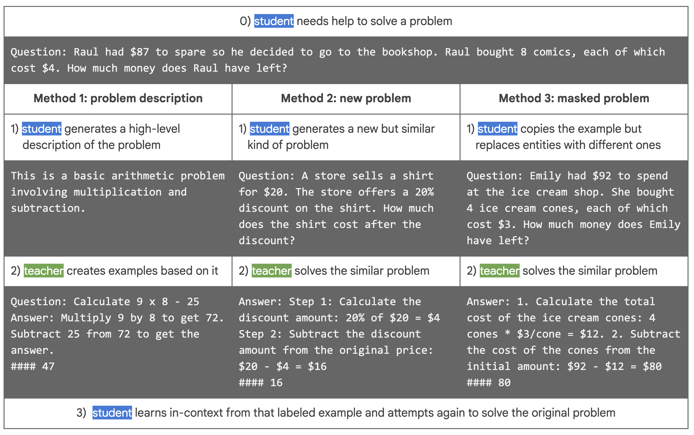
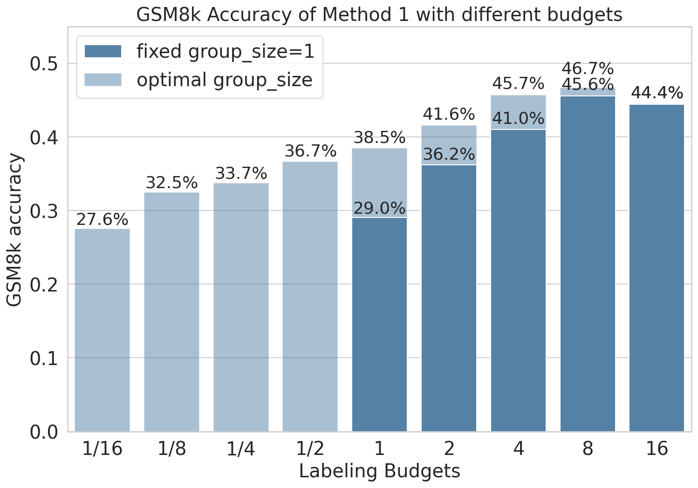

# 大型语言模型能否在保护隐私的前提下互相协助？

发布时间：2024年04月01日

`LLM应用` `机器学习` `隐私保护`

> Can LLMs get help from other LLMs without revealing private information?

# 摘要

> 级联系统在机器学习领域十分普遍，它允许在本地模型无法准确处理数据时，向远程大型模型寻求帮助。随着大型语言模型（LLM）服务的兴起，级联系统因其在降低成本的同时保持性能而备受青睐。然而，当本地模型能接触到敏感信息时，使用级联系统可能会引发用户隐私的严重问题，因为这些信息可能被传输至远程模型。本研究展示了如何通过为本地模型配备隐私保护技术，来降低这种风险，确保在利用远程模型的同时，用户的私人信息得到妥善保护。我们引入了两种隐私度量方法，以评估信息泄露的风险。此外，我们还提出了一种新型系统，该系统基于最新的社会学习范式，让LLM之间通过自然语言交流实现协同学习。在多个数据集上的实验结果表明，我们的方法在减少隐私泄露的同时，相比传统的非级联系统，能够提升任务的执行效率。

> Cascades are a common type of machine learning systems in which a large, remote model can be queried if a local model is not able to accurately label a user's data by itself. Serving stacks for large language models (LLMs) increasingly use cascades due to their ability to preserve task performance while dramatically reducing inference costs. However, applying cascade systems in situations where the local model has access to sensitive data constitutes a significant privacy risk for users since such data could be forwarded to the remote model. In this work, we show the feasibility of applying cascade systems in such setups by equipping the local model with privacy-preserving techniques that reduce the risk of leaking private information when querying the remote model. To quantify information leakage in such setups, we introduce two privacy measures. We then propose a system that leverages the recently introduced social learning paradigm in which LLMs collaboratively learn from each other by exchanging natural language. Using this paradigm, we demonstrate on several datasets that our methods minimize the privacy loss while at the same time improving task performance compared to a non-cascade baseline.

[Arxiv](https://arxiv.org/abs/2404.01041)