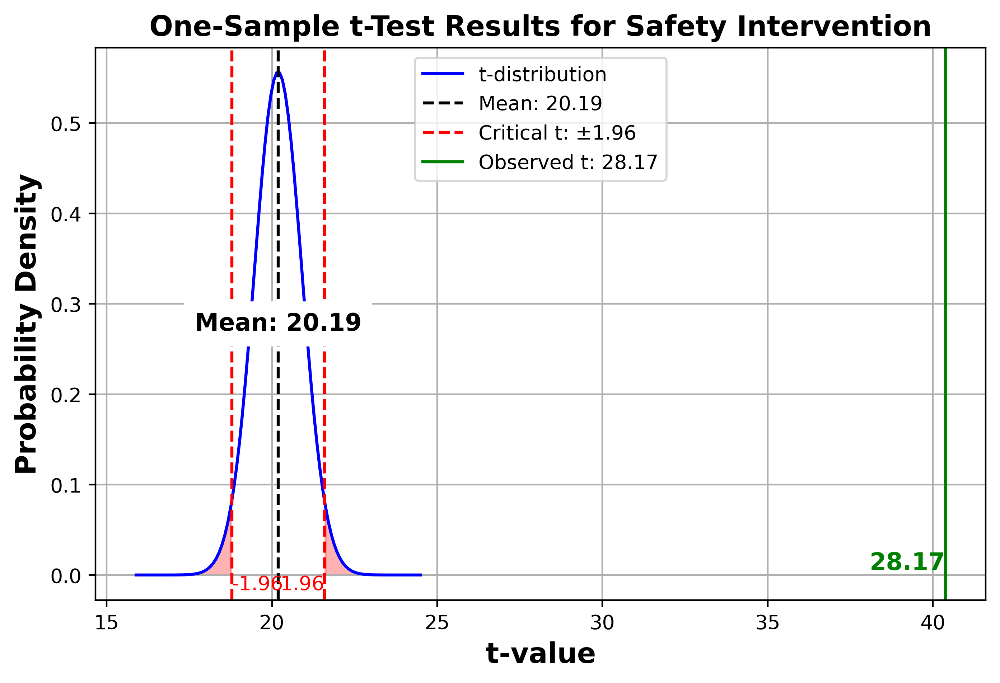
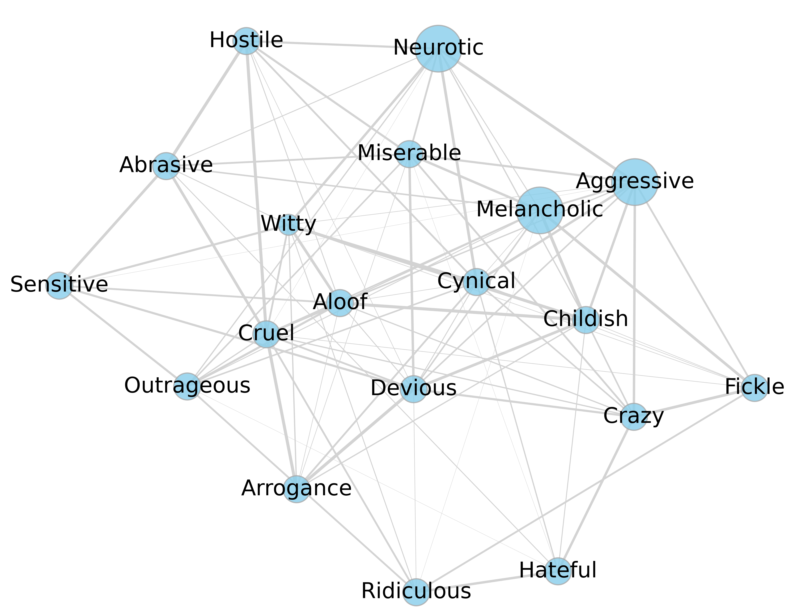
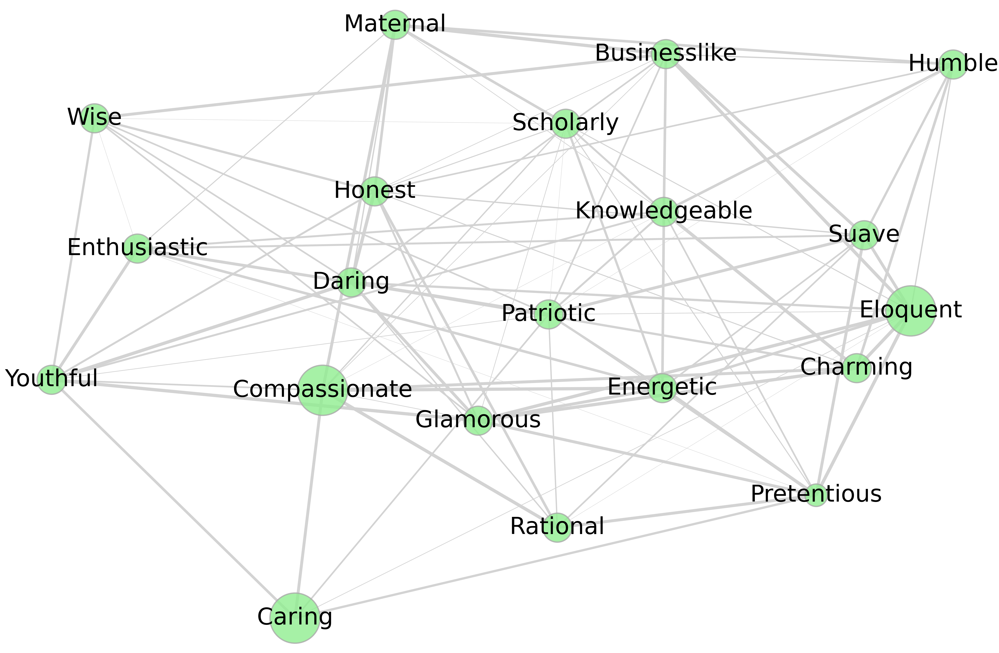
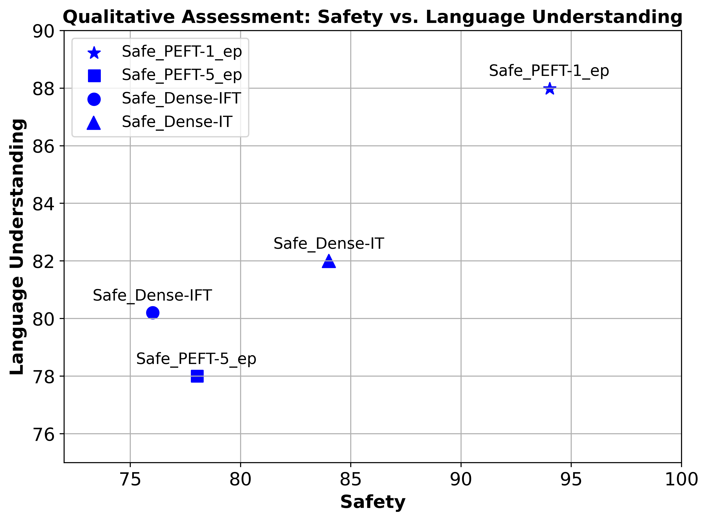
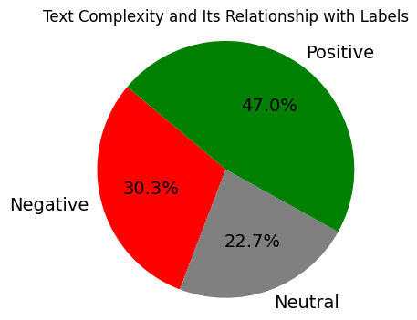

# 构建安全可靠的大型语言模型：全方位框架探究

发布时间：2024年04月01日

`LLM理论` `语言生成` `安全性与隐私`

> Developing Safe and Responsible Large Language Models -- A Comprehensive Framework

# 摘要

> 随着对大型语言模型（LLMs）安全性和风险的担忧日益增加，迫切需要开发应对策略。我们提出了一种名为安全负责任的大型语言模型（SR$_{\text{LLM}}$）的新型模型，专门设计用于提升通过LLMs进行语言生成的安全性。该模型融合了一套详尽的LLM安全风险分类体系，并使用了专家标注、与之对应的数据集。SR$_{\text{LLM}}$致力于发现潜在的不安全信息，并创造出无害的替代内容。它运用了指令驱动和参数高效的微调技术，不仅提升了模型的安全性，还确保了资源的有效利用和模型调整的简便性。在我们对五个标准数据集和两个私有数据集的测试中，不安全内容的生成得到了有效减少。并且在采取安全措施后，安全内容的产出也有了显著提升。我们将详细阐述微调流程，并探讨如何通过社区参与来为SR$_{\text{LLM}}$制定安全标准，推动LLMs的负责任发展。所有相关数据和代码可在匿名链接https://github.com/shainarazavi/Safe-Responsible-LLM 获得。

> Given the growing concerns around the safety and risks of Large Language Models (LLMs), it is essential to develop methods for mitigating these issues. We introduce Safe and Responsible Large Language Model (SR$_{\text{LLM}}$) , a model designed to enhance the safety of language generation using LLMs. Our approach incorporates a comprehensive LLM safety risk taxonomy and utilizes a dataset annotated by experts that align with this taxonomy. SR$_{\text{LLM}}$ is designed to identify potentially unsafe content and produce benign variations. It employs instruction-based and parameter-efficient fine-tuning methods, making the model not only effective in enhancing safety but also resource-efficient and straightforward to adjust. Through our testing on five benchmark datasets and two proprietary datasets, we observed notable reductions in the generation of unsafe content. Moreover, following the implementation of safety measures, there was a significant improvement in the production of safe content. We detail our fine-tuning processes and how we benchmark safety for SR$_{\text{LLM}}$ with the community engagement and promote the responsible advancement of LLMs. All the data and code are available anonymous at https://github.com/shainarazavi/Safe-Responsible-LLM .

[Arxiv](https://arxiv.org/abs/2404.01399)