# 通过语言模型奖励，直接对视频大型多模态模型进行偏好优化。

发布时间：2024年04月01日

`LLM应用` `视频问答` `多模态模型`

> Direct Preference Optimization of Video Large Multimodal Models from Language Model Reward

# 摘要

> 偏好建模技术，例如直接偏好优化（DPO），能有效提升大型语言模型（LLM）的泛化能力。但在视频指令执行任务中，如何提供有效的反馈，特别是识别生成内容的不实信息，依然是个难题。先前研究尝试使用大型多模态模型（LMMs）指导偏好建模，但其评估生成内容真实性的准确性尚未定论。本研究提出了一个新框架，通过详细视频字幕辅助，让语言模型在视频问答（QA）预测中利用这些信息。我们的方法与OpenAI GPT-4V模型的奖励机制高度一致，该机制直接处理视频帧。此外，我们发现，通过DPO应用这种定制奖励，显著提升了视频LMMs在视频QA任务的表现。

> Preference modeling techniques, such as direct preference optimization (DPO), has shown effective in enhancing the generalization abilities of large language model (LLM). However, in tasks involving video instruction-following, providing informative feedback, especially for detecting hallucinations in generated responses, remains a significant challenge. Previous studies have explored using large large multimodal models (LMMs) as reward models to guide preference modeling, but their ability to accurately assess the factuality of generated responses compared to corresponding videos has not been conclusively established. This paper introduces a novel framework that utilizes detailed video captions as a proxy of video content, enabling language models to incorporate this information as supporting evidence for scoring video Question Answering (QA) predictions. Our approach demonstrates robust alignment with OpenAI GPT-4V model's reward mechanism, which directly takes video frames as input. Furthermore, we show that applying this tailored reward through DPO significantly improves the performance of video LMMs on video QA tasks.

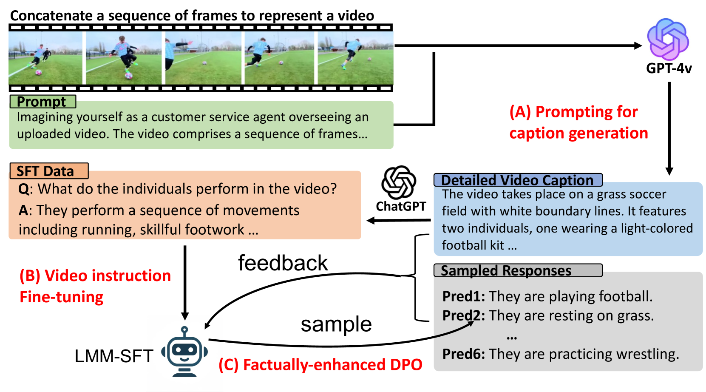

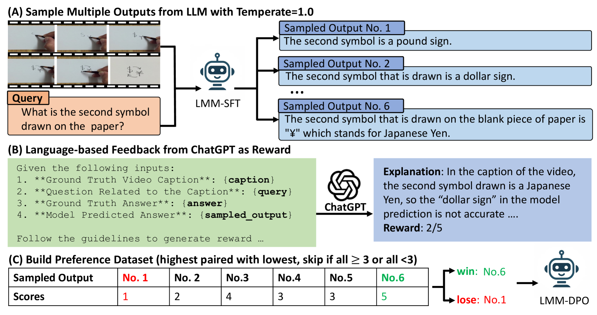

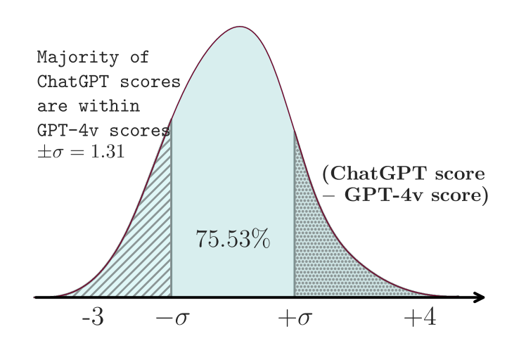

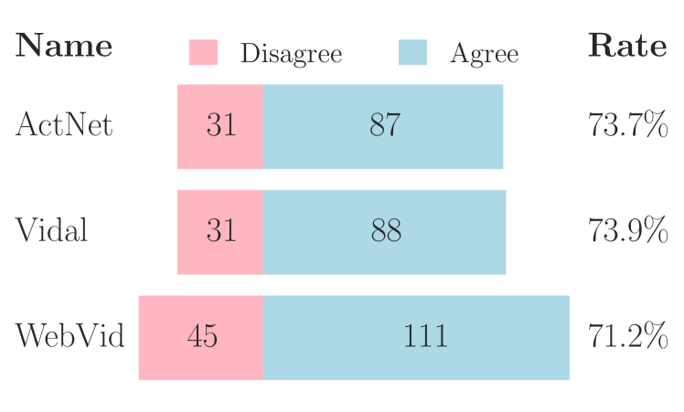

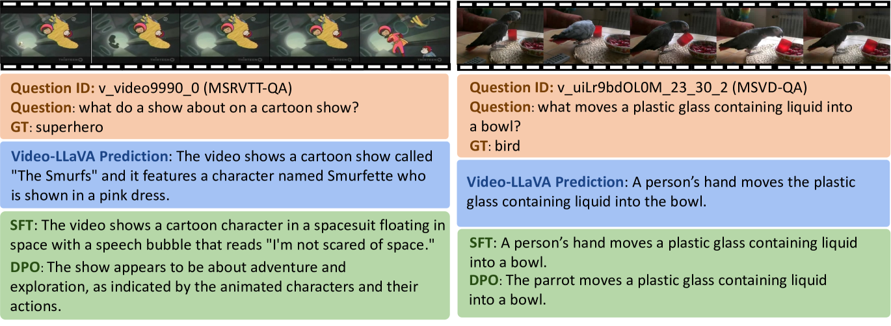

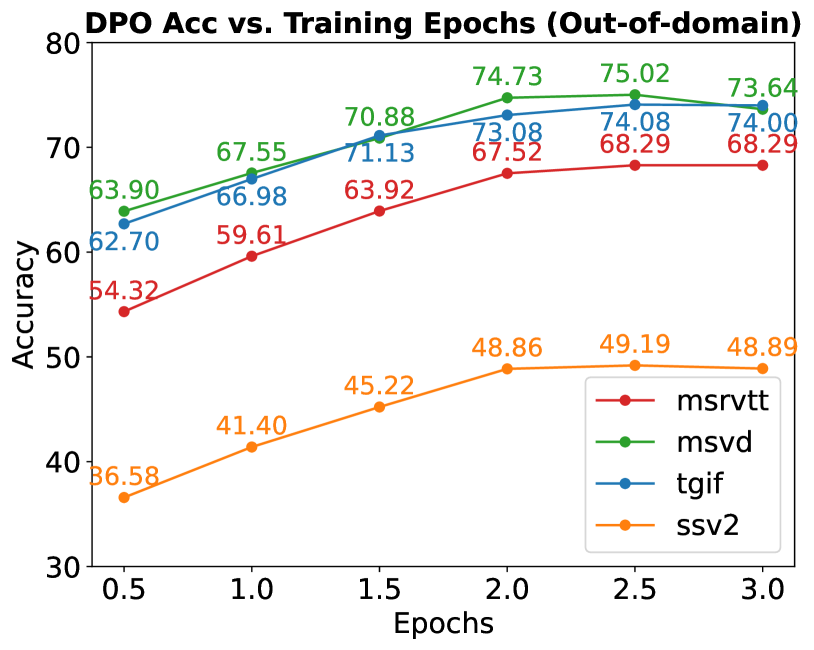

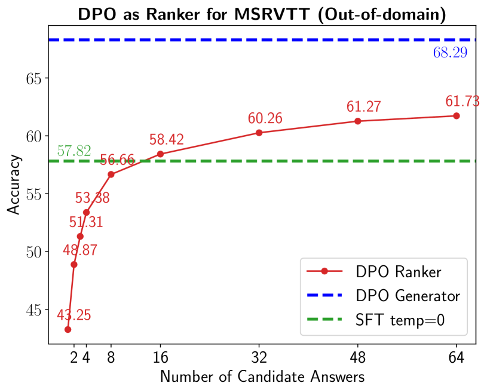

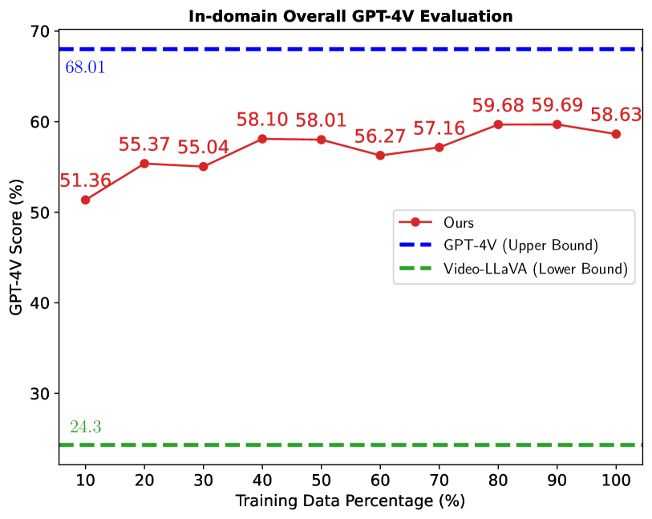

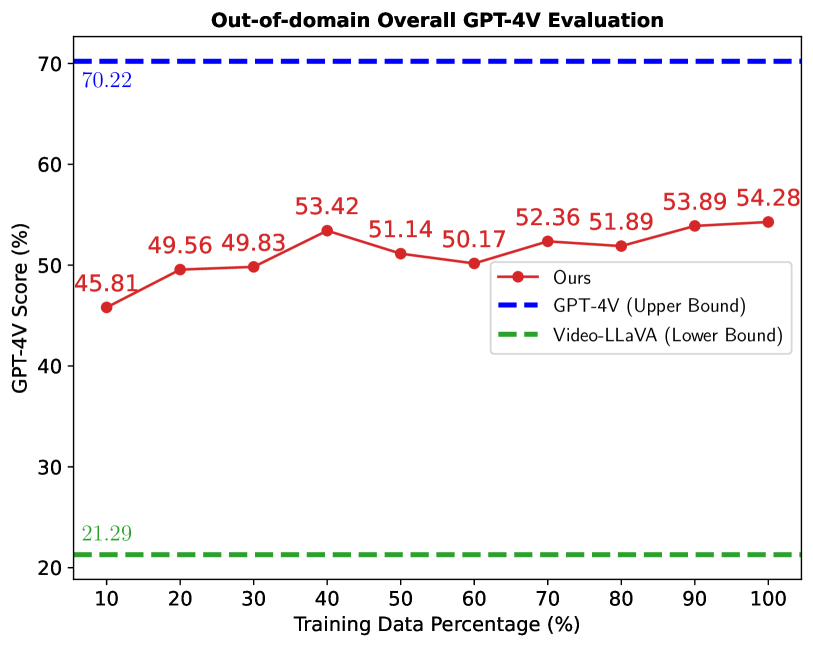

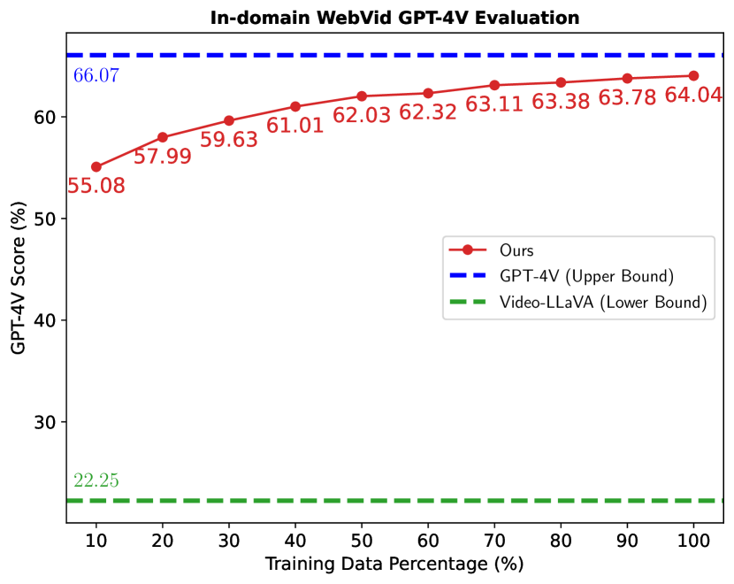

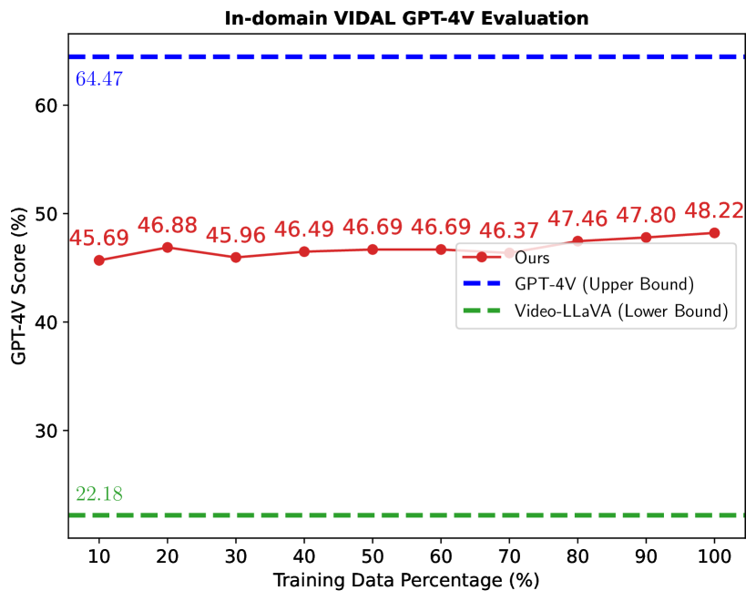

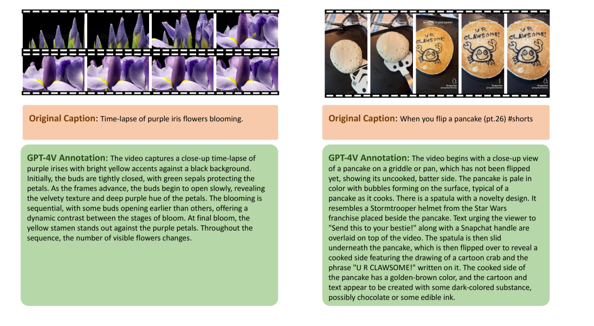

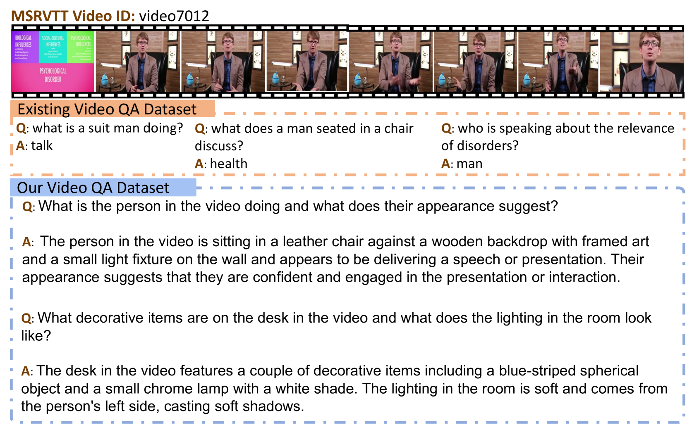

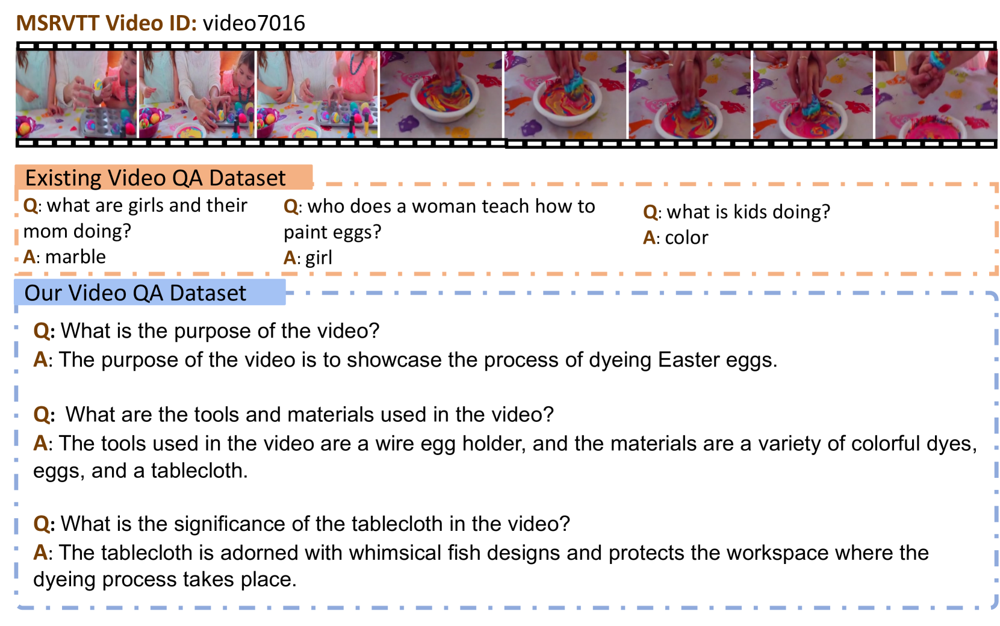

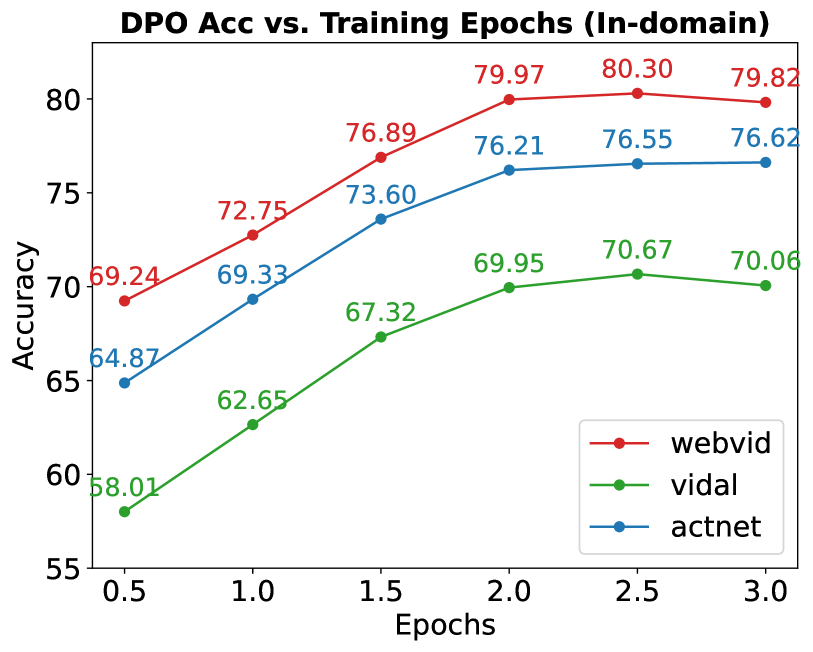

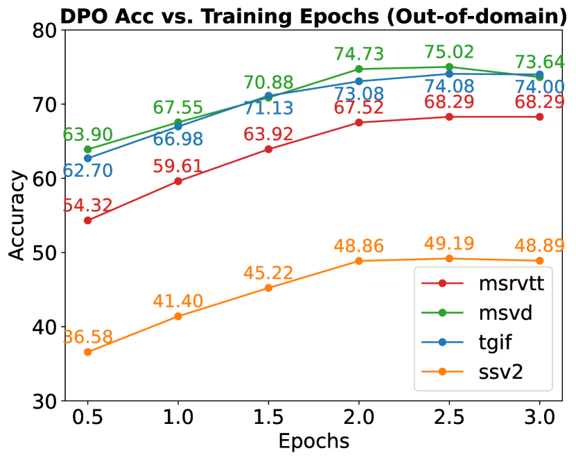

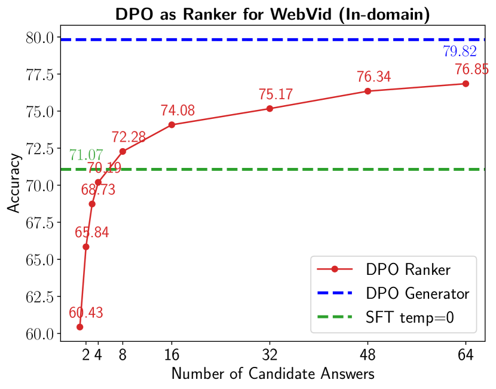

[Arxiv](https://arxiv.org/abs/2404.01258)