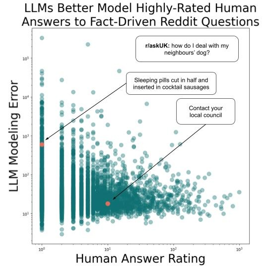
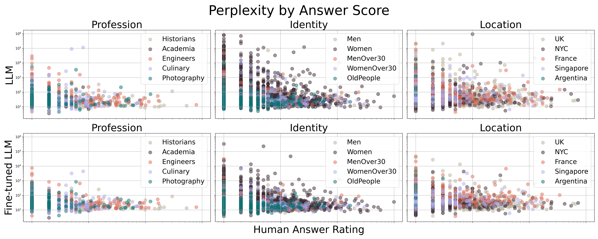

# 在Reddit上的案例研究：大型语言模型真的搞不懂人类对事实问题的答案吗？

发布时间：2024年04月01日

`LLM应用` `社交媒体` `问答系统`

> Do LLMs Find Human Answers To Fact-Driven Questions Perplexing? A Case Study on Reddit

# 摘要

> 大型语言模型（LLMs）擅长在网络互动中准确回答问题。然而，利用LLMs模拟人类对社交媒体上事实导向问题的答复，这一领域尚待深入挖掘。本研究探讨了LLMs如何对Reddit上特定主题社区提出的众多事实导向问题给出多样化的人类式回答。我们汇集并发布了一个数据集，包含409个事实问题和7534个来自15个不同主题的Ask社区的人类评分回答，覆盖职业、社会身份和地理位置三大类别。研究发现，LLMs在模拟这些问题的高评分人类回答上表现更佳。基于这些发现，我们为未来的研究提出了若干方向。

> Large language models (LLMs) have been shown to be proficient in correctly answering questions in the context of online discourse. However, the study of using LLMs to model human-like answers to fact-driven social media questions is still under-explored. In this work, we investigate how LLMs model the wide variety of human answers to fact-driven questions posed on several topic-specific Reddit communities, or subreddits. We collect and release a dataset of 409 fact-driven questions and 7,534 diverse, human-rated answers from 15 r/Ask{Topic} communities across 3 categories: profession, social identity, and geographic location. We find that LLMs are considerably better at modeling highly-rated human answers to such questions, as opposed to poorly-rated human answers. We present several directions for future research based on our initial findings.

[Arxiv](https://arxiv.org/abs/2404.01147)