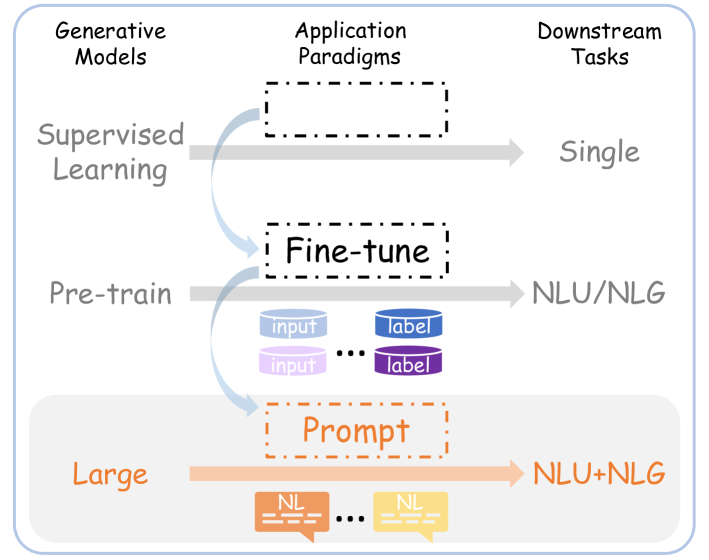
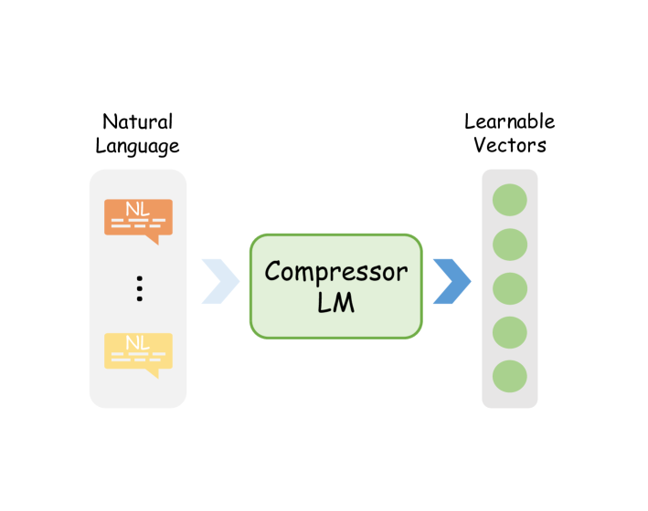
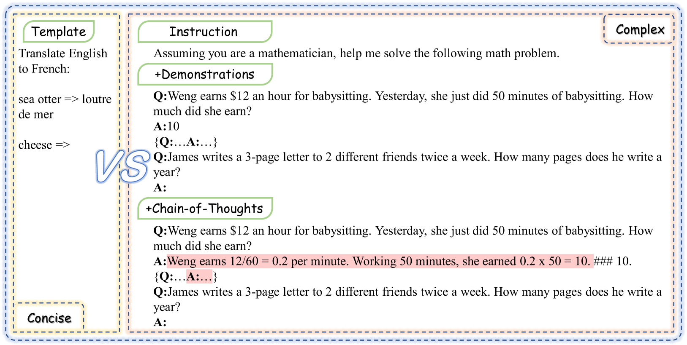
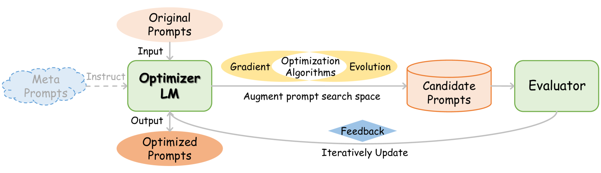

# 大型语言模型的高效提示技巧：全面调查研究

发布时间：2024年04月01日

`LLM应用` `提示技术
````

> Efficient Prompting Methods for Large Language Models: A Survey

# 摘要

> 如今，提示法已成为让大型语言模型（LLMs）适应特定自然语言处理任务的主流做法。它不仅拓宽了LLMs上下文学习的道路，同时也增加了模型推理的计算成本和设计提示的人力投入，尤其是在使用长篇复杂提示来引导及控制LLMs表现时更为明显。由此，LLM领域迎来了高效提示技术的飞速增长。本文将对这些技术进行全面梳理。概括来说，高效提示技术主要分为两大类：计算高效型和设计高效型。前者通过多种方式压缩提示，后者则利用自动优化技术来提升效率。我们将回顾提示技术的基本概念，探讨其在高效性上取得的进展，并展望未来的研究动向。

> Prompting has become a mainstream paradigm for adapting large language models (LLMs) to specific natural language processing tasks. While this approach opens the door to in-context learning of LLMs, it brings the additional computational burden of model inference and human effort of manual-designed prompts, particularly when using lengthy and complex prompts to guide and control the behavior of LLMs. As a result, the LLM field has seen a remarkable surge in efficient prompting methods. In this paper, we present a comprehensive overview of these methods. At a high level, efficient prompting methods can broadly be categorized into two approaches: prompting with efficient computation and prompting with efficient design. The former involves various ways of compressing prompts, and the latter employs techniques for automatic prompt optimization. We present the basic concepts of prompting, review the advances for efficient prompting, and highlight future research directions.









[Arxiv](https://arxiv.org/abs/2404.01077)