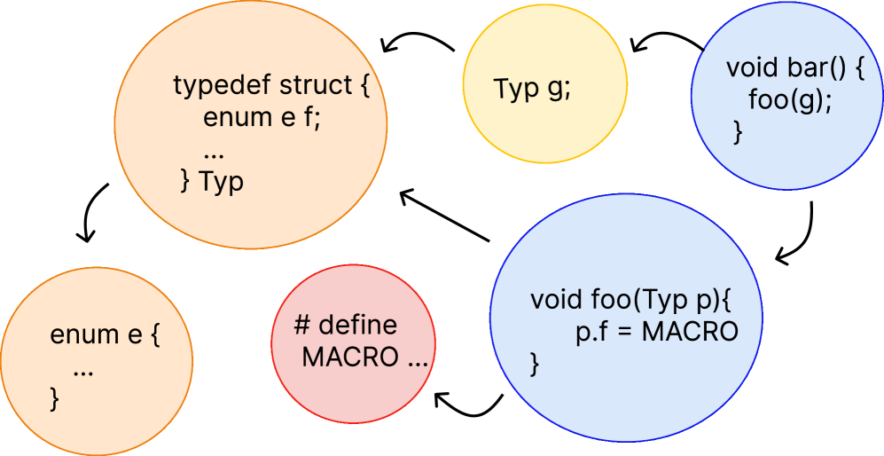
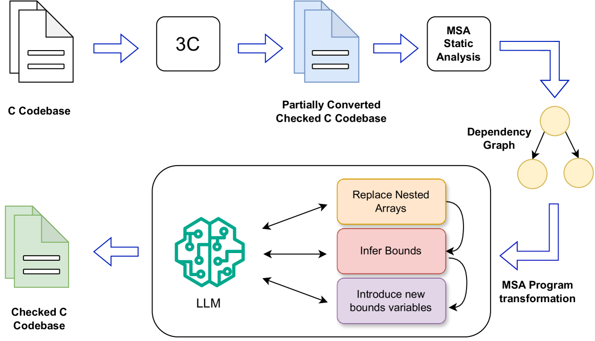
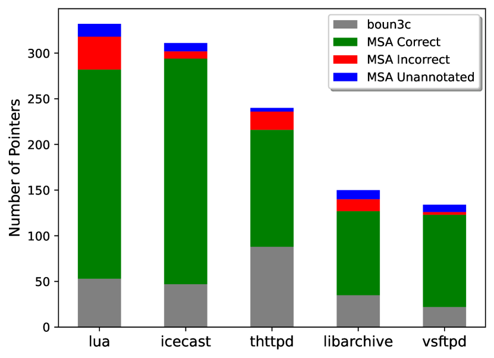

# 通过大型语言模型 (LLM) 保障 C 程序的内存安全。

发布时间：2024年04月01日

`LLM应用` `软件工程` `内存安全`

> Enabling Memory Safety of C Programs using LLMs

# 摘要

> 低级代码，如 C 语言，其内存安全漏洞一直是软件漏洞的主要根源。将 C 代码迁移到安全的 C 方言是消除这些漏洞的方法之一，这些方言依赖程序员提供的注释来确保安全，最小化运行时开销。然而，这种迁移过程繁琐，给程序员带来沉重负担，导致这种技术的应用并不广泛。移植过程不仅涉及注释推断，还可能包括代码的重构或重写，以适应注释要求。本文利用大型语言模型（LLMs）来应对这些挑战。我们展示了如何利用 LLM 进行复杂的代码推理和重写大型代码库。同时，我们提出了一个创新的框架，通过轻量级静态分析实现整个程序的转换，将复杂的任务分解为 LLM 能够有效处理的较小步骤。我们将这一理念实现在名为 MSA 的工具中，专门针对 CheckedC 方言。通过在多个微基准测试和真实世界的代码（最多 20K 行）上的评估，MSA 展现了超越传统 LLM 基线的卓越性能，并在与最先进的符号技术（非 LLM）相比时显示出明显的改进。

> Memory safety violations in low-level code, written in languages like C, continues to remain one of the major sources of software vulnerabilities. One method of removing such violations by construction is to port C code to a safe C dialect. Such dialects rely on programmer-supplied annotations to guarantee safety with minimal runtime overhead. This porting, however, is a manual process that imposes significant burden on the programmer and, hence, there has been limited adoption of this technique.
  The task of porting not only requires inferring annotations, but may also need refactoring/rewriting of the code to make it amenable to such annotations. In this paper, we use Large Language Models (LLMs) towards addressing both these concerns. We show how to harness LLM capabilities to do complex code reasoning as well as rewriting of large codebases. We also present a novel framework for whole-program transformations that leverages lightweight static analysis to break the transformation into smaller steps that can be carried out effectively by an LLM. We implement our ideas in a tool called MSA that targets the CheckedC dialect. We evaluate MSA on several micro-benchmarks, as well as real-world code ranging up to 20K lines of code. We showcase superior performance compared to a vanilla LLM baseline, as well as demonstrate improvement over a state-of-the-art symbolic (non-LLM) technique.

[Arxiv](https://arxiv.org/abs/2404.01096)