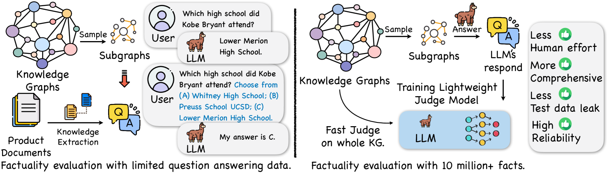
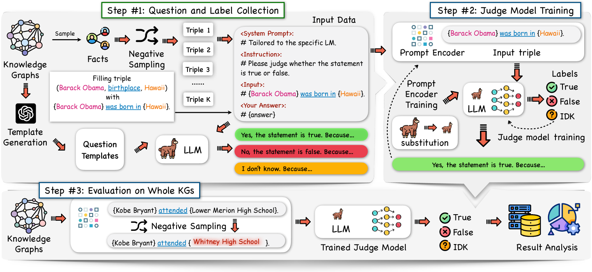
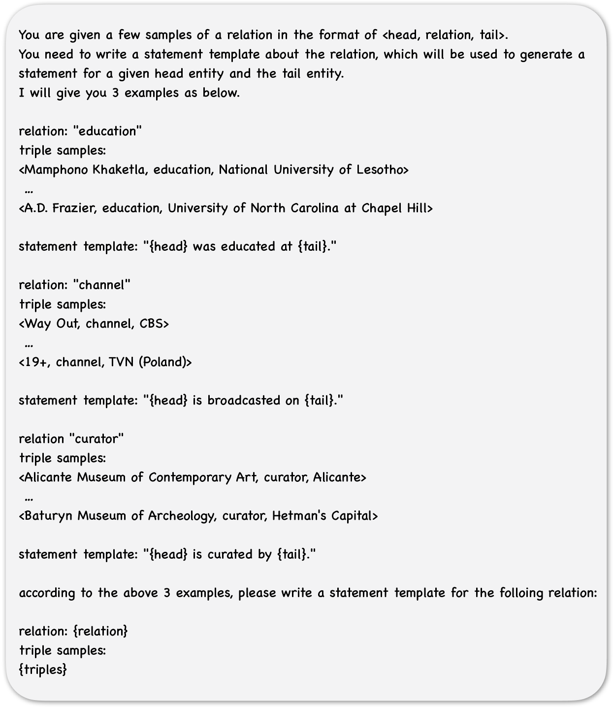

# 通过大规模知识图谱来评估大型语言模型的真实性。

发布时间：2024年04月01日

`LLM应用` `人工智能` `事实性评估`

> Evaluating the Factuality of Large Language Models using Large-Scale Knowledge Graphs

# 摘要

> 大型语言模型（LLMs）的兴起极大地重塑了人工智能的版图，提升了机器学习和AI的整体实力。然而，LLMs可能产生不实信息，这一事实性问题引起了广泛关注。本文提出了GraphEval，一种利用超过1000万条事实构建的大规模测试数据集来评估LLM性能的新方法，无需大量的人力投入。GraphEval通过引入一个评估模型来判断LLM所生成答案的正确性，简化了评估流程。实验结果显示，该评估模型在事实性评估方面与LLM输出的正确性高度一致，并且显著降低了评估成本。此外，我们的研究还深入探讨了LLM在多个指标上的性能，并为未来确保LLM输出的事实准确性提供了宝贵的洞见。相关代码已在 https://github.com/xz-liu/GraphEval 上公开。

> The advent of Large Language Models (LLMs) has significantly transformed the AI landscape, enhancing machine learning and AI capabilities. Factuality issue is a critical concern for LLMs, as they may generate factually incorrect responses. In this paper, we propose GraphEval to evaluate an LLM's performance using a substantially large test dataset. Specifically, the test dataset is retrieved from a large knowledge graph with more than 10 million facts without expensive human efforts. Unlike conventional methods that evaluate LLMs based on generated responses, GraphEval streamlines the evaluation process by creating a judge model to estimate the correctness of the answers given by the LLM. Our experiments demonstrate that the judge model's factuality assessment aligns closely with the correctness of the LLM's generated outputs, while also substantially reducing evaluation costs. Besides, our findings offer valuable insights into LLM performance across different metrics and highlight the potential for future improvements in ensuring the factual integrity of LLM outputs. The code is publicly available at https://github.com/xz-liu/GraphEval.

[Arxiv](https://arxiv.org/abs/2404.00942)