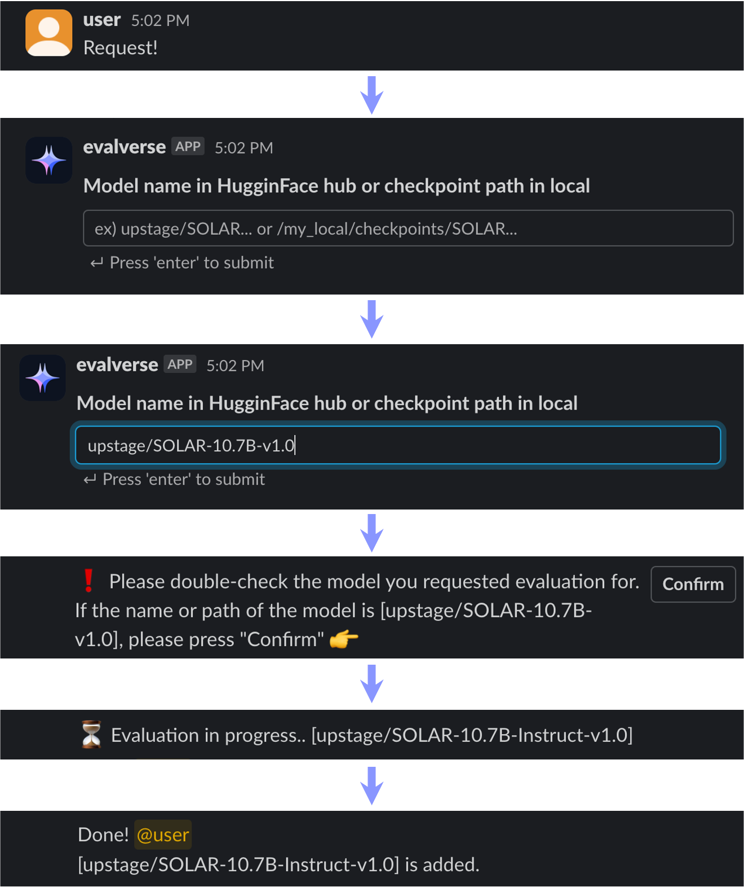

# Evalverse：为大型语言模型评估打造的一体化、易用资源库

发布时间：2024年04月01日

`LLM应用` `人工智能` `评估工具`

> Evalverse: Unified and Accessible Library for Large Language Model Evaluation

# 摘要

> 本文向大家展示了Evalverse，这是一个创新的库，它通过整合各种评估工具到一个统一、易于使用的框架中，大大简化了对大型语言模型（LLMs）的评估工作。即使是对人工智能不太熟悉的人，也能通过Evalverse轻松进行LLM评估，并获取详尽的报告，这一切都得益于它与Slack等通讯平台的无缝对接。Evalverse不仅是研究人员的得力助手，也为实践者提供了一个便捷的LLM评估中心。此外，我们还精心制作了一个两分钟的演示视频，全面展示了Evalverse的功能和应用。

> This paper introduces Evalverse, a novel library that streamlines the evaluation of Large Language Models (LLMs) by unifying disparate evaluation tools into a single, user-friendly framework. Evalverse enables individuals with limited knowledge of artificial intelligence to easily request LLM evaluations and receive detailed reports, facilitated by an integration with communication platforms like Slack. Thus, Evalverse serves as a powerful tool for the comprehensive assessment of LLMs, offering both researchers and practitioners a centralized and easily accessible evaluation framework. Finally, we also provide a demo video for Evalverse, showcasing its capabilities and implementation in a two-minute format.

[Arxiv](https://arxiv.org/abs/2404.00943)