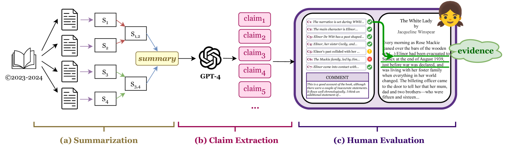
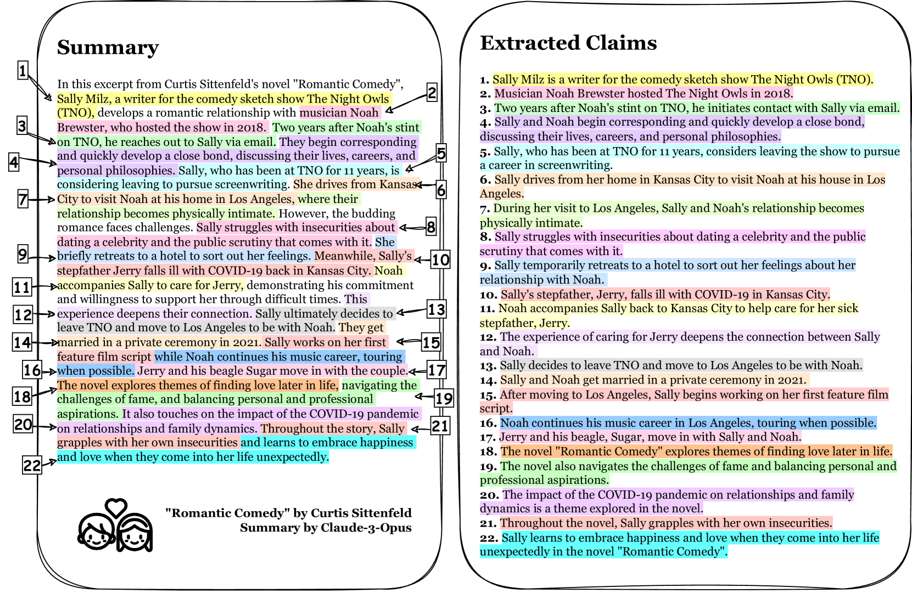
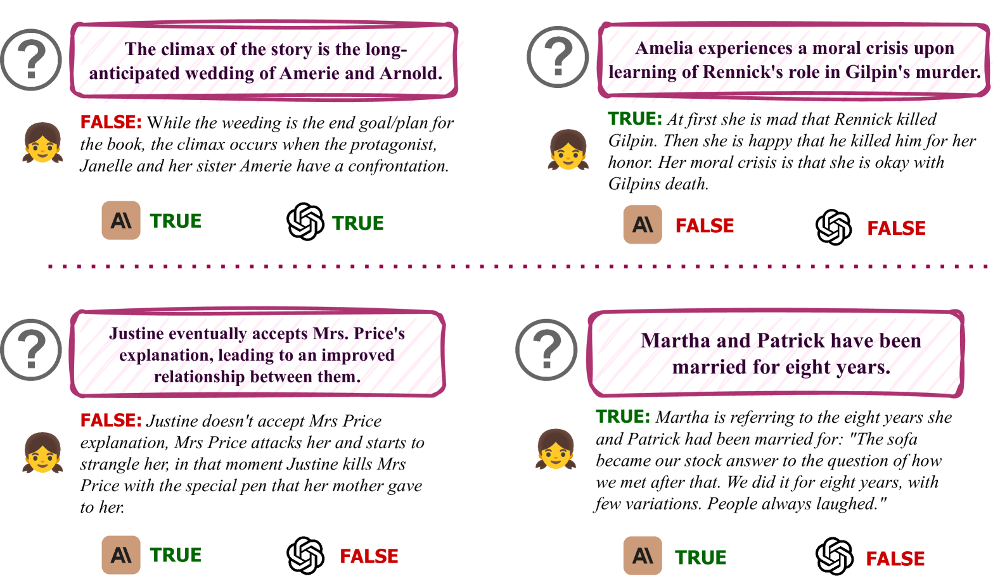
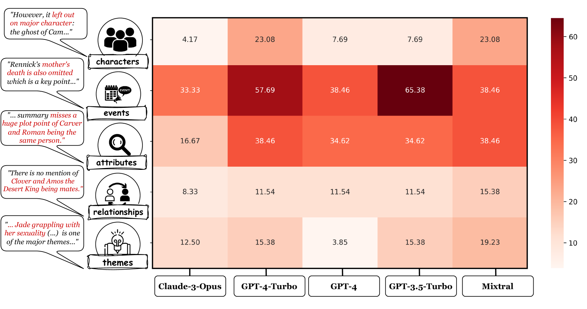
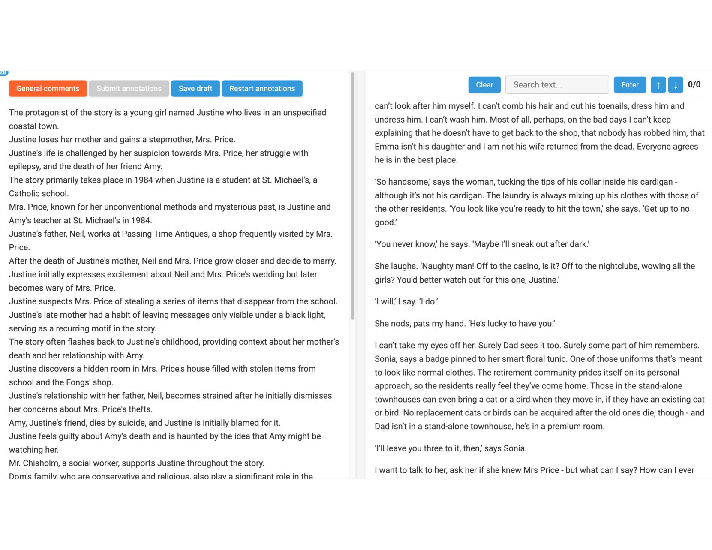
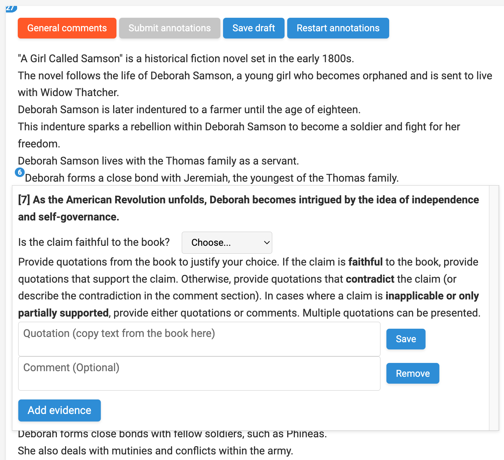
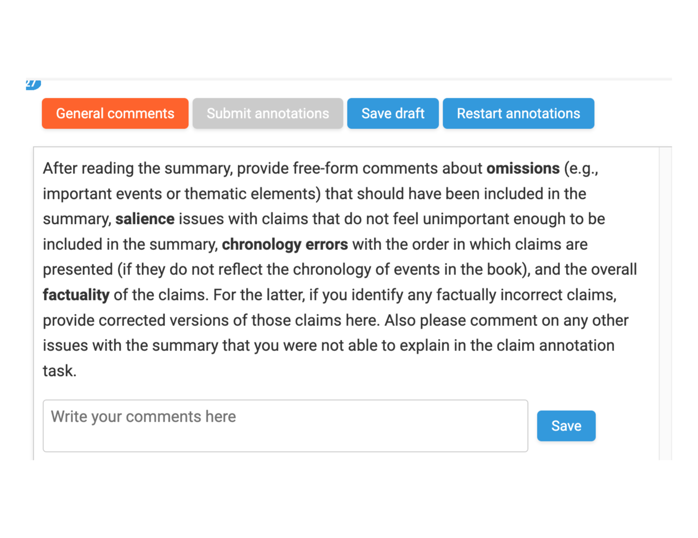
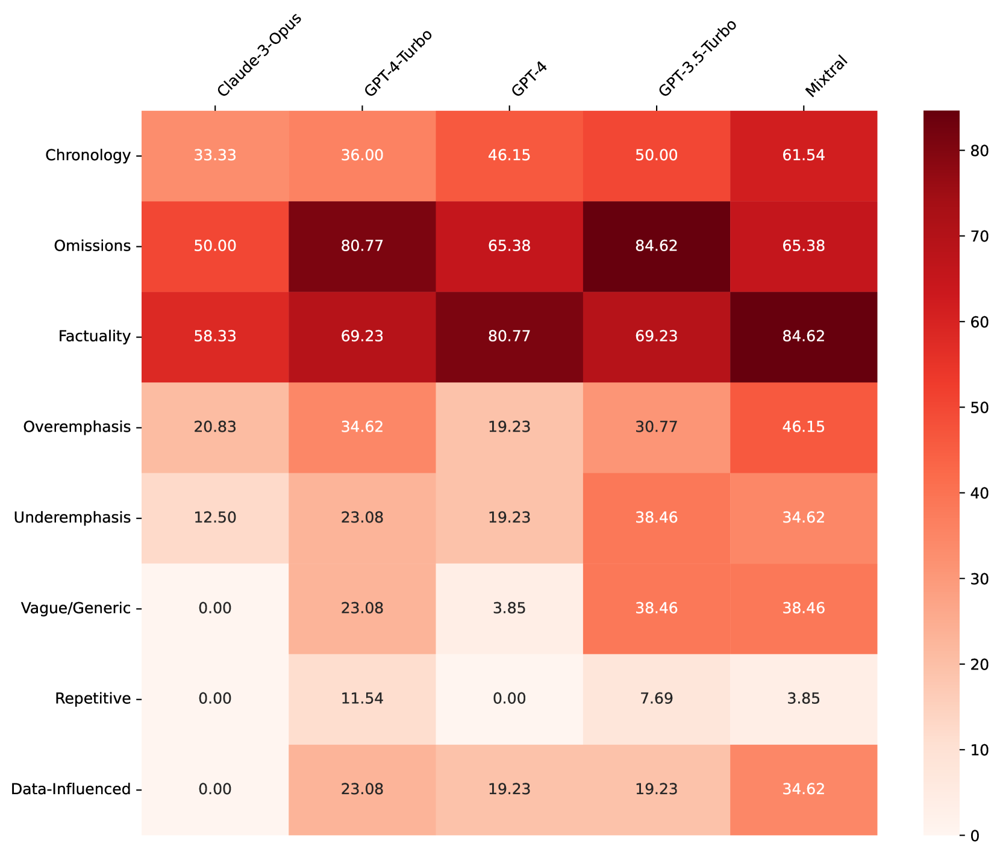
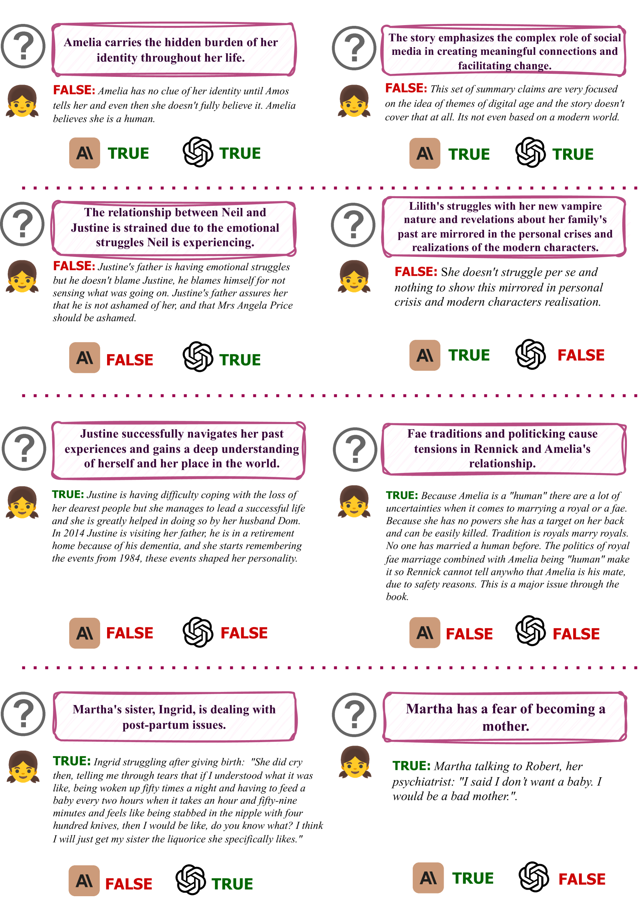
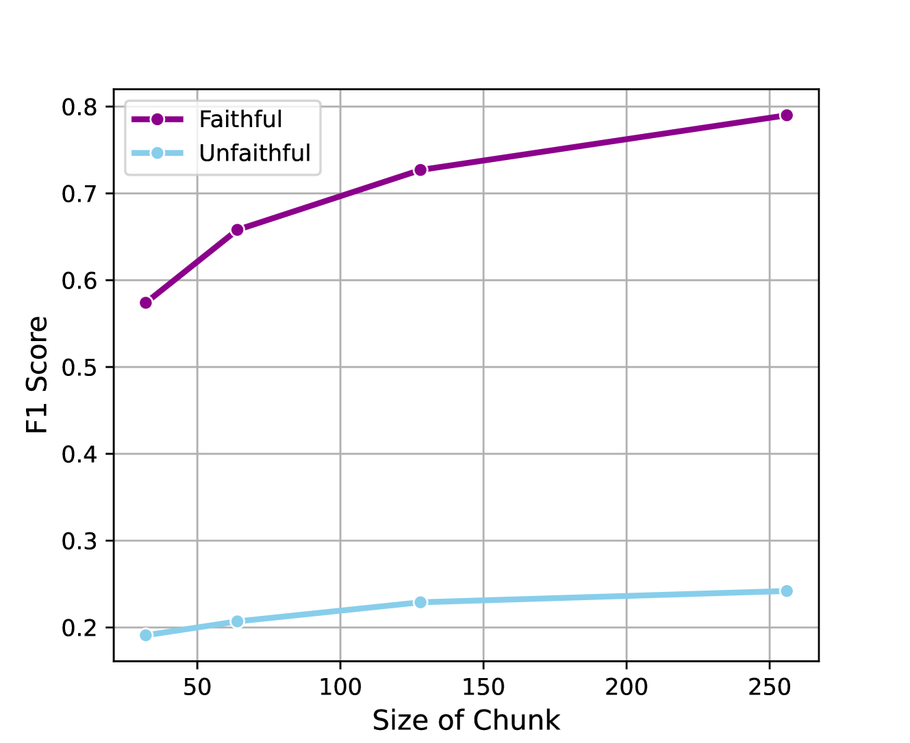

# FABLES：探究书籍摘要的真实度与内容筛选

发布时间：2024年04月01日

`LLM应用` `书籍摘要` `自动评估`

> FABLES: Evaluating faithfulness and content selection in book-length summarization

# 摘要

> 长篇幅的大型语言模型（LLM）理论上能够概括长达百万字符的书籍文档，但文档的篇幅和复杂度限制了对忠实度等输入相关特性的评估。本研究首次对2023至2024年间出版的小说摘要，进行了大规模的人类评估，以LLM的忠实度和内容选择为焦点。为避免数据污染，我们挑选了已完整阅读过这些书籍的注释者参与评估，以降低成本和认知负担。我们创建了FABLES数据集，包含26本书籍摘要中3,158个声明的注释，仅花费5200美元，据此对LLM摘要生成器的忠实度进行排名。结果显示，Claude-3-Opus的表现远超所有闭源LLM，而开源的Mixtral与GPT-3.5-Turbo不相上下。分析发现，大多数不忠实的声明与事件和角色状态紧密相关，通常需要对叙事进行间接推理才能识别。尽管基于LLM的自动评分器在其他场景中对事实性和连贯性的评估颇为可靠，我们开发的多个LLM忠实度评分器却与人类注释的关联性不强，尤其在识别不忠实声明方面。我们的实验指出，检测不忠实声明不仅是摘要评估的重要方向，也是长文本理解的重要测试场。此外，我们还探讨了书长摘要中的内容选择错误，建立了与关键叙事元素相关的遗漏错误分类，并发现对书籍末尾事件的过度强调是一种系统性现象。

> While long-context large language models (LLMs) can technically summarize book-length documents (>100K tokens), the length and complexity of the documents have so far prohibited evaluations of input-dependent aspects like faithfulness. In this paper, we conduct the first large-scale human evaluation of faithfulness and content selection on LLM-generated summaries of fictional books. Our study mitigates the issue of data contamination by focusing on summaries of books published in 2023 or 2024, and we hire annotators who have fully read each book prior to the annotation task to minimize cost and cognitive burden. We collect FABLES, a dataset of annotations on 3,158 claims made in LLM-generated summaries of 26 books, at a cost of $5.2K USD, which allows us to rank LLM summarizers based on faithfulness: Claude-3-Opus significantly outperforms all closed-source LLMs, while the open-source Mixtral is on par with GPT-3.5-Turbo. An analysis of the annotations reveals that most unfaithful claims relate to events and character states, and they generally require indirect reasoning over the narrative to invalidate. While LLM-based auto-raters have proven reliable for factuality and coherence in other settings, we implement several LLM raters of faithfulness and find that none correlates strongly with human annotations, especially with regard to detecting unfaithful claims. Our experiments suggest that detecting unfaithful claims is an important future direction not only for summarization evaluation but also as a testbed for long-context understanding. Finally, we move beyond faithfulness by exploring content selection errors in book-length summarization: we develop a typology of omission errors related to crucial narrative elements and also identify a systematic over-emphasis on events occurring towards the end of the book.

[Arxiv](https://arxiv.org/abs/2404.01261)