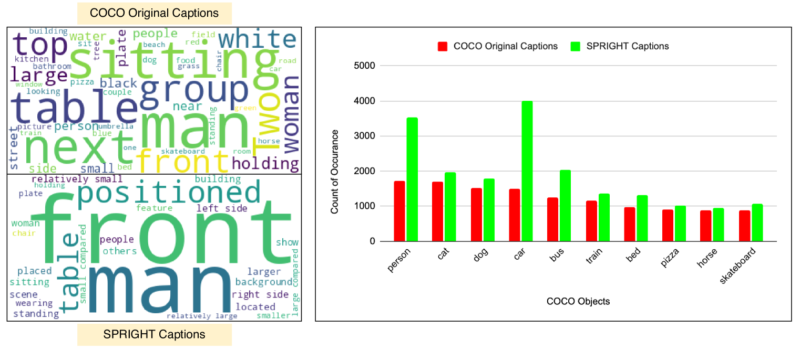
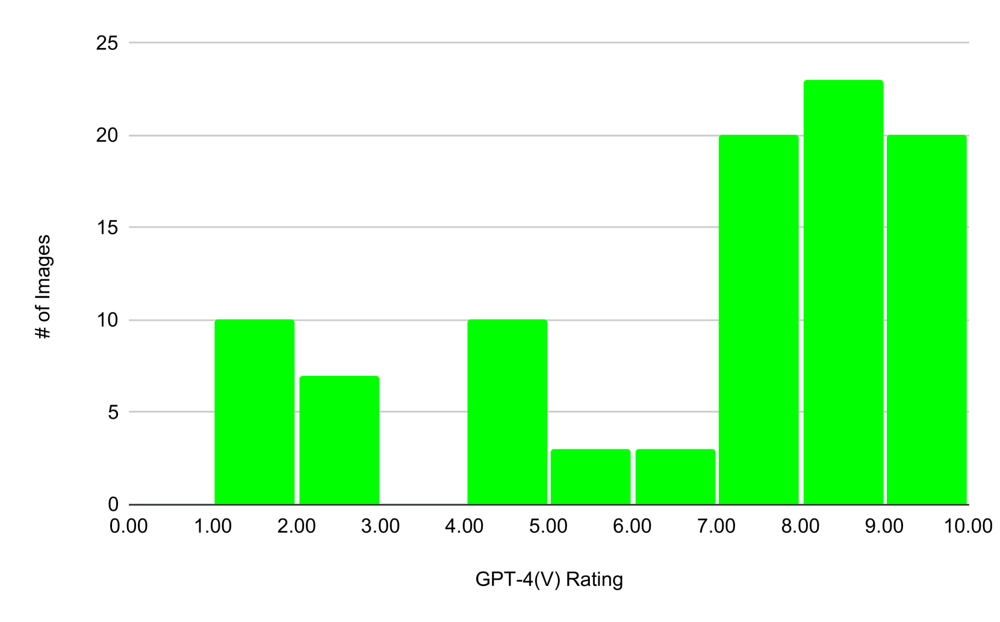
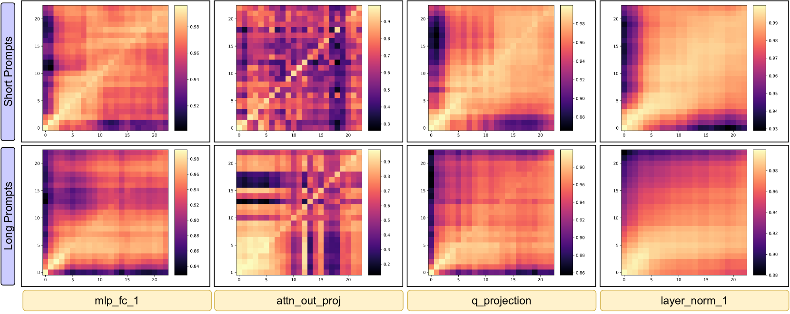
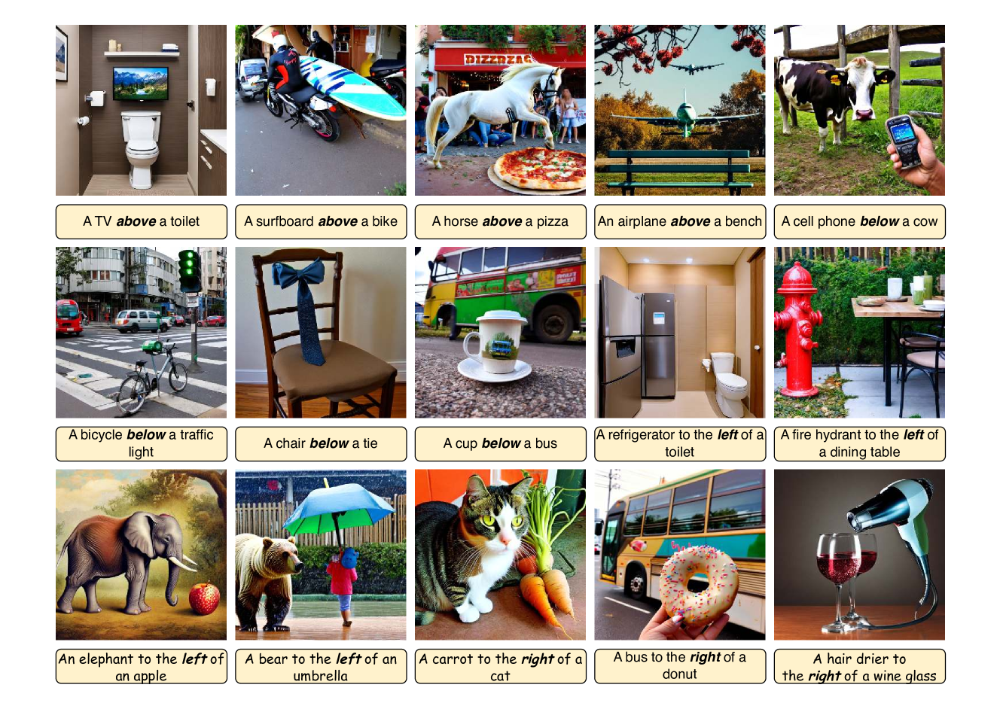
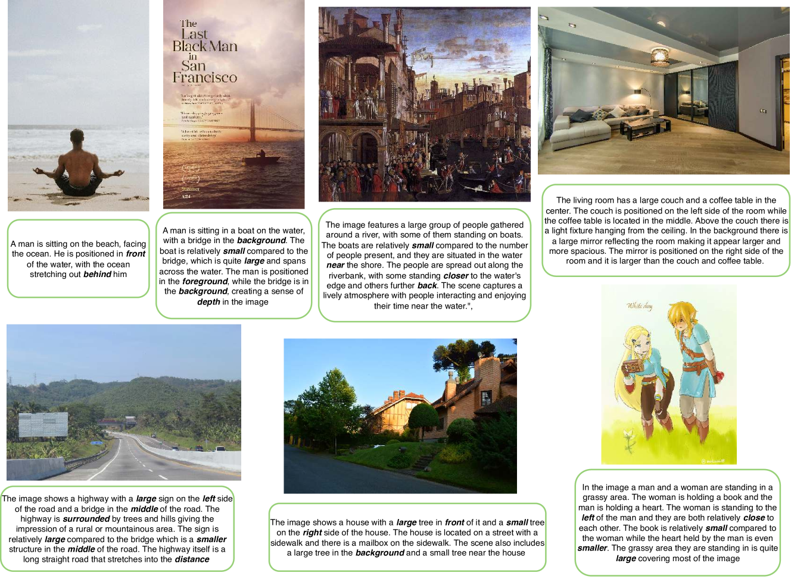
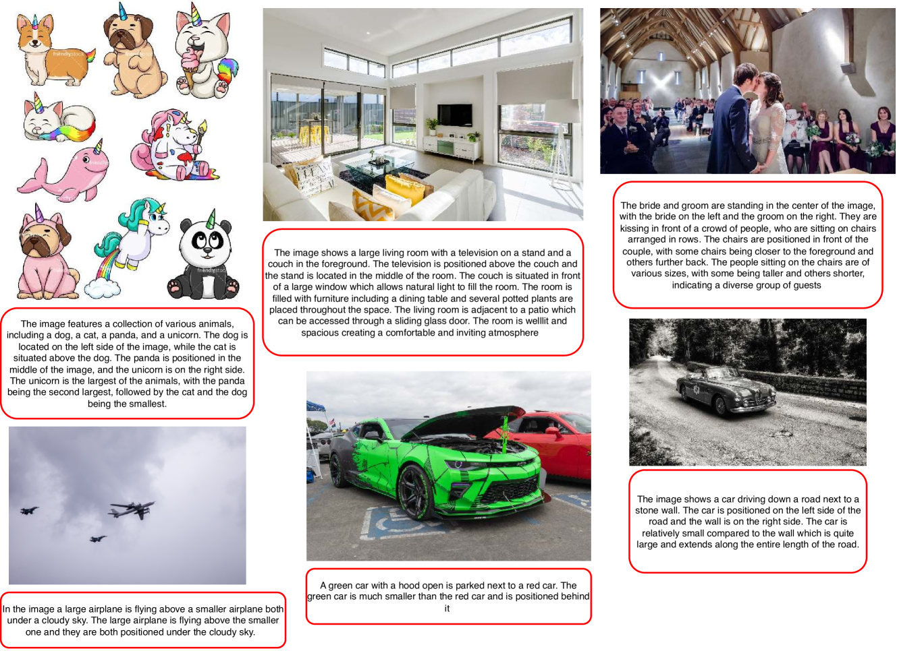

# 精准把握：提升文本转图像模型的空间连贯性

发布时间：2024年04月01日

`RAG` `计算机视觉`

> Getting it Right: Improving Spatial Consistency in Text-to-Image Models

# 摘要

> 目前文本到图像模型面临的一个挑战是，它们往往无法稳定地生成与文本描述的空间关系完全吻合的图像。本文深入探讨了这一问题，并提出了一系列创新的数据集和方法，以达到最先进的性能水平。我们首先发现，现有的视觉-语言数据集在空间关系的表现上尚有不足，为此我们创立了SPRIGHT——首个专注于空间关系的大规模数据集，它通过重新为来自四个知名视觉数据集的600万张图像配文而构建。经过三阶段的评估与分析，证实SPRIGHT在捕捉空间关系方面显著优于以往的数据集。仅使用SPRIGHT数据集的一小部分，我们就在生成空间准确度上取得了22%的进步，并提升了FID和CMMD指标。此外，我们还发现，训练模型识别包含众多物体的图像，能显著增强空间一致性。尤为值得一提的是，我们在T2I-CompBench基准测试中以0.2133的空间得分创造了新纪录，这仅是通过在不足500张图像上进行微调实现的。通过一系列控制实验和消融研究，我们记录了多项发现，这些发现有助于深化我们对文本到图像模型中影响空间一致性因素的理解。为了推动该领域的发展，我们公开了我们的数据集和模型。

> One of the key shortcomings in current text-to-image (T2I) models is their inability to consistently generate images which faithfully follow the spatial relationships specified in the text prompt. In this paper, we offer a comprehensive investigation of this limitation, while also developing datasets and methods that achieve state-of-the-art performance. First, we find that current vision-language datasets do not represent spatial relationships well enough; to alleviate this bottleneck, we create SPRIGHT, the first spatially-focused, large scale dataset, by re-captioning 6 million images from 4 widely used vision datasets. Through a 3-fold evaluation and analysis pipeline, we find that SPRIGHT largely improves upon existing datasets in capturing spatial relationships. To demonstrate its efficacy, we leverage only ~0.25% of SPRIGHT and achieve a 22% improvement in generating spatially accurate images while also improving the FID and CMMD scores. Secondly, we find that training on images containing a large number of objects results in substantial improvements in spatial consistency. Notably, we attain state-of-the-art on T2I-CompBench with a spatial score of 0.2133, by fine-tuning on <500 images. Finally, through a set of controlled experiments and ablations, we document multiple findings that we believe will enhance the understanding of factors that affect spatial consistency in text-to-image models. We publicly release our dataset and model to foster further research in this area.

[Arxiv](https://arxiv.org/abs/2404.01197)