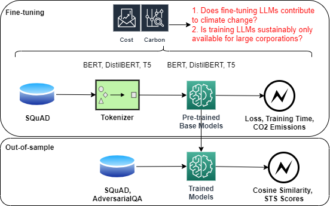

# 绿色AI：研究大型语言模型训练过程中的碳排放、减排措施及其平衡之道。

发布时间：2024年04月01日

`LLM理论` `人工智能`

> Green AI: Exploring Carbon Footprints, Mitigation Strategies, and Trade Offs in Large Language Model Training

# 摘要

> 自然语言处理领域的杰出研究一直在努力通过优化训练方法、调整模型结构和深化数据集来创新模型，以提升性能。然而，随着NLP领域的快速发展，随之而来的是温室气体排放的增加，这引起了人们对训练大型语言模型可能造成的环境破坏的担忧。深入了解人工智能相关的各种成本，尤其是环境方面的成本，对于确保AI模型的安全性至关重要。目前，对AI模型CO2排放量的研究尚处于起步阶段。在本文中，我们评估了一些知名大型语言模型的CO2排放量，这些模型因其庞大的模型参数而留下显著的碳足迹。我们提倡以负责任和可持续的方式进行LLM训练，并提出了减少碳排放的策略。此外，我们还探讨了硬件选择对CO2排放的影响，通过比较两种常用GPU在模型训练过程中的CO2排放。根据我们的研究结果，我们分析了所提解决方案的优劣，并论证了在不损害模型鲁棒性和性能的前提下，训练更加环保的AI模型的可能性。

> Prominent works in the field of Natural Language Processing have long attempted to create new innovative models by improving upon previous model training approaches, altering model architecture, and developing more in-depth datasets to better their performance. However, with the quickly advancing field of NLP comes increased greenhouse gas emissions, posing concerns over the environmental damage caused by training LLMs. Gaining a comprehensive understanding of the various costs, particularly those pertaining to environmental aspects, that are associated with artificial intelligence serves as the foundational basis for ensuring safe AI models. Currently, investigations into the CO2 emissions of AI models remain an emerging area of research, and as such, in this paper, we evaluate the CO2 emissions of well-known large language models, which have an especially high carbon footprint due to their significant amount of model parameters. We argue for the training of LLMs in a way that is responsible and sustainable by suggesting measures for reducing carbon emissions. Furthermore, we discuss how the choice of hardware affects CO2 emissions by contrasting the CO2 emissions during model training for two widely used GPUs. Based on our results, we present the benefits and drawbacks of our proposed solutions and make the argument for the possibility of training more environmentally safe AI models without sacrificing their robustness and performance.

[Arxiv](https://arxiv.org/abs/2404.01157)