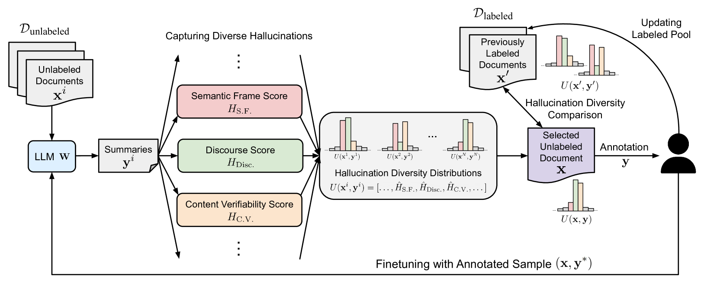
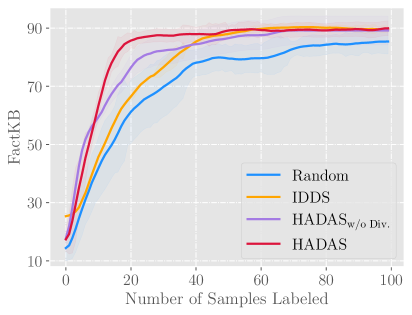
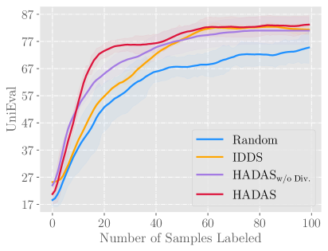
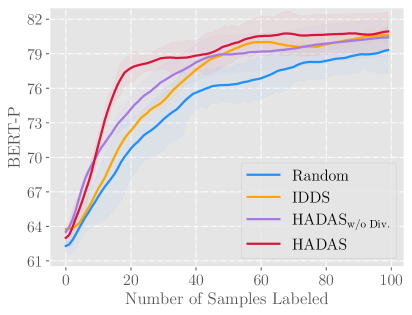
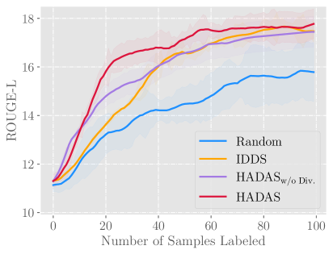
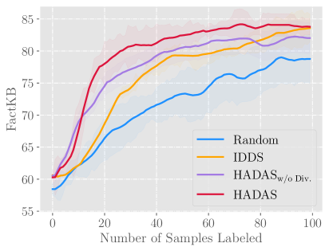
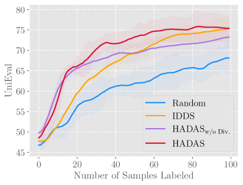
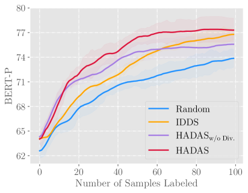
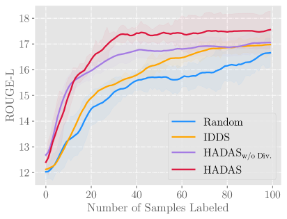

# 在文本摘要中，我们采用一种幻觉多样性感知的主动学习方法。

发布时间：2024年04月01日

`LLM应用` `人工智能` `机器学习`

> Hallucination Diversity-Aware Active Learning for Text Summarization

# 摘要

> 大型语言模型（LLMs）有时会产出虚假信息，即那些与事实不符或缺乏依据的文本。目前缓解这种幻觉问题的策略通常依赖于昂贵的人工注释来发现并修正LLM生成的虚假内容。而且，这些策略大多只针对某一特定类型的幻觉，如实体或标记错误，这在应对LLM输出中出现的多种幻觉类型时显得力不从心。在本文中，我们首次提出了一种主动学习框架，旨在减少LLM幻觉问题所需的昂贵人工注释。通过细致地衡量文本摘要中语义框架、论述连贯性和内容真实性方面的错误，我们引入了HAllucination Diversity-Aware Sampling（HADAS）方法，以在LLM微调的主动学习过程中挑选出多样化的幻觉样本进行注释。在三个不同数据集和多种基础模型上的广泛实验表明，我们的方法在有效性和效率上都显著降低了LLM的幻觉现象。

> Large Language Models (LLMs) have shown propensity to generate hallucinated outputs, i.e., texts that are factually incorrect or unsupported. Existing methods for alleviating hallucinations typically require costly human annotations to identify and correct hallucinations in LLM outputs. Moreover, most of these methods focus on a specific type of hallucination, e.g., entity or token errors, which limits their effectiveness in addressing various types of hallucinations exhibited in LLM outputs. To our best knowledge, in this paper we propose the first active learning framework to alleviate LLM hallucinations, reducing costly human annotations of hallucination needed. By measuring fine-grained hallucinations from errors in semantic frame, discourse and content verifiability in text summarization, we propose HAllucination Diversity-Aware Sampling (HADAS) to select diverse hallucinations for annotations in active learning for LLM finetuning. Extensive experiments on three datasets and different backbone models demonstrate advantages of our method in effectively and efficiently mitigating LLM hallucinations.

[Arxiv](https://arxiv.org/abs/2404.01588)