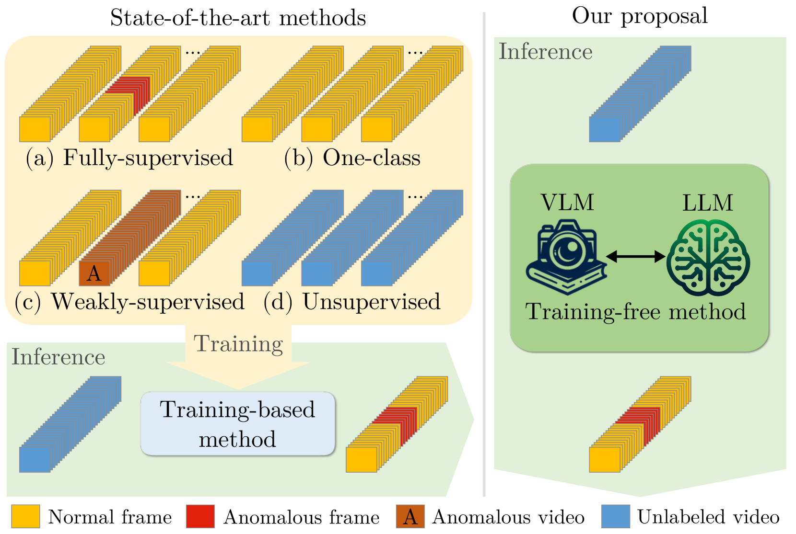
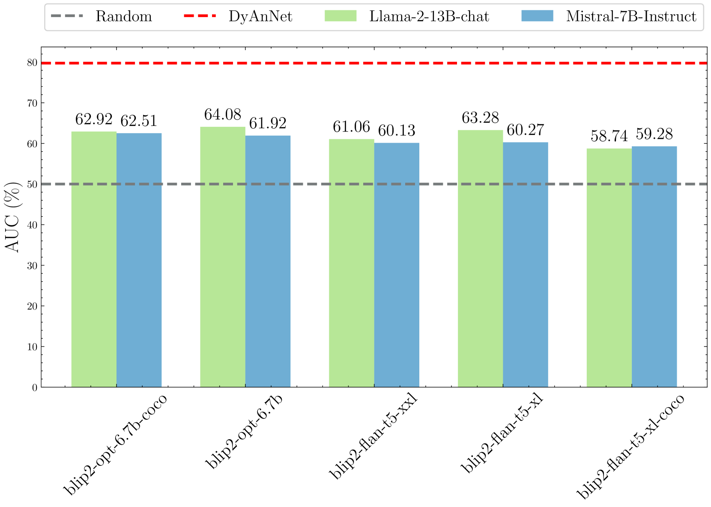
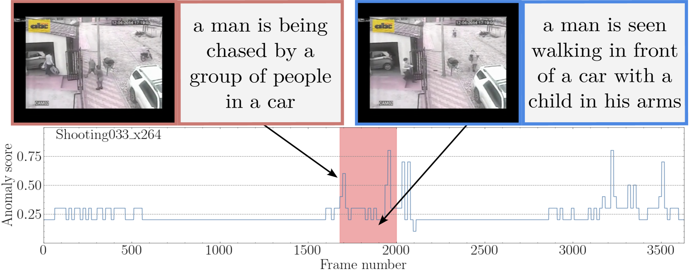
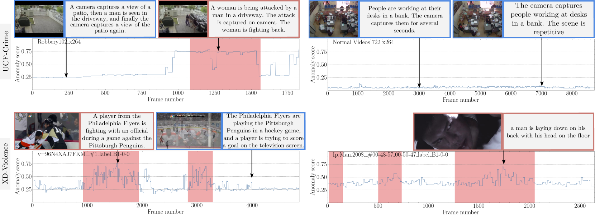
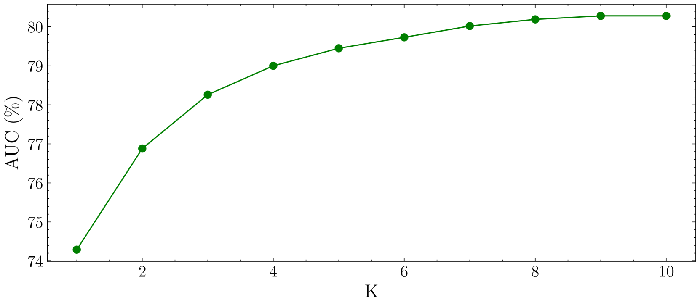
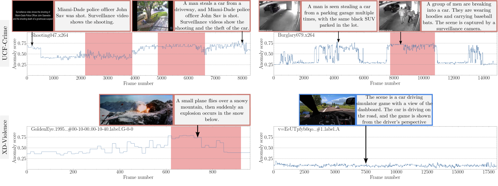

# 通过运用大型语言模型，我们可以实现无需额外训练的视频异常检测技术。

发布时间：2024年04月01日

`LLM应用` `视频监控` `异常检测`

> Harnessing Large Language Models for Training-free Video Anomaly Detection

# 摘要

> 视频异常检测（VAD）致力于在视频流中精确发现异常行为。传统方法通常通过训练深度学习模型来掌握正常行为的规律，这些方法可能需要视频级别的指导、单一类别的监督学习，或是在无监督环境下进行。然而，这些基于训练的方法往往与特定领域紧密相关，导致在实际应用中需要大量成本，因为一旦领域发生变化，就必须重新进行数据搜集和模型训练。在本研究中，我们突破传统束缚，提出了一种全新的无需训练的VAD方法——基于语言的视频异常检测（LAVAD），该方法充分发挥了预训练的大型语言模型（LLMs）和现成的视觉-语言模型（VLMs）的潜力。我们运用VLM支持的字幕生成模型，为测试视频中的每一帧生成文字描述。借助这些文本场景描述，我们设计了一种提示机制，激活LLMs在时间序列整合和异常评分方面的能力，使其成为一个高效的视频异常探测器。我们还利用与模态相协调的VLM，并提出了基于跨模态相似性的创新技术，以清除不稳定的字幕并优化LLM的异常检测分数。我们在两个涵盖真实监控场景的大型数据集上对LAVAD进行了评估，结果显示，它在无需任何训练或数据收集的情况下，超越了无监督和单类方法的性能。

> Video anomaly detection (VAD) aims to temporally locate abnormal events in a video. Existing works mostly rely on training deep models to learn the distribution of normality with either video-level supervision, one-class supervision, or in an unsupervised setting. Training-based methods are prone to be domain-specific, thus being costly for practical deployment as any domain change will involve data collection and model training. In this paper, we radically depart from previous efforts and propose LAnguage-based VAD (LAVAD), a method tackling VAD in a novel, training-free paradigm, exploiting the capabilities of pre-trained large language models (LLMs) and existing vision-language models (VLMs). We leverage VLM-based captioning models to generate textual descriptions for each frame of any test video. With the textual scene description, we then devise a prompting mechanism to unlock the capability of LLMs in terms of temporal aggregation and anomaly score estimation, turning LLMs into an effective video anomaly detector. We further leverage modality-aligned VLMs and propose effective techniques based on cross-modal similarity for cleaning noisy captions and refining the LLM-based anomaly scores. We evaluate LAVAD on two large datasets featuring real-world surveillance scenarios (UCF-Crime and XD-Violence), showing that it outperforms both unsupervised and one-class methods without requiring any training or data collection.

[Arxiv](https://arxiv.org/abs/2404.01014)