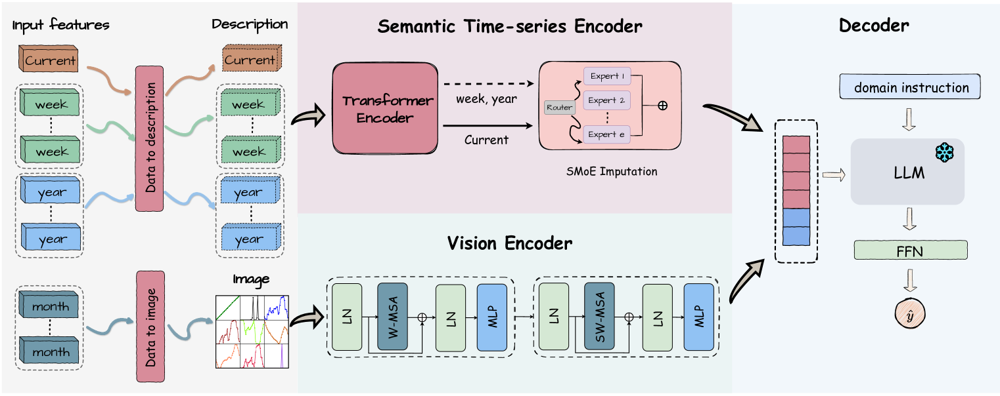
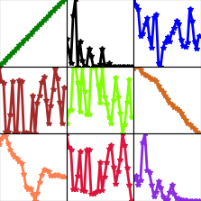
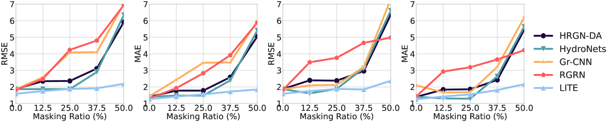

# LITE：借助多模态大型语言模型，构建环境生态系统模型

发布时间：2024年04月01日

`LLM应用` `环境科学` `大数据`

> LITE: Modeling Environmental Ecosystems with Multimodal Large Language Models

# 摘要

> 环境生态模型对于地球的可持续治理至关重要。精确预测环境变量的时空变化，有助于明智决策，提升人类福祉。深度学习方法在预测环境变量的时空关系上展现出希望，但在处理环境数据中的不完整性和分布偏移方面仍有局限，这些问题通常由数据收集成本和测量误差引起。为此，我们引入了 LITE -- 一款针对环境生态系统建模的多模态大型语言模型。LITE 通过将环境变量转换成自然语言和图表，实现了数据的统一表达。利用统一编码器捕捉多模态数据的时空动态和相互关系，并通过稀疏专家混合框架对缺失特征进行补全，同时通过多尺度历史数据应对分布偏移。在领域知识的指导下，语言模型综合多模态信息进行预测。实验证明，LITE 在环境时空预测方面显著超越现有最佳方法，预测误差降低了 41.25%。相关数据和代码已在 https://github.com/hrlics/LITE 上公开。

> The modeling of environmental ecosystems plays a pivotal role in the sustainable management of our planet. Accurate prediction of key environmental variables over space and time can aid in informed policy and decision-making, thus improving people's livelihood. Recently, deep learning-based methods have shown promise in modeling the spatial-temporal relationships for predicting environmental variables. However, these approaches often fall short in handling incomplete features and distribution shifts, which are commonly observed in environmental data due to the substantial cost of data collection and malfunctions in measuring instruments. To address these issues, we propose LITE -- a multimodal large language model for environmental ecosystems modeling. Specifically, LITE unifies different environmental variables by transforming them into natural language descriptions and line graph images. Then, LITE utilizes unified encoders to capture spatial-temporal dynamics and correlations in different modalities. During this step, the incomplete features are imputed by a sparse Mixture-of-Experts framework, and the distribution shift is handled by incorporating multi-granularity information from past observations. Finally, guided by domain instructions, a language model is employed to fuse the multimodal representations for the prediction. Our experiments demonstrate that LITE significantly enhances performance in environmental spatial-temporal prediction across different domains compared to the best baseline, with a 41.25% reduction in prediction error. This justifies its effectiveness. Our data and code are available at https://github.com/hrlics/LITE.

[Arxiv](https://arxiv.org/abs/2404.01165)