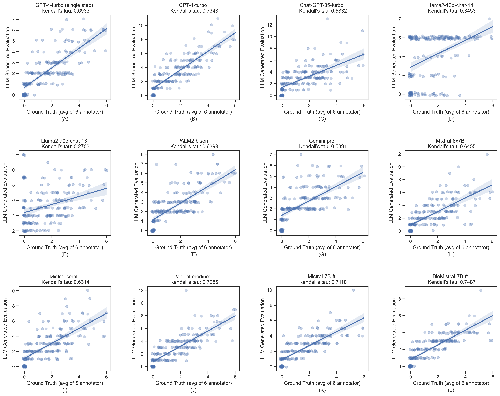
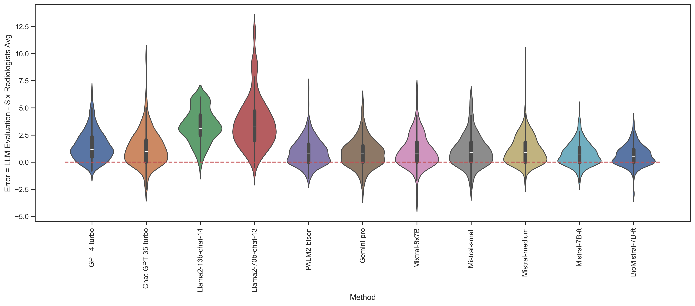
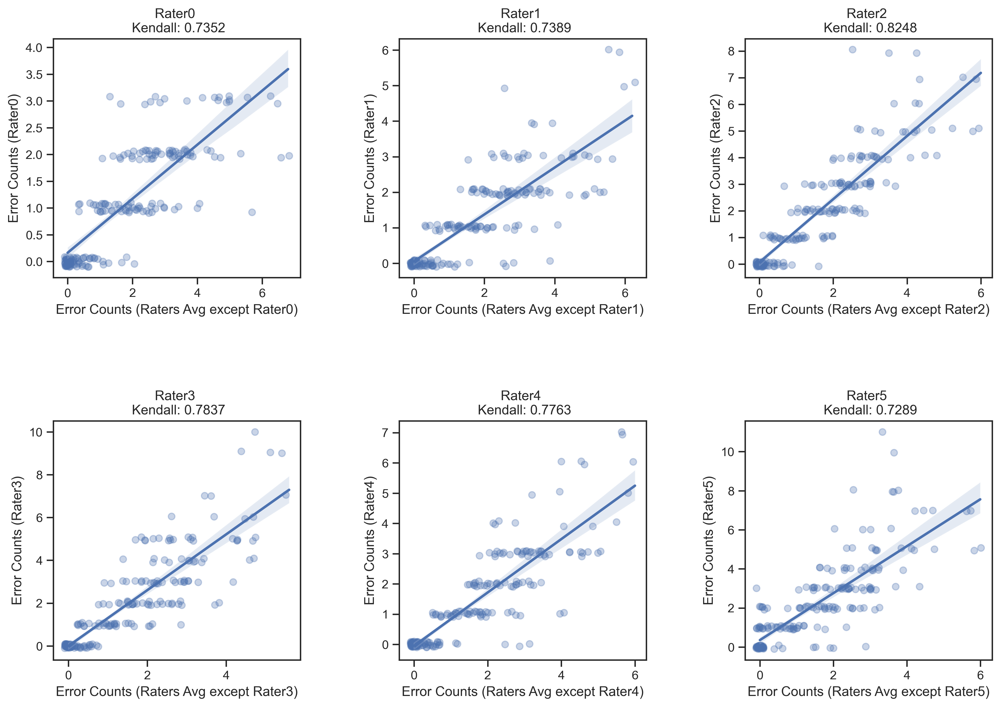
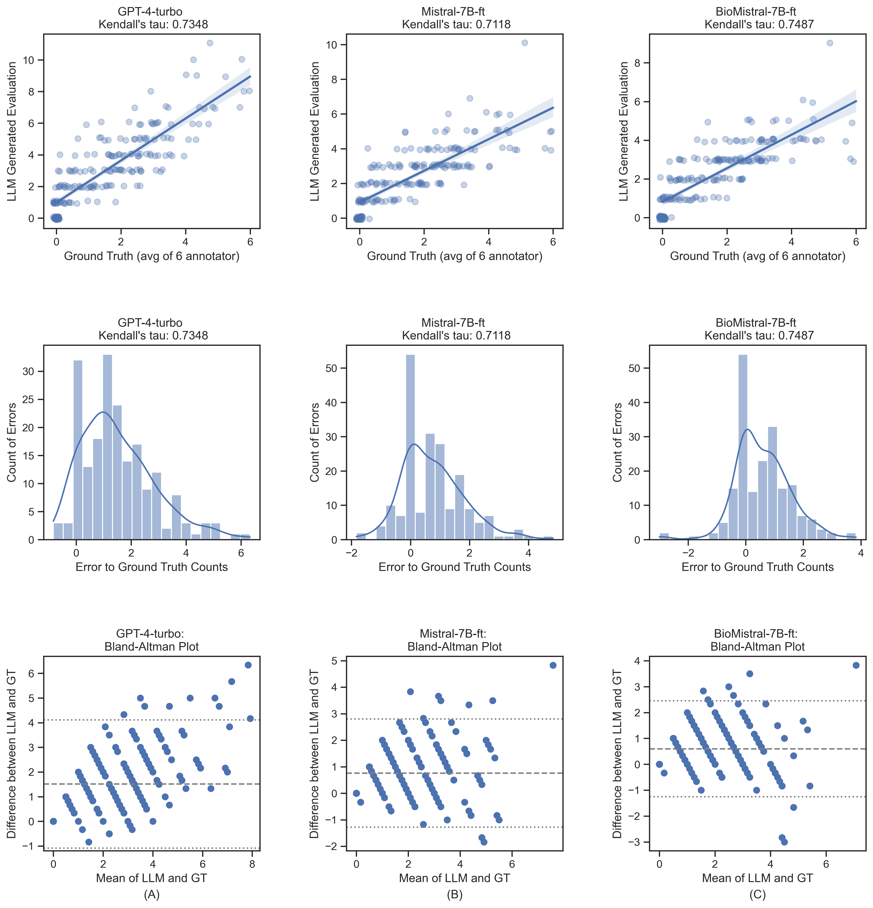

# LLM-RadJudge：在生成X光报告方面达到放射科医生的评估水准

发布时间：2024年04月01日

`LLM应用` `放射学` `人工智能`

> LLM-RadJudge: Achieving Radiologist-Level Evaluation for X-Ray Report Generation

# 摘要

> 为放射学AI的发展把脉，关键在于精准评估生成的放射学报告，然而传统评估标准并未完全满足临床实际需求。本研究创新性地采用大型语言模型（LLMs）作为评估工具，对放射学报告进行对比分析。研究发现，采用GPT-4模型时，我们的评估方法在一致性上接近专业放射科医师的水平。为了实现成本效益和普及应用，我们利用LLM评估结果构建数据集，并通过知识蒸馏技术培养出一个小型模型。这个小型模型在评估能力上与GPT-4不相上下。我们的评估框架及蒸馏后的模型，为放射学报告的生成提供了一种高效且易于获取的评估方案，有助于推动更具临床价值的模型研发。该模型未来也将开放源代码，以便更多人使用。

> Evaluating generated radiology reports is crucial for the development of radiology AI, but existing metrics fail to reflect the task's clinical requirements. This study proposes a novel evaluation framework using large language models (LLMs) to compare radiology reports for assessment. We compare the performance of various LLMs and demonstrate that, when using GPT-4, our proposed metric achieves evaluation consistency close to that of radiologists. Furthermore, to reduce costs and improve accessibility, making this method practical, we construct a dataset using LLM evaluation results and perform knowledge distillation to train a smaller model. The distilled model achieves evaluation capabilities comparable to GPT-4. Our framework and distilled model offer an accessible and efficient evaluation method for radiology report generation, facilitating the development of more clinically relevant models. The model will be further open-sourced and accessible.

[Arxiv](https://arxiv.org/abs/2404.00998)