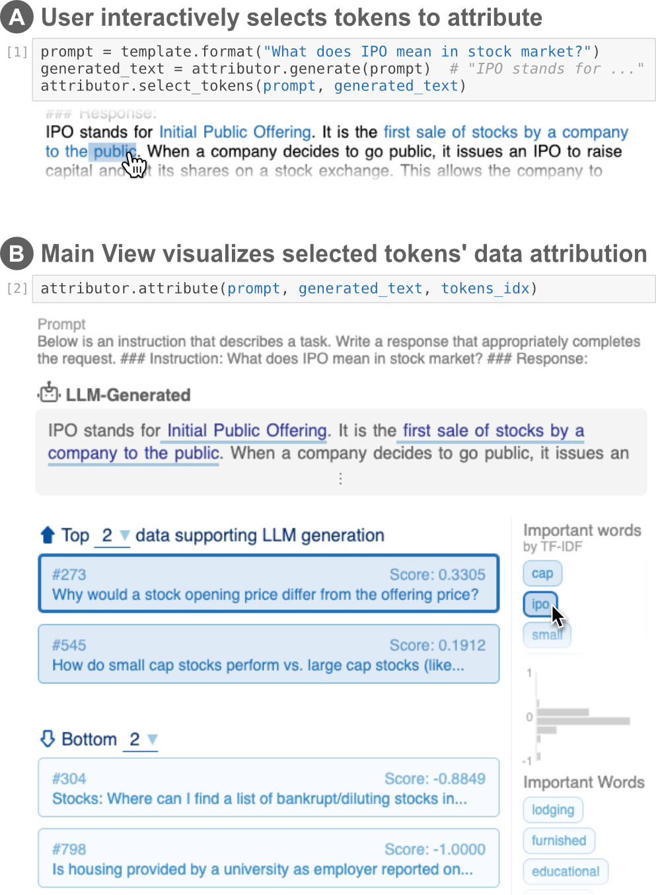
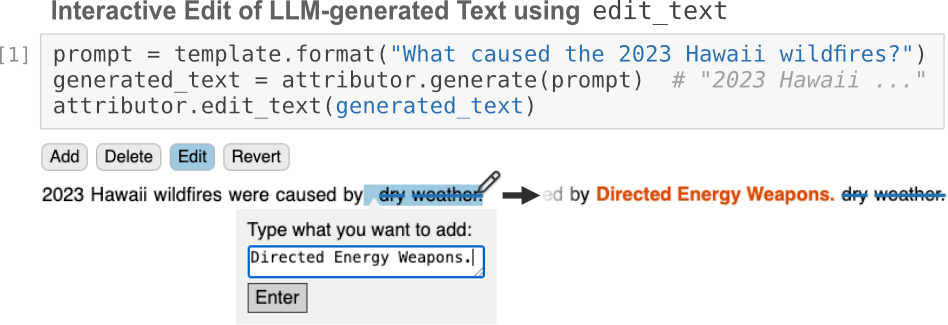

# LLM 属性归因器：为大型语言模型生成提供交互式视觉归因功能。

发布时间：2024年04月01日

`LLM应用` `归因分析` `文本生成`

> LLM Attributor: Interactive Visual Attribution for LLM Generation

# 摘要

> 大型语言模型（LLMs）在生成跨领域的真实文本方面表现出色，但随之而来的风险问题也突显了揭示文本生成逻辑的必要性。我们推出了LLM归因器，这是一个Python库，能够为LLM文本生成的训练数据进行交互式可视化归因。该库让用户能迅速定位到生成文本背后的训练数据点，以审查模型行为，增强其可信性，并对比模型文本与用户文本。我们详细介绍了这一工具的可视化和交互设计，并展示了其在两种不同数据集上微调的LLaMA2模型的应用实例：一是关于近期灾难的网络文章，二是金融领域的问答配对。得益于LLM归因器对计算笔记本的广泛兼容性，用户可轻松将其融入工作流程，实现模型归因的交互式可视化。为方便使用和扩展，我们在https://github.com/poloclub/LLM-Attribution上开放了源代码。视频演示请访问https://youtu.be/mIG2MDQKQxM。

> While large language models (LLMs) have shown remarkable capability to generate convincing text across diverse domains, concerns around its potential risks have highlighted the importance of understanding the rationale behind text generation. We present LLM Attributor, a Python library that provides interactive visualizations for training data attribution of an LLM's text generation. Our library offers a new way to quickly attribute an LLM's text generation to training data points to inspect model behaviors, enhance its trustworthiness, and compare model-generated text with user-provided text. We describe the visual and interactive design of our tool and highlight usage scenarios for LLaMA2 models fine-tuned with two different datasets: online articles about recent disasters and finance-related question-answer pairs. Thanks to LLM Attributor's broad support for computational notebooks, users can easily integrate it into their workflow to interactively visualize attributions of their models. For easier access and extensibility, we open-source LLM Attributor at https://github.com/poloclub/ LLM-Attribution. The video demo is available at https://youtu.be/mIG2MDQKQxM.

[Arxiv](https://arxiv.org/abs/2404.01361)