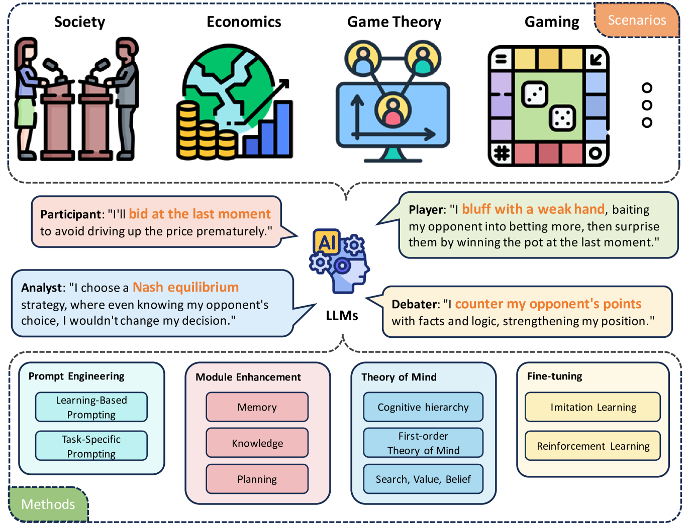
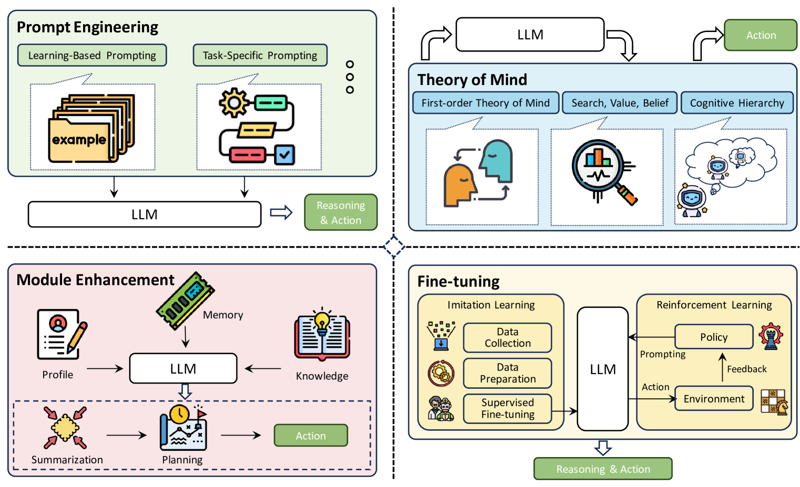

# 大型语言模型：策略性推理的探索之旅

发布时间：2024年04月01日

`LLM应用` `战略推理` `人工智能`

> LLM as a Mastermind: A Survey of Strategic Reasoning with Large Language Models

# 摘要

> 本文深入探讨了大型语言模型（LLMs）在战略推理领域的最新进展与机遇。战略推理，作为一种复杂的思维过程，要求我们不仅要理解和预测多智能体环境中的对手行为，还要能够灵活调整自己的策略。这种推理方式特别强调在不断变化的互动中理解环境和预测他人行为的重要性。文章详细分析了LLMs在战略推理中的应用范围、实际应用、研究方法和评估标准，突出了这一新兴领域的快速发展以及跨学科研究如何提升模型的决策能力。此外，本文还旨在整理和阐释这一主题下分散的研究文献，为读者提供一个系统的综述，强调战略推理作为一项关键的认知能力的重要性，并为未来的研究动向和可能的技术提升提供深刻洞见。

> This paper presents a comprehensive survey of the current status and opportunities for Large Language Models (LLMs) in strategic reasoning, a sophisticated form of reasoning that necessitates understanding and predicting adversary actions in multi-agent settings while adjusting strategies accordingly. Strategic reasoning is distinguished by its focus on the dynamic and uncertain nature of interactions among multi-agents, where comprehending the environment and anticipating the behavior of others is crucial. We explore the scopes, applications, methodologies, and evaluation metrics related to strategic reasoning with LLMs, highlighting the burgeoning development in this area and the interdisciplinary approaches enhancing their decision-making performance. It aims to systematize and clarify the scattered literature on this subject, providing a systematic review that underscores the importance of strategic reasoning as a critical cognitive capability and offers insights into future research directions and potential improvements.

[Arxiv](https://arxiv.org/abs/2404.01230)