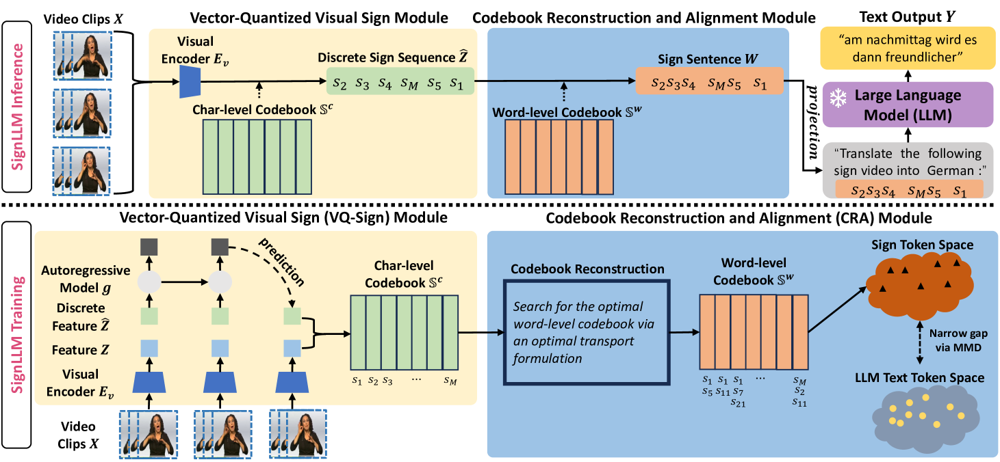
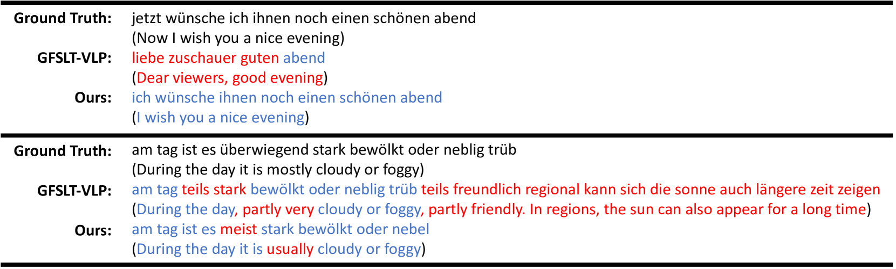

# 大型语言模型擅长于手语翻译。

发布时间：2024年04月01日

`LLM应用` `手语翻译` `计算机视觉`

> LLMs are Good Sign Language Translators

# 摘要

> 手语翻译（SLT）任务致力于将手语视频转化为口语表达，这一领域充满挑战。本研究借鉴了大型语言模型（LLMs）在多语言文本上的卓越翻译能力，尝试利用现有的LLMs来解决SLT问题。我们对手语视频进行了规范化处理，使其具备口语的语言属性，并引入了创新的SignLLM框架，将手语视频转换成易于现成LLMs理解的语言形式。SignLLM框架包含两大核心组件：首先是将手语视频转换为一系列字符级手语标记的向量量化视觉模块；其次是利用最优传输方法，将字符级标记转换为单词级手语表示的代码簿重建与对齐模块。此外，我们还引入了手语-文本对齐损失，以加强手语与文本之间的语义匹配。最终，我们在两个业界公认的SLT基准测试中取得了领先的无术语翻译成果。

> Sign Language Translation (SLT) is a challenging task that aims to translate sign videos into spoken language. Inspired by the strong translation capabilities of large language models (LLMs) that are trained on extensive multilingual text corpora, we aim to harness off-the-shelf LLMs to handle SLT. In this paper, we regularize the sign videos to embody linguistic characteristics of spoken language, and propose a novel SignLLM framework to transform sign videos into a language-like representation for improved readability by off-the-shelf LLMs. SignLLM comprises two key modules: (1) The Vector-Quantized Visual Sign module converts sign videos into a sequence of discrete character-level sign tokens, and (2) the Codebook Reconstruction and Alignment module converts these character-level tokens into word-level sign representations using an optimal transport formulation. A sign-text alignment loss further bridges the gap between sign and text tokens, enhancing semantic compatibility. We achieve state-of-the-art gloss-free results on two widely-used SLT benchmarks.

[Arxiv](https://arxiv.org/abs/2404.00925)