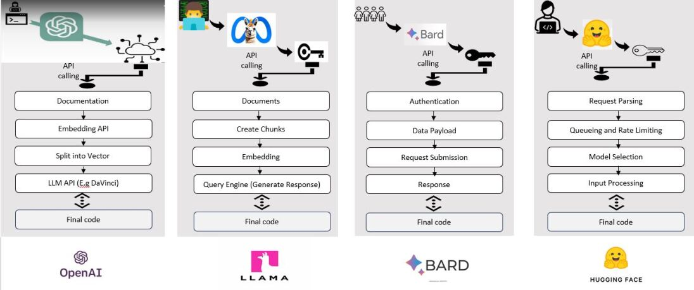

# 借助众多AI助手，我们对大型语言模型展开了评估，目前取得了一些初步成果。

发布时间：2024年04月01日

`RAG` `人工智能` `评估模型`

> Large Language Model Evaluation Via Multi AI Agents: Preliminary results

# 摘要

> 大型语言模型（LLMs）已成为研究和日常运作不可或缺的一部分，因此对其进行严格评估显得尤为重要。这不仅对单一任务至关重要，也有助于我们理解其对社会的影响与可能带来的风险。尽管已有许多尝试从多角度审视LLMs，但针对评估各类LLMs性能的多智能体AI模型仍显不足。为填补这一空白，我们提出了一种创新的多智能体AI模型，用以评估并对比不同LLMs的表现。该模型包含八位独特的AI代理，它们分别从GPT-3.5、GPT-3.5 Turbo、GPT-4、GPT-4 Turbo、Google Bard、LLAMA和Hugging Face等高级语言模型中，根据统一描述检索代码。我们的模型通过各语言模型的API获取指定描述的代码。同时，我们还开发了一个验证代理，负责评估其他代理生成代码的质量。通过将HumanEval基准测试整合进验证代理，我们得以评估所生成代码的性能，并洞察各模型的能力和效率。初步结果显示，GPT-3.5 Turbo模型的表现相对优于其他模型。这一初期分析作为基准测试，使我们能够直观地比较它们的性能。我们未来的目标是引入大量多任务Python（MBPP）基准测试，以提升评估过程的精确度。同时，我们计划将模型分享给来自不同领域的二十位专家，通过他们的测试反馈，进一步优化我们的模型。

> As Large Language Models (LLMs) have become integral to both research and daily operations, rigorous evaluation is crucial. This assessment is important not only for individual tasks but also for understanding their societal impact and potential risks. Despite extensive efforts to examine LLMs from various perspectives, there is a noticeable lack of multi-agent AI models specifically designed to evaluate the performance of different LLMs. To address this gap, we introduce a novel multi-agent AI model that aims to assess and compare the performance of various LLMs. Our model consists of eight distinct AI agents, each responsible for retrieving code based on a common description from different advanced language models, including GPT-3.5, GPT-3.5 Turbo, GPT-4, GPT-4 Turbo, Google Bard, LLAMA, and Hugging Face. Our developed model utilizes the API of each language model to retrieve code for a given high-level description. Additionally, we developed a verification agent, tasked with the critical role of evaluating the code generated by its counterparts. We integrate the HumanEval benchmark into our verification agent to assess the generated code's performance, providing insights into their respective capabilities and efficiencies. Our initial results indicate that the GPT-3.5 Turbo model's performance is comparatively better than the other models. This preliminary analysis serves as a benchmark, comparing their performances side by side. Our future goal is to enhance the evaluation process by incorporating the Massively Multitask Benchmark for Python (MBPP) benchmark, which is expected to further refine our assessment. Additionally, we plan to share our developed model with twenty practitioners from various backgrounds to test our model and collect their feedback for further improvement.

[Arxiv](https://arxiv.org/abs/2404.01023)