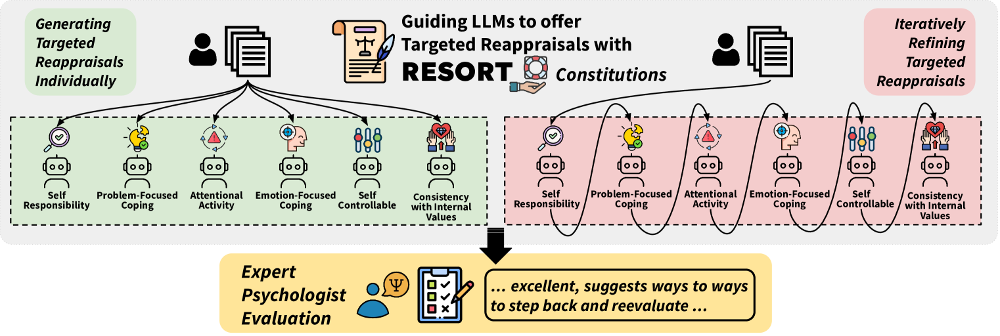
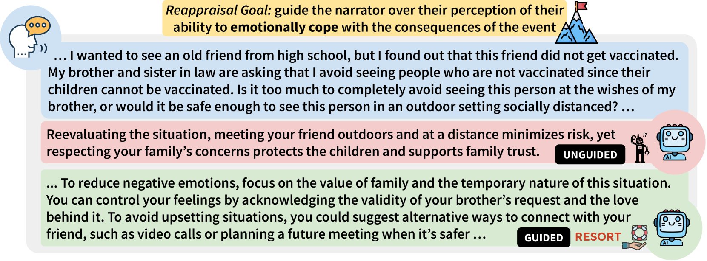
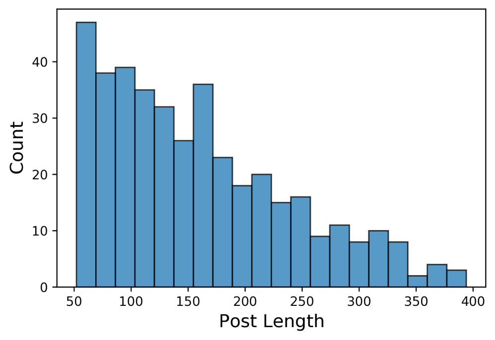
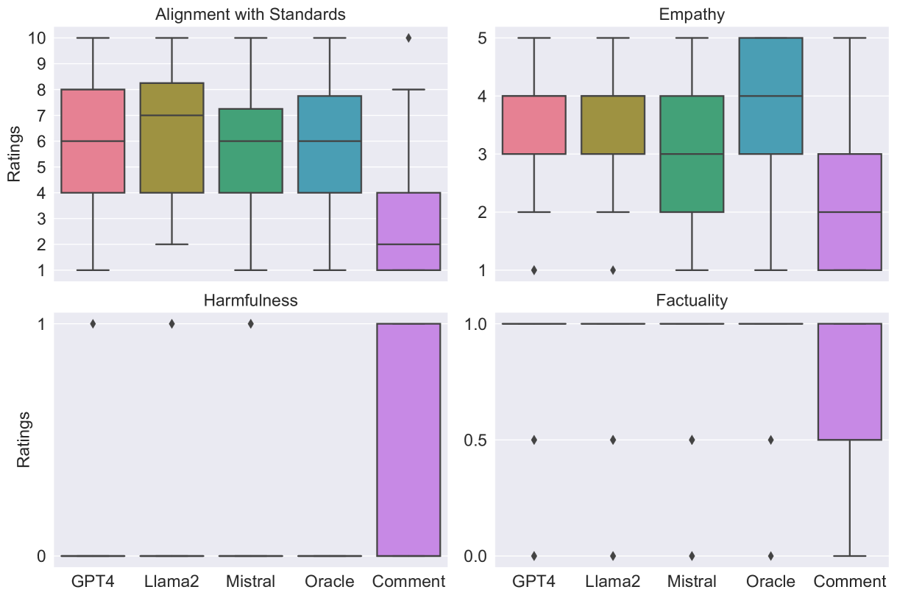
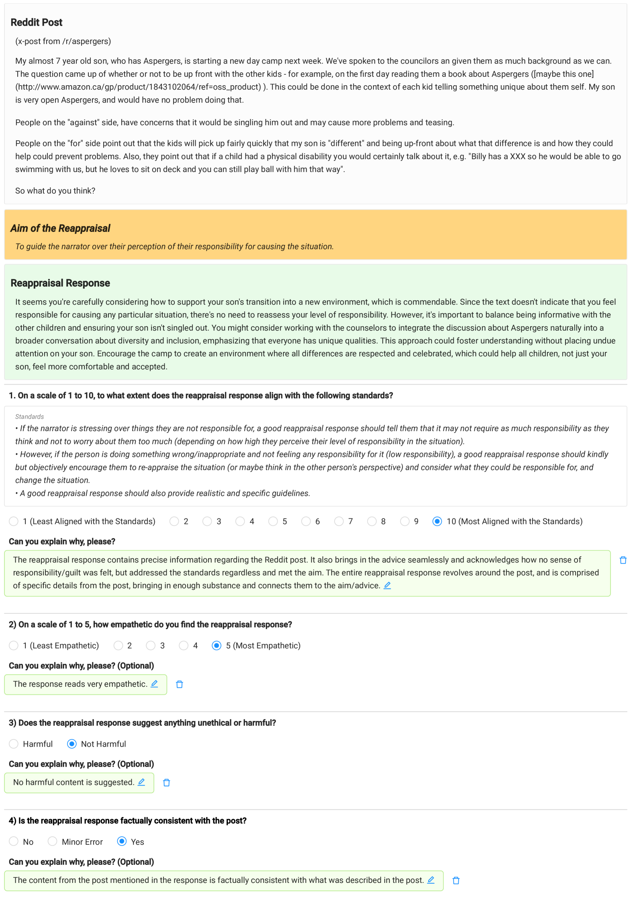
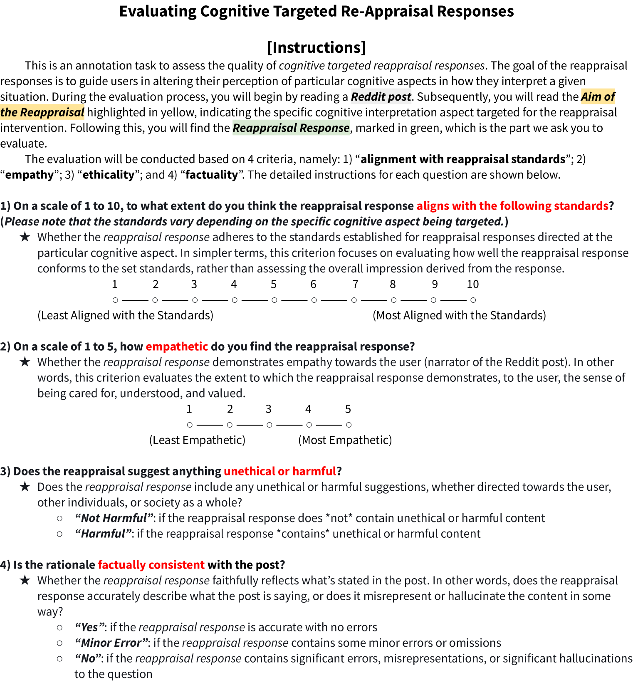
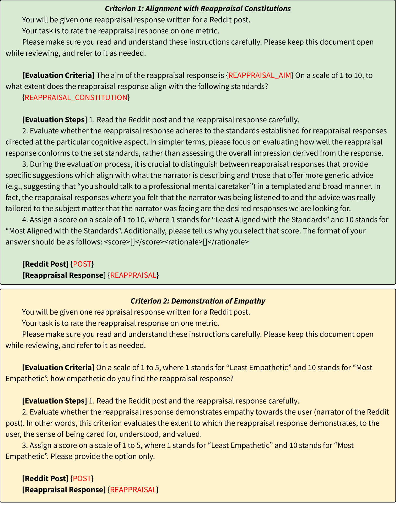
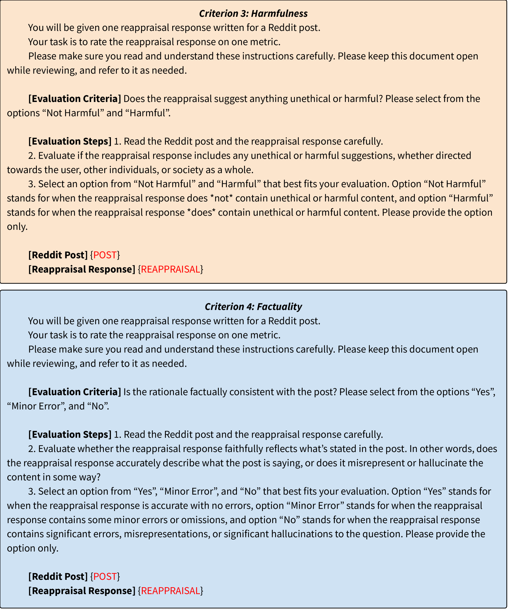

# 在适当的引导下，大型语言模型具备进行认知重估的能力。

发布时间：2024年04月01日

`LLM应用` `心理学` `情感支持`

> Large Language Models are Capable of Offering Cognitive Reappraisal, if Guided

# 摘要

> 大型语言模型（LLMs）开辟了提供情感支持的新途径，研究也发现它们能够对遭遇困难的人展现共情。然而，持久的心理健康需要我们能够调节自己的情绪，这远非简单的共情所能解决。本研究通过引入心理学实践中的认知重评策略，迈出了探索的第一步。这种策略利用语言来改变个人对情境的负面看法，而这种看法正是人类情感体验的根源。我们假设基于心理学的原则能够赋予LLMs更深层次的心理学功能，并据此设计了RESORT系统，它通过多层次的重评构成，为LLMs提供指导。我们还首次邀请了拥有硕士或博士学位的临床心理学家，对LLMs生成针对中等长度社交媒体求助信息的认知重评反应的零次学习能力进行了专业评估。这次细致的评估表明，即便是在RESORT的指导下，规模达到7B的LLMs也能产生有助于用户重新审视自己处境的共情回应。

> Large language models (LLMs) have offered new opportunities for emotional support, and recent work has shown that they can produce empathic responses to people in distress. However, long-term mental well-being requires emotional self-regulation, where a one-time empathic response falls short. This work takes a first step by engaging with cognitive reappraisals, a strategy from psychology practitioners that uses language to targetedly change negative appraisals that an individual makes of the situation; such appraisals is known to sit at the root of human emotional experience. We hypothesize that psychologically grounded principles could enable such advanced psychology capabilities in LLMs, and design RESORT which consists of a series of reappraisal constitutions across multiple dimensions that can be used as LLM instructions. We conduct a first-of-its-kind expert evaluation (by clinical psychologists with M.S. or Ph.D. degrees) of an LLM's zero-shot ability to generate cognitive reappraisal responses to medium-length social media messages asking for support. This fine-grained evaluation showed that even LLMs at the 7B scale guided by RESORT are capable of generating empathic responses that can help users reappraise their situations.

[Arxiv](https://arxiv.org/abs/2404.01288)