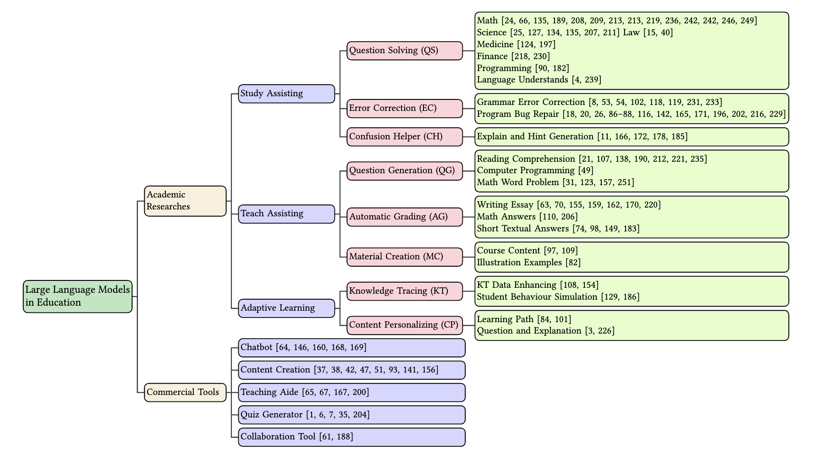

# 教育领域的大型语言模型：调查与未来展望

发布时间：2024年04月01日

`LLM应用

这篇论文摘要详细讨论了大型语言模型（LLMs）在教育领域的应用，包括师生辅助、自适应学习和商业工具等多个方面。它不仅梳理了技术进展，还分析了相关数据集和评测基准，并探讨了在教育领域应用LLMs的风险与挑战。此外，论文还展望了未来的研究方向，强调了LLMs在教育中的潜在积极影响。因此，这篇论文属于“LLM应用”分类，因为它专注于LLMs在特定领域（教育）的实际应用和影响。` `个性化学习`

> Large Language Models for Education: A Survey and Outlook

# 摘要

> 随着大型语言模型（LLMs）的兴起，教育领域迎来了一个充满可能性的新时代。本篇综述从多角度深入探讨了LLMs在教育中的应用，涵盖了师生辅助、自适应学习及商业工具等多个方面。我们系统梳理了各领域的技术进展，整理了相关数据集与评测基准，并指出了在教育领域应用LLMs所面临的风险与挑战。同时，我们展望了未来的研究方向，强调了其潜在的积极影响。本综述旨在为教育工作者、研究者及决策者提供一个全面的技术蓝图，以期借助LLMs的力量，推动教育实践的革新，并营造一个更为高效的个性化学习环境。

> The advent of Large Language Models (LLMs) has brought in a new era of possibilities in the realm of education. This survey paper summarizes the various technologies of LLMs in educational settings from multifaceted perspectives, encompassing student and teacher assistance, adaptive learning, and commercial tools. We systematically review the technological advancements in each perspective, organize related datasets and benchmarks, and identify the risks and challenges associated with deploying LLMs in education. Furthermore, we outline future research opportunities, highlighting the potential promising directions. Our survey aims to provide a comprehensive technological picture for educators, researchers, and policymakers to harness the power of LLMs to revolutionize educational practices and foster a more effective personalized learning environment.

[Arxiv](https://arxiv.org/abs/2403.18105)