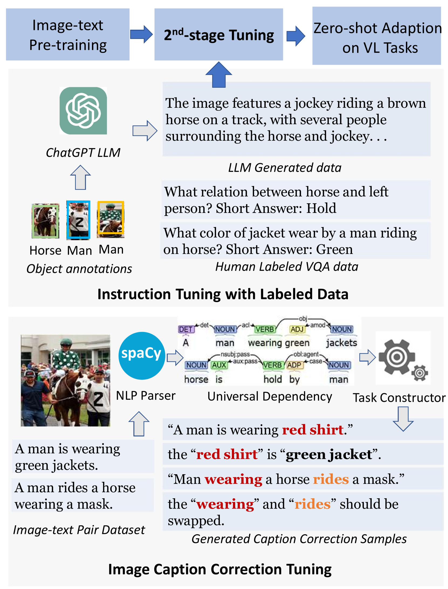
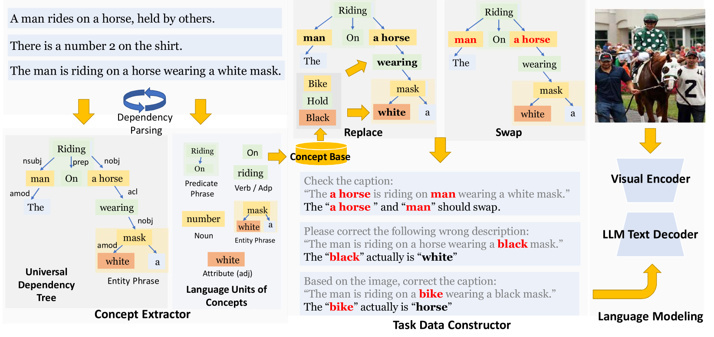
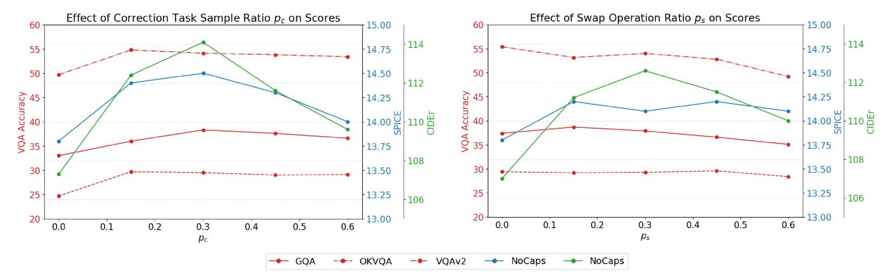
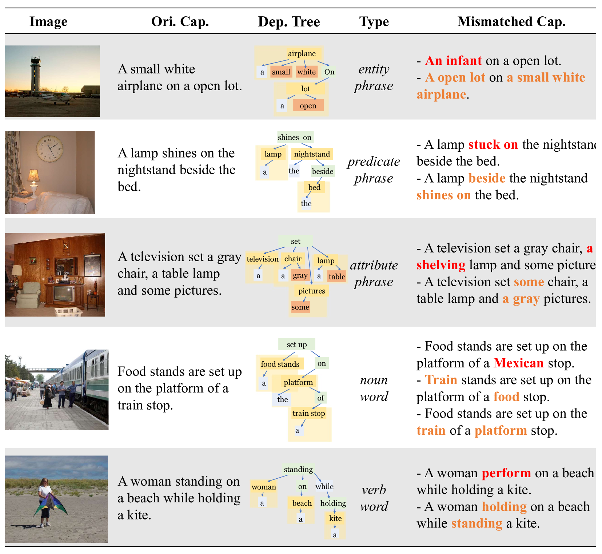

# 学习通过修正：为零-shot生成性视觉语言推理任务打造高效的调优方案。

发布时间：2024年04月01日

`LLM应用` `视觉-语言处理`

> Learning by Correction: Efficient Tuning Task for Zero-Shot Generative Vision-Language Reasoning

# 摘要

> 生成性视觉-语言模型（VLMs）在零-shot视觉-语言任务上展现了卓越的能力，如自动图像描述和视觉问题解答。但要提升它们的推理能力，通常需要依赖昂贵的人工标注或大型语言模型生成的注释进行二次指令调整。为解决这一问题，我们提出了一种新的预训练任务——图像条件字幕校正（ICCC），它能在不依赖标注数据的情况下提升VLMs的零-shot能力。ICCC任务通过让VLMs修正视觉与语言概念的不匹配，强化了模型遵循指令和基于视觉输入生成文本的能力。我们运用语言结构和轻量级依赖解析器，低成本地从图像-文本数据集中创建ICCC任务样本。在BLIP-2和InstructBLIP的实验结果显示，通过ICCC的指令调整，零-shot图像-文本生成任务的性能得到了显著提升。

> Generative vision-language models (VLMs) have shown impressive performance in zero-shot vision-language tasks like image captioning and visual question answering. However, improving their zero-shot reasoning typically requires second-stage instruction tuning, which relies heavily on human-labeled or large language model-generated annotation, incurring high labeling costs. To tackle this challenge, we introduce Image-Conditioned Caption Correction (ICCC), a novel pre-training task designed to enhance VLMs' zero-shot performance without the need for labeled task-aware data. The ICCC task compels VLMs to rectify mismatches between visual and language concepts, thereby enhancing instruction following and text generation conditioned on visual inputs. Leveraging language structure and a lightweight dependency parser, we construct data samples of ICCC task from image-text datasets with low labeling and computation costs. Experimental results on BLIP-2 and InstructBLIP demonstrate significant improvements in zero-shot image-text generation-based VL tasks through ICCC instruction tuning.

[Arxiv](https://arxiv.org/abs/2404.00909)