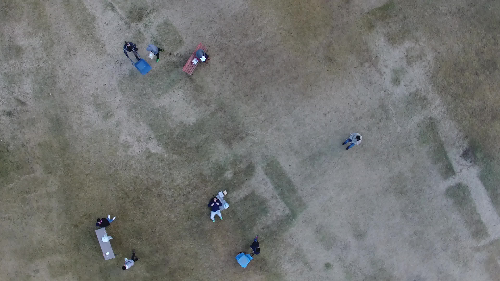
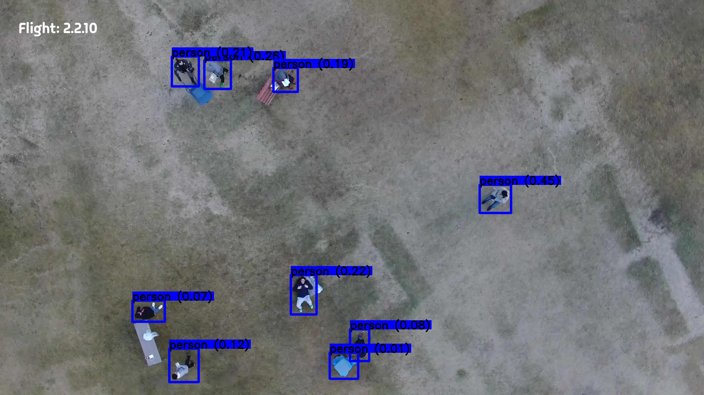
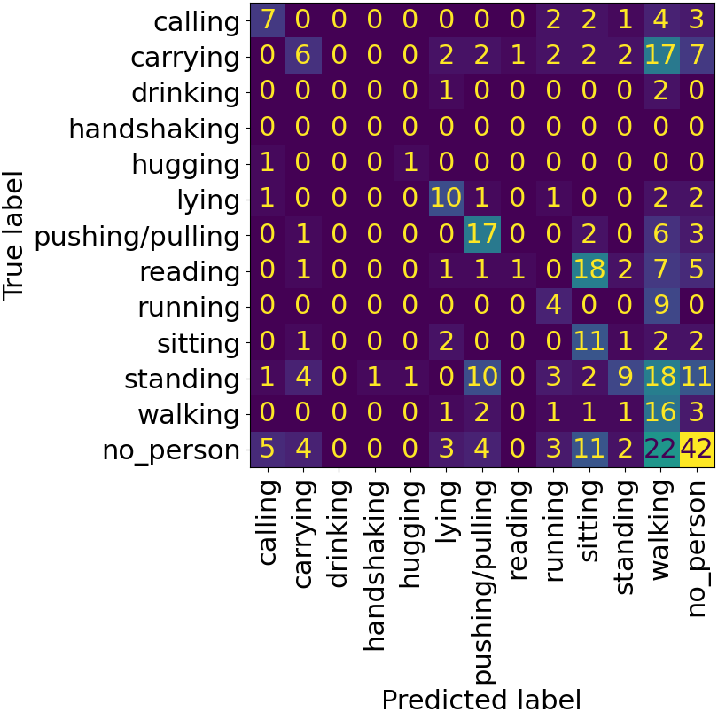
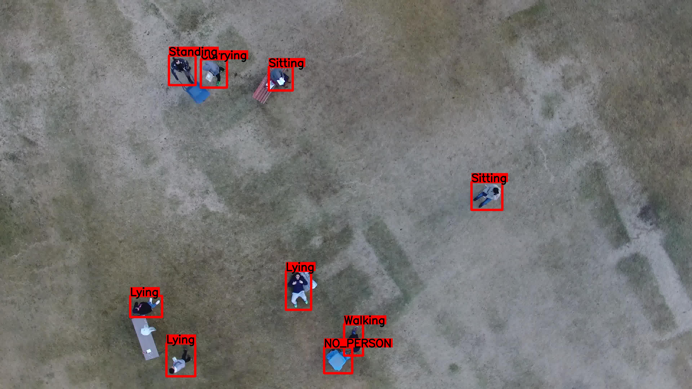

# 通过运用 YOLO-World 与 GPT-4V 语言模型，实现无人机图像中的零-shot 人员探测与行为识别。

发布时间：2024年04月01日

`LLM应用` `无人机` `机器人技术`

> Leveraging YOLO-World and GPT-4V LMMs for Zero-Shot Person Detection and Action Recognition in Drone Imagery

# 摘要

> 本文探讨了零-shot 大型多模态模型（LMMs）在无人机感知领域的应用前景。我们重点研究了人员检测与动作识别任务，并选取了 YOLO-World 和 GPT-4V(ision) 这两款知名 LMMs，通过公开的航拍数据集进行评估。传统深度学习依赖丰富的训练数据，但在某些机器人应用场景中，获取此类数据既耗资源又难以及时完成。而基于提示的 LMMs 以其灵活性和卓越的泛化能力，有望颠覆这些领域的机器人技术。研究发现，YOLO-World 在检测性能上表现不俗，GPT-4V 虽在动作分类上有所欠缺，但在筛选无效区域和描述场景方面展现了潜力。本研究为运用 LMMs 于无人机感知迈出了第一步，为未来在此领域的深入研究奠定了基础。

> In this article, we explore the potential of zero-shot Large Multimodal Models (LMMs) in the domain of drone perception. We focus on person detection and action recognition tasks and evaluate two prominent LMMs, namely YOLO-World and GPT-4V(ision) using a publicly available dataset captured from aerial views. Traditional deep learning approaches rely heavily on large and high-quality training datasets. However, in certain robotic settings, acquiring such datasets can be resource-intensive or impractical within a reasonable timeframe. The flexibility of prompt-based Large Multimodal Models (LMMs) and their exceptional generalization capabilities have the potential to revolutionize robotics applications in these scenarios. Our findings suggest that YOLO-World demonstrates good detection performance. GPT-4V struggles with accurately classifying action classes but delivers promising results in filtering out unwanted region proposals and in providing a general description of the scenery. This research represents an initial step in leveraging LMMs for drone perception and establishes a foundation for future investigations in this area.

[Arxiv](https://arxiv.org/abs/2404.01571)