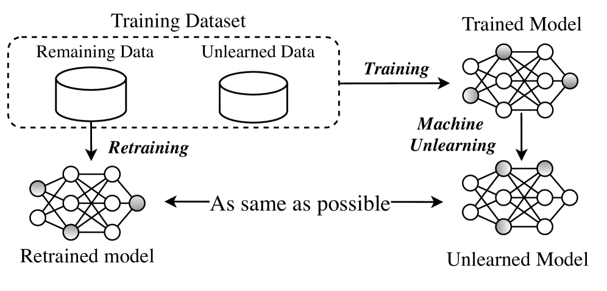

# 本综述简要探讨了传统模型与大型语言模型中的机器去学习技术。

发布时间：2024年04月01日

`LLM理论` `隐私保护` `机器学习`

> Machine Unlearning for Traditional Models and Large Language Models: A Short Survey

# 摘要

> 随着个人隐私保护法规的落地，机器学习领域遭遇了“被遗忘权”的考验。为应对这一挑战，机器“反学习”技术应运而生，目标是应用户要求删除特定数据，并减轻其对模型的后续影响。尽管机器“反学习”引起了广泛关注，但针对其最新发展，尤其是在大型语言模型领域的全面审视尚属空白。本研究意在弥补这一不足，深入剖析机器“反学习”，涵盖其定义、类型、评估准则以及在不同环境下遇到的挑战和应对策略。文章特别对传统模型与LLMs的“反学习”进行了细致分类和探讨，并提出了评估其成效与效率的方法，确立了性能衡量的标准。本文揭示了现有“反学习”技术的局限，并强调进行全面评估的必要性，以防无序遗忘的发生。这项调查不仅回顾了“反学习”技术的核心理念，还指出了其面临的问题和未来研究的可能方向，为该领域的研究者提供了宝贵的参考。

> With the implementation of personal data privacy regulations, the field of machine learning (ML) faces the challenge of the "right to be forgotten". Machine unlearning has emerged to address this issue, aiming to delete data and reduce its impact on models according to user requests. Despite the widespread interest in machine unlearning, comprehensive surveys on its latest advancements, especially in the field of Large Language Models (LLMs) is lacking. This survey aims to fill this gap by providing an in-depth exploration of machine unlearning, including the definition, classification and evaluation criteria, as well as challenges in different environments and their solutions. Specifically, this paper categorizes and investigates unlearning on both traditional models and LLMs, and proposes methods for evaluating the effectiveness and efficiency of unlearning, and standards for performance measurement. This paper reveals the limitations of current unlearning techniques and emphasizes the importance of a comprehensive unlearning evaluation to avoid arbitrary forgetting. This survey not only summarizes the key concepts of unlearning technology but also points out its prominent issues and feasible directions for future research, providing valuable guidance for scholars in the field.

[Arxiv](https://arxiv.org/abs/2404.01206)