# 科学论文中大型语言模型（LLM）使用频率的增长已被详细记录。

发布时间：2024年04月01日

`LLM应用` `科学出版` `学术写作`

> Mapping the Increasing Use of LLMs in Scientific Papers

# 摘要

> 科学出版推动科学知识的传播与积累，确保科学研究的可验证性。近期，关于大型语言模型（如 ChatGPT）在学术写作中的普及程度及其对科学实践的潜在影响，引发了广泛讨论。然而，我们尚无法准确衡量由 LLM 显著改动或创作的学术文章比例。为填补这一空白，我们对 2020 年至 2024 年间发表的近百万篇论文进行了宏观统计分析，旨在揭示 LLM 修改内容的普及趋势。研究发现，LLM 在学术界的使用正逐渐增加，尤其在计算机科学领域最为显著。而数学论文和自然杂志系列期刊的 LLM 修改比例相对较低。此外，频繁发布预印本的作者、热门研究领域的论文以及篇幅较短的文章，更可能经过 LLM 的修改。这些发现揭示了 LLM 在科学写作中的广泛应用。

> Scientific publishing lays the foundation of science by disseminating research findings, fostering collaboration, encouraging reproducibility, and ensuring that scientific knowledge is accessible, verifiable, and built upon over time. Recently, there has been immense speculation about how many people are using large language models (LLMs) like ChatGPT in their academic writing, and to what extent this tool might have an effect on global scientific practices. However, we lack a precise measure of the proportion of academic writing substantially modified or produced by LLMs. To address this gap, we conduct the first systematic, large-scale analysis across 950,965 papers published between January 2020 and February 2024 on the arXiv, bioRxiv, and Nature portfolio journals, using a population-level statistical framework to measure the prevalence of LLM-modified content over time. Our statistical estimation operates on the corpus level and is more robust than inference on individual instances. Our findings reveal a steady increase in LLM usage, with the largest and fastest growth observed in Computer Science papers (up to 17.5%). In comparison, Mathematics papers and the Nature portfolio showed the least LLM modification (up to 6.3%). Moreover, at an aggregate level, our analysis reveals that higher levels of LLM-modification are associated with papers whose first authors post preprints more frequently, papers in more crowded research areas, and papers of shorter lengths. Our findings suggests that LLMs are being broadly used in scientific writings.

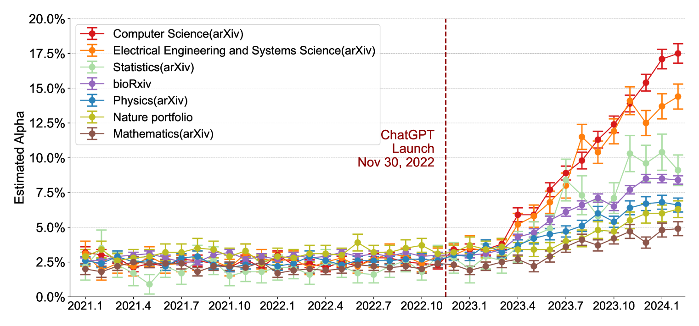

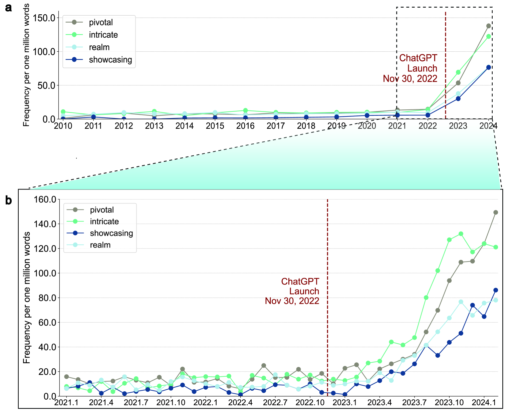

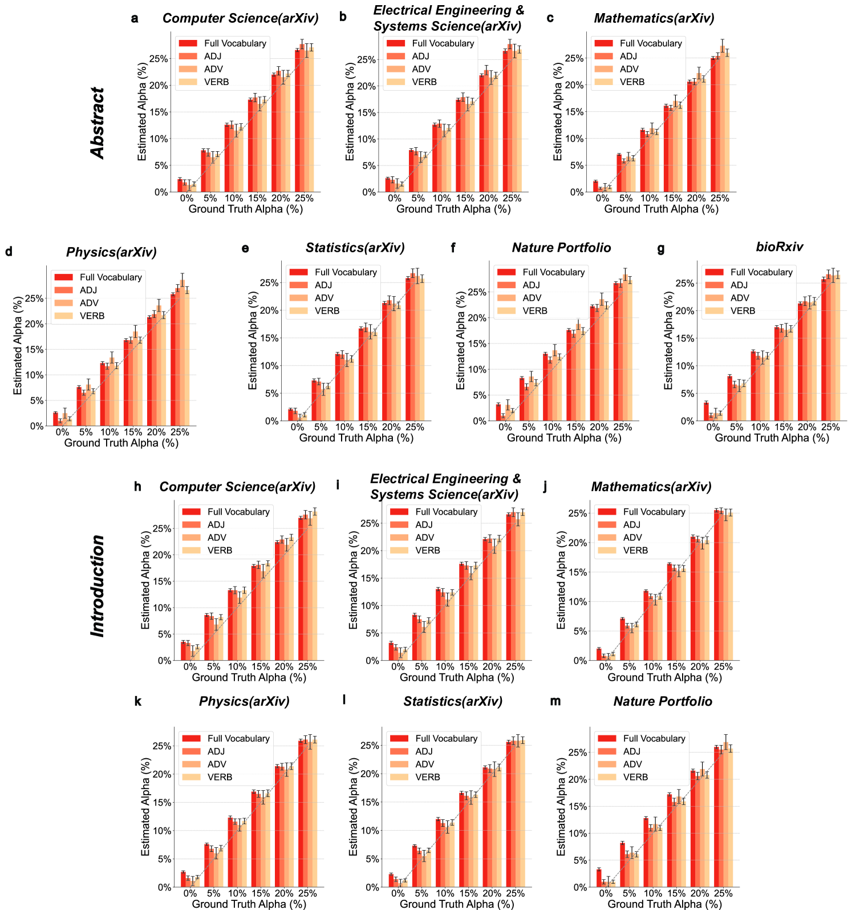

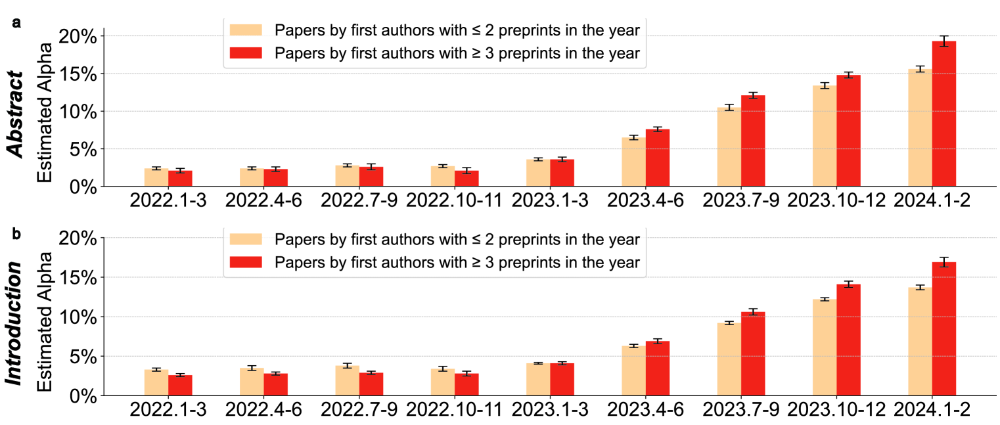

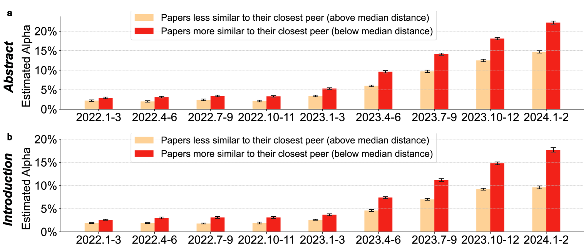

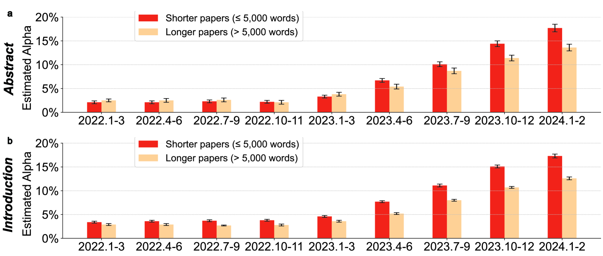

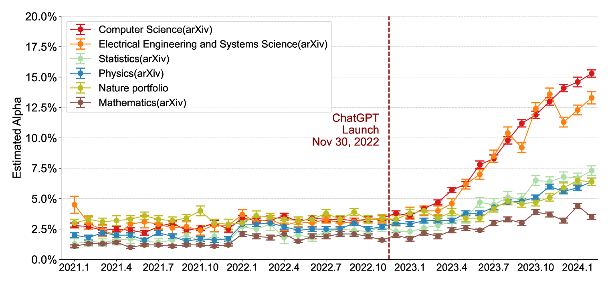

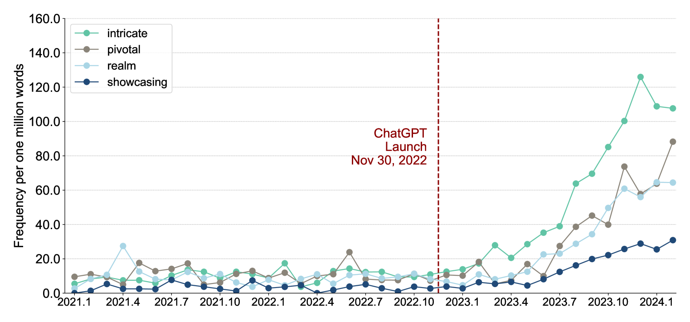

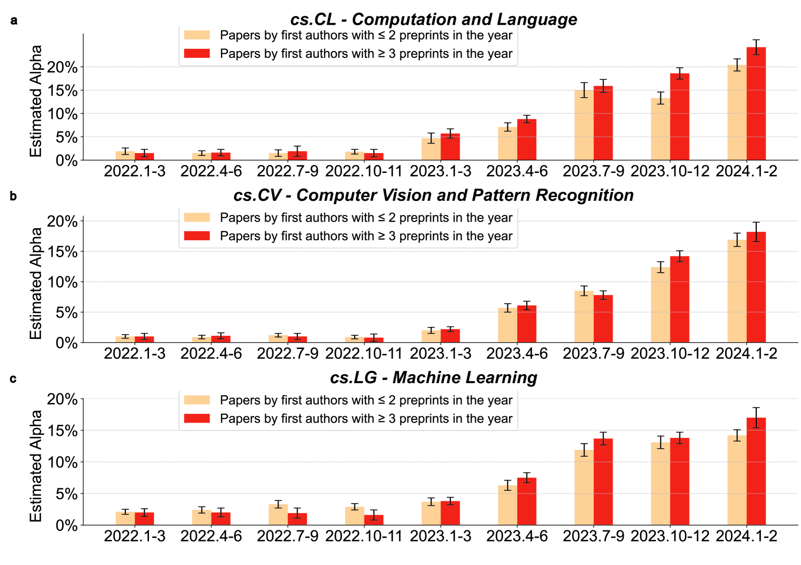

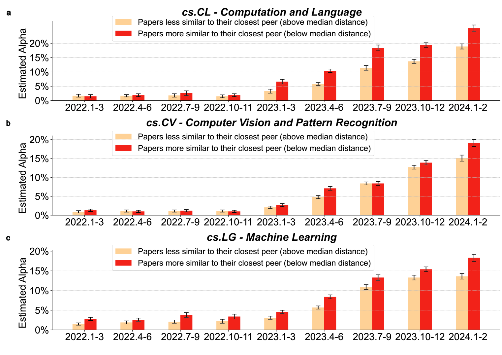

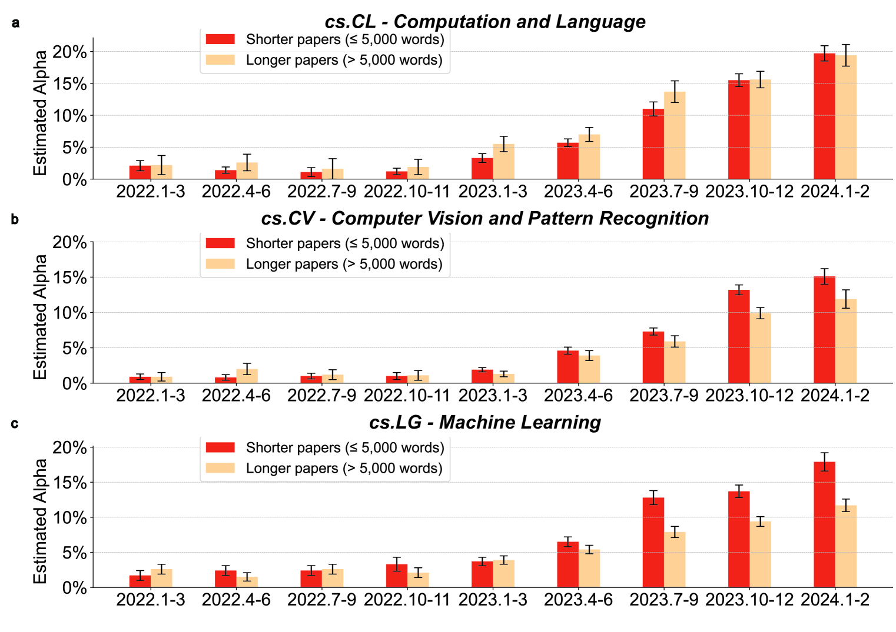

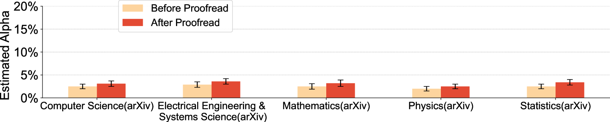

[Arxiv](https://arxiv.org/abs/2404.01268)