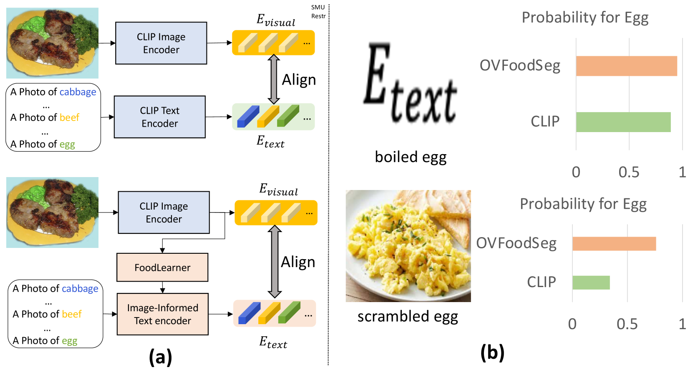
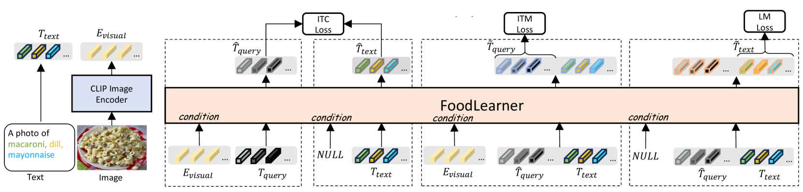
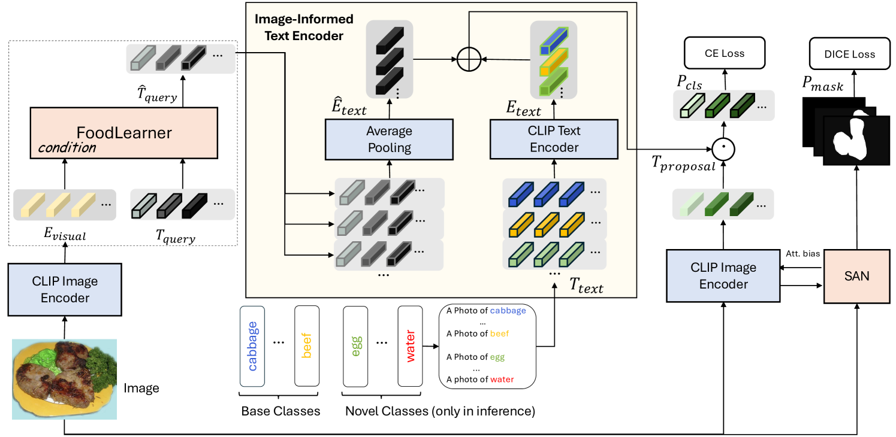
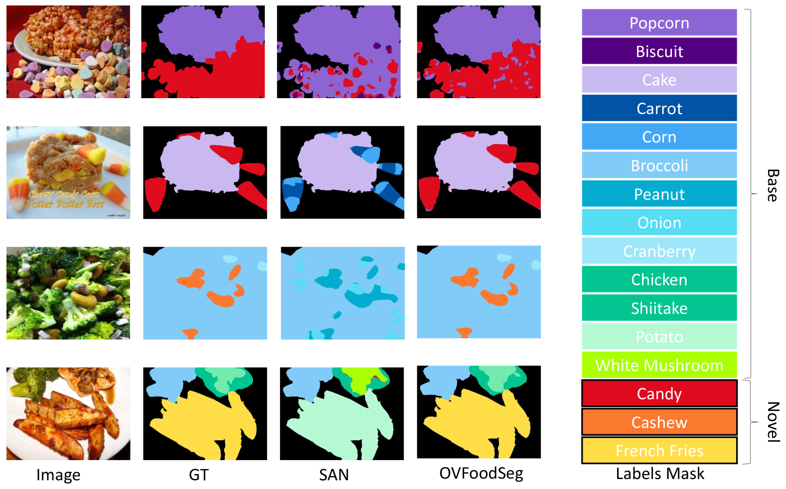
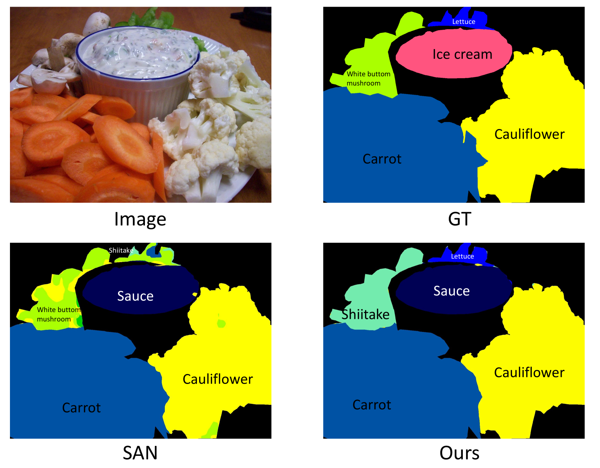

# OVFoodSeg: 利用图像信息增强文本表达，提升食品图像的开放词汇量分割技术

发布时间：2024年04月01日

`LLM应用` `图像分割`

> OVFoodSeg: Elevating Open-Vocabulary Food Image Segmentation via Image-Informed Textual Representation

# 摘要

> 在食品计算的世界里，图像中食材的分割面临着巨大的挑战，这源于同种食材间的差异巨大、新食材层出不穷以及大规模食品图像分割数据集的注释成本高昂。传统方法通常依赖于封闭词汇和静态文本嵌入，但在处理多样化新食材时往往力不从心。针对这些难题，我们推出了OVFoodSeg框架，它采用开放词汇设置，并结合视觉上下文来增强文本嵌入。该框架融合了视觉-语言模型，通过FoodLearner和图像信息文本编码器这两个创新模块，将文本嵌入与图像信息紧密结合。OVFoodSeg的训练分为两个阶段：首先是FoodLearner的预训练，让其学会将视觉信息与食品相关的文本表示相匹配；其次是调整FoodLearner和图像信息文本编码器以完成分割任务。OVFoodSeg在解决前人模型不足的同时，实现了显著进步，在FoodSeg103数据集上将平均交并比提升了4.9%，为食品图像分割技术创造了新的纪录。

> In the realm of food computing, segmenting ingredients from images poses substantial challenges due to the large intra-class variance among the same ingredients, the emergence of new ingredients, and the high annotation costs associated with large food segmentation datasets. Existing approaches primarily utilize a closed-vocabulary and static text embeddings setting. These methods often fall short in effectively handling the ingredients, particularly new and diverse ones. In response to these limitations, we introduce OVFoodSeg, a framework that adopts an open-vocabulary setting and enhances text embeddings with visual context. By integrating vision-language models (VLMs), our approach enriches text embedding with image-specific information through two innovative modules, eg, an image-to-text learner FoodLearner and an Image-Informed Text Encoder. The training process of OVFoodSeg is divided into two stages: the pre-training of FoodLearner and the subsequent learning phase for segmentation. The pre-training phase equips FoodLearner with the capability to align visual information with corresponding textual representations that are specifically related to food, while the second phase adapts both the FoodLearner and the Image-Informed Text Encoder for the segmentation task. By addressing the deficiencies of previous models, OVFoodSeg demonstrates a significant improvement, achieving an 4.9\% increase in mean Intersection over Union (mIoU) on the FoodSeg103 dataset, setting a new milestone for food image segmentation.

[Arxiv](https://arxiv.org/abs/2404.01409)