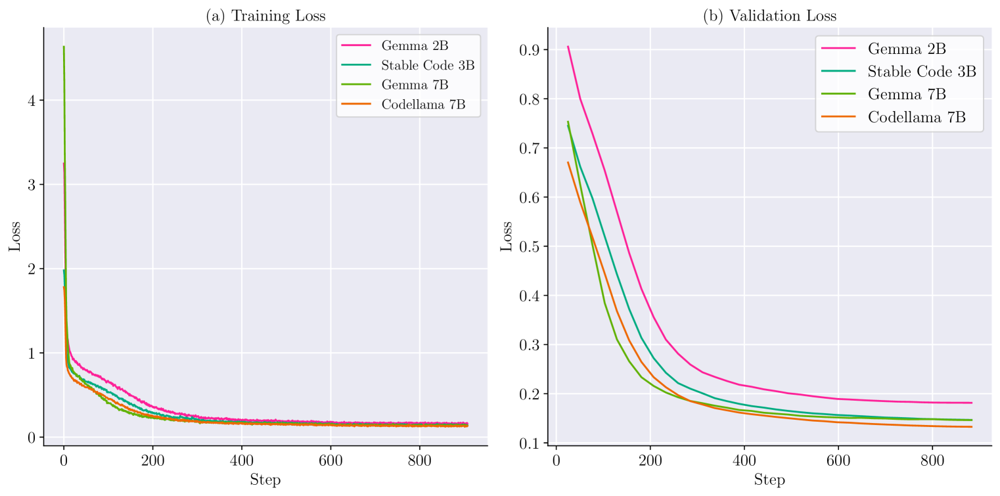

# 章鱼：一款适用于软件API功能调用的设备端语言模型

发布时间：2024年04月01日

`LLM应用` `软件工程` `API交互`

> Octopus: On-device language model for function calling of software APIs

# 摘要

> 在人工智能的快速发展中，大型语言模型（LLMs）凭借其卓越的文本处理与生成技术，扮演着核心角色。本研究推出了一项创新策略，目的是利用设备内的LLMs来激活软件API。通过细致整理软件API的文档资料，我们对拥有2B、3B和7B参数的LLMs进行了精准调校，以提升它们在软件API交互中的表现。我们重点关注提升模型对API架构和语法的掌握，从而大幅提高API功能调用的准确度。同时，引入了\textit{条件遮蔽}技术，确保输出符合预期格式，降低误差率，且不影响推理速率。我们还设计了一项新的基准测试，用以评估LLMs在API交互上的效果，为未来研究打下坚实基础。经过调优的章鱼模型在调用软件API方面，性能超越了GPT-4。本研究致力于推动自动化软件开发与API集成的进步，标志着在实现LLMs与实际软件工程需求相结合方面取得了显著成就。

> In the rapidly evolving domain of artificial intelligence, Large Language Models (LLMs) play a crucial role due to their advanced text processing and generation abilities. This study introduces a new strategy aimed at harnessing on-device LLMs in invoking software APIs. We meticulously compile a dataset derived from software API documentation and apply fine-tuning to LLMs with capacities of 2B, 3B and 7B parameters, specifically to enhance their proficiency in software API interactions. Our approach concentrates on refining the models' grasp of API structures and syntax, significantly enhancing the accuracy of API function calls. Additionally, we propose \textit{conditional masking} techniques to ensure outputs in the desired formats and reduce error rates while maintaining inference speeds. We also propose a novel benchmark designed to evaluate the effectiveness of LLMs in API interactions, establishing a foundation for subsequent research. Octopus, the fine-tuned model, is proved to have better performance than GPT-4 for the software APIs calling. This research aims to advance automated software development and API integration, representing substantial progress in aligning LLM capabilities with the demands of practical software engineering applications.

[Arxiv](https://arxiv.org/abs/2404.01549)