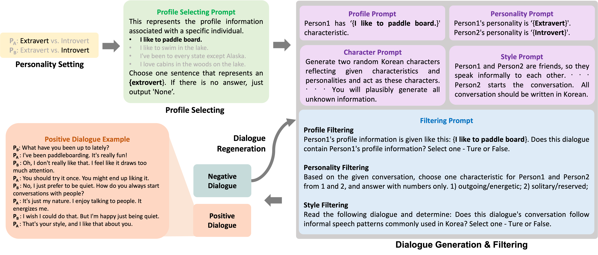
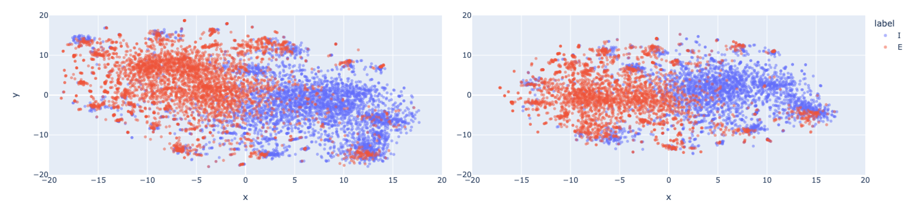
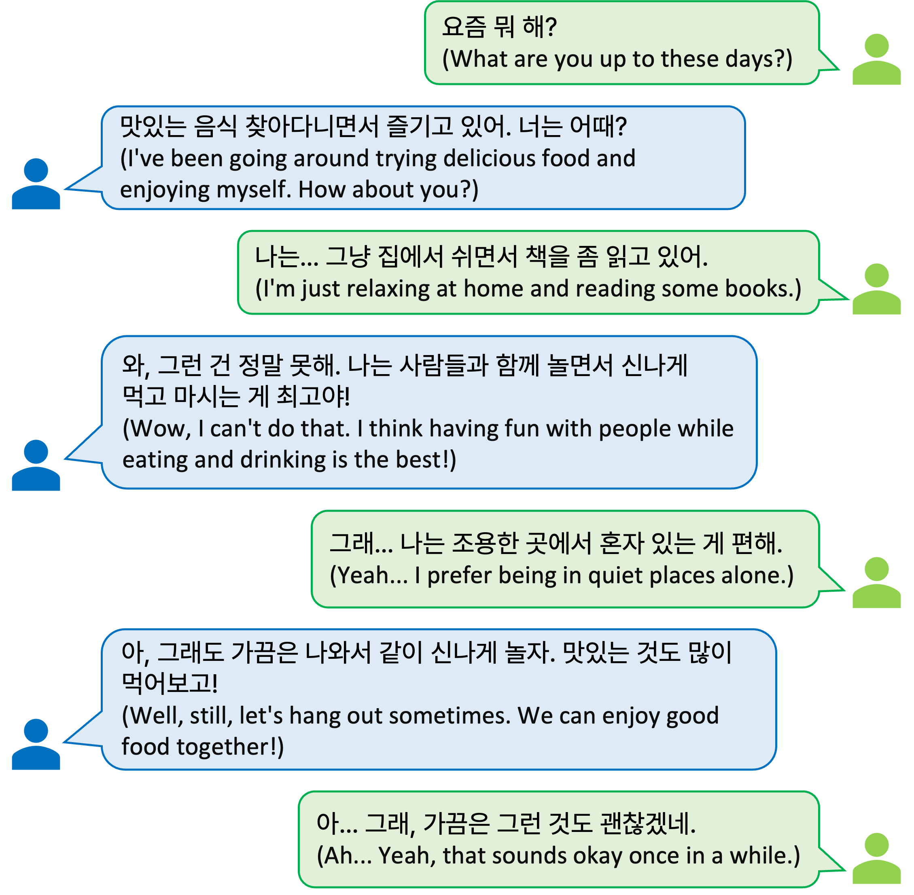

# PSYDIAL：利用大型语言模型生成个性化合成对话

发布时间：2024年04月01日

`LLM应用` `对话系统` `个性化推荐`

> PSYDIAL: Personality-based Synthetic Dialogue Generation using Large Language Models

# 摘要

> 我们打造了一个创新的端到端个性化合成对话数据生成系统，旨在通过提示技术激发大型语言模型的互动回应。我们精心设计了提示内容，以产生更贴近现实对话的场景，模拟用户与聊天机器人之间的自然互动。我们推出了PSYDIAL——首个以个性对话为核心的韩语对话数据集，它是基于我们的生成流程精心策划而成的。研究特别关注大五人格特质中的外向性维度。实验数据显示，与仅经预训练或闲聊数据集微调的模型相比，PSYDIAL训练出的模型在生成具有个性特征的回应方面取得了显著进步。该系统的灵活性不仅限于对话任务，还预示着其在非对话类应用中的广阔前景。这项研究为韩语对话AI的个性化和精细化发展铺平了道路，也可能惠及其他语言。相关代码已在 https://github.com/jiSilverH/psydial 上公开发布。

> We present a novel end-to-end personality-based synthetic dialogue data generation pipeline, specifically designed to elicit responses from large language models via prompting. We design the prompts to generate more human-like dialogues considering real-world scenarios when users engage with chatbots. We introduce PSYDIAL, the first Korean dialogue dataset focused on personality-based dialogues, curated using our proposed pipeline. Notably, we focus on the Extraversion dimension of the Big Five personality model in our research. Experimental results indicate that while pre-trained models and those fine-tuned with a chit-chat dataset struggle to generate responses reflecting personality, models trained with PSYDIAL show significant improvements. The versatility of our pipeline extends beyond dialogue tasks, offering potential for other non-dialogue related applications. This research opens doors for more nuanced, personality-driven conversational AI in Korean and potentially other languages. Our code is publicly available at https://github.com/jiSilverH/psydial.

[Arxiv](https://arxiv.org/abs/2404.00930)