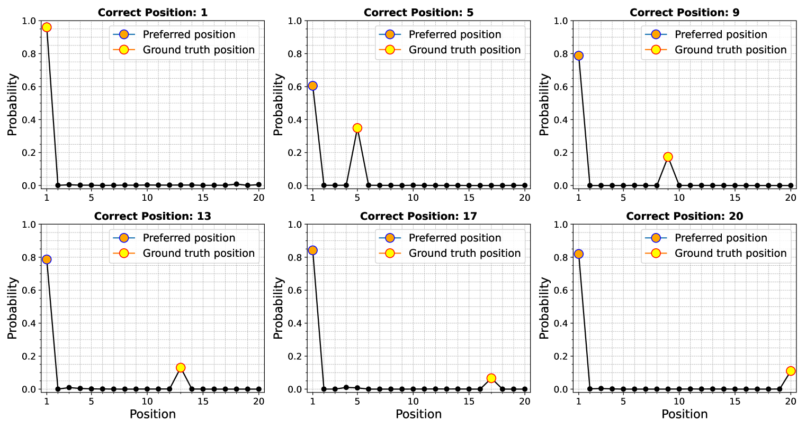
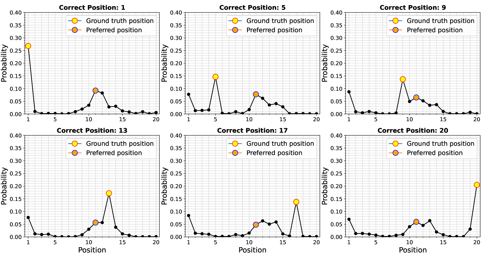
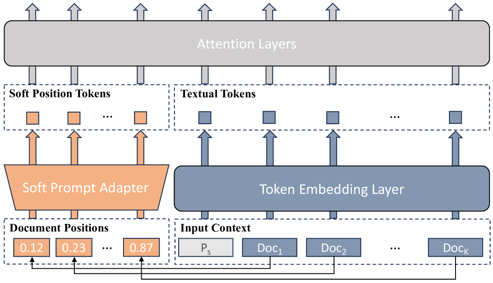

# 为了降低大型语言模型中的位置偏见，我们采用了一种位置感知的高效微调策略。

发布时间：2024年04月01日

`LLM理论` `知识图谱` `长文本处理`

> Position-Aware Parameter Efficient Fine-Tuning Approach for Reducing Positional Bias in LLMs

# 摘要

> 近期大型语言模型（LLMs）的发展，提升了它们处理长文本输入的能力，这对于需要从外部数据库提取信息的任务至关重要，因为这些任务往往伴随着较长的文本输入。然而，最新研究发现LLMs在处理信息时存在位置偏见，即模型性能会随着输入序列中信息位置的不同而有所差异。本研究通过大量实验探究了位置偏见的成因，发现这主要源于不同模型固有的位置偏好。我们发现，仅依靠提示性策略并不能有效解决这一问题。为此，我们提出了一种名为位置感知参数高效微调（PAPEFT）的新方法，它结合了数据增强和参数高效适配器技术，以实现对输入上下文的均匀关注。实验证明，这种方法能有效降低位置偏见，从而增强LLMs在处理需要外部知识检索的长文本任务上的性能。

> Recent advances in large language models (LLMs) have enhanced their ability to process long input contexts. This development is particularly crucial for tasks that involve retrieving knowledge from an external datastore, which can result in long inputs. However, recent studies show a positional bias in LLMs, demonstrating varying performance depending on the location of useful information within the input sequence. In this study, we conduct extensive experiments to investigate the root causes of positional bias. Our findings indicate that the primary contributor to LLM positional bias stems from the inherent positional preferences of different models. We demonstrate that merely employing prompt-based solutions is inadequate for overcoming the positional preferences. To address this positional bias issue of a pre-trained LLM, we developed a Position-Aware Parameter Efficient Fine-Tuning (PAPEFT) approach which is composed of a data augmentation technique and a parameter efficient adapter, enhancing a uniform attention distribution across the input context. Our experiments demonstrate that the proposed approach effectively reduces positional bias, improving LLMs' effectiveness in handling long context sequences for various tasks that require externally retrieved knowledge.

[Arxiv](https://arxiv.org/abs/2404.01430)