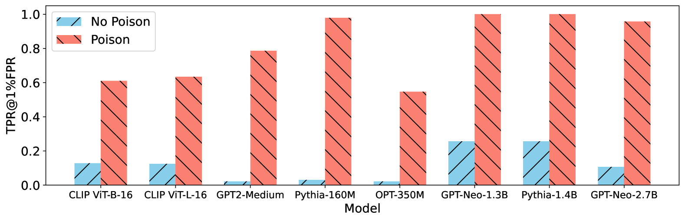
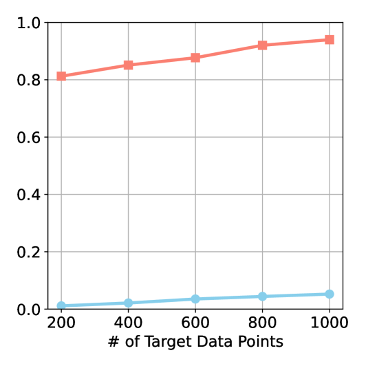
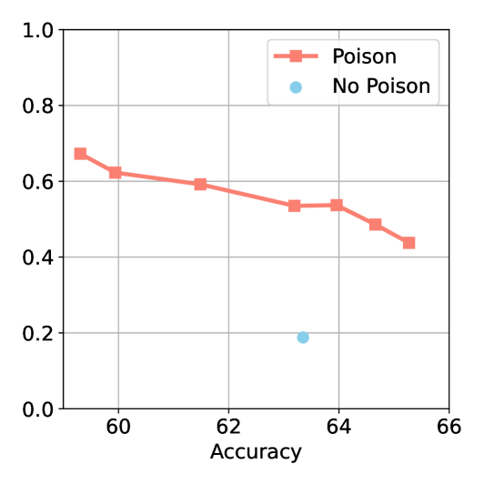

# 通过在预训练模型中植入污染信息，我们能够增强对模型成员身份的推断能力，从而打开隐私保护的后门。

发布时间：2024年04月01日

`LLM应用` `机器学习` `隐私安全`

> Privacy Backdoors: Enhancing Membership Inference through Poisoning Pre-trained Models

# 摘要

> 通过微调大型预训练模型来定制应用模型的做法司空见惯。然而，网络上随处可见的基础模型检查点却暗藏风险，后门攻击便是其中之一。本文揭露了一种新型隐私漏洞——隐私后门攻击。这种攻击通过黑盒方式，放大了微调模型过程中的隐私泄露风险。一旦使用者对带有后门的模型进行微调，他们的训练数据就会以惊人速度外泄，远超常规模型。我们对多种数据集和模型进行了广泛测试，包括视觉-语言模型（CLIP）和大型语言模型，证明了这种攻击的普遍有效性。同时，我们还通过不同的微调和推理方法进行了深入的消融研究，全面剖析这一新风险。研究结果凸显了机器学习领域内的一项重大隐私挑战，并促使我们反思开源预训练模型使用过程中的安全规范。

> It is commonplace to produce application-specific models by fine-tuning large pre-trained models using a small bespoke dataset. The widespread availability of foundation model checkpoints on the web poses considerable risks, including the vulnerability to backdoor attacks. In this paper, we unveil a new vulnerability: the privacy backdoor attack. This black-box privacy attack aims to amplify the privacy leakage that arises when fine-tuning a model: when a victim fine-tunes a backdoored model, their training data will be leaked at a significantly higher rate than if they had fine-tuned a typical model. We conduct extensive experiments on various datasets and models, including both vision-language models (CLIP) and large language models, demonstrating the broad applicability and effectiveness of such an attack. Additionally, we carry out multiple ablation studies with different fine-tuning methods and inference strategies to thoroughly analyze this new threat. Our findings highlight a critical privacy concern within the machine learning community and call for a reevaluation of safety protocols in the use of open-source pre-trained models.

[Arxiv](https://arxiv.org/abs/2404.01231)