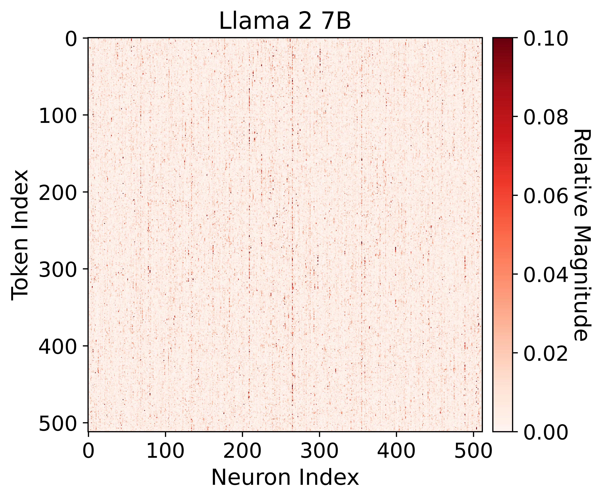
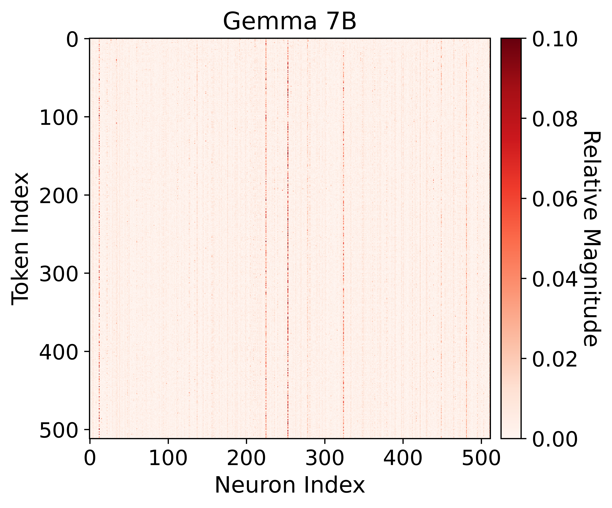
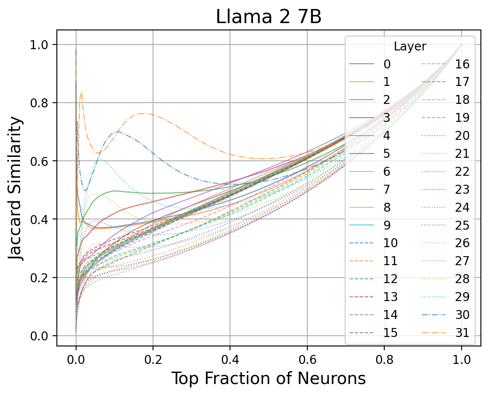
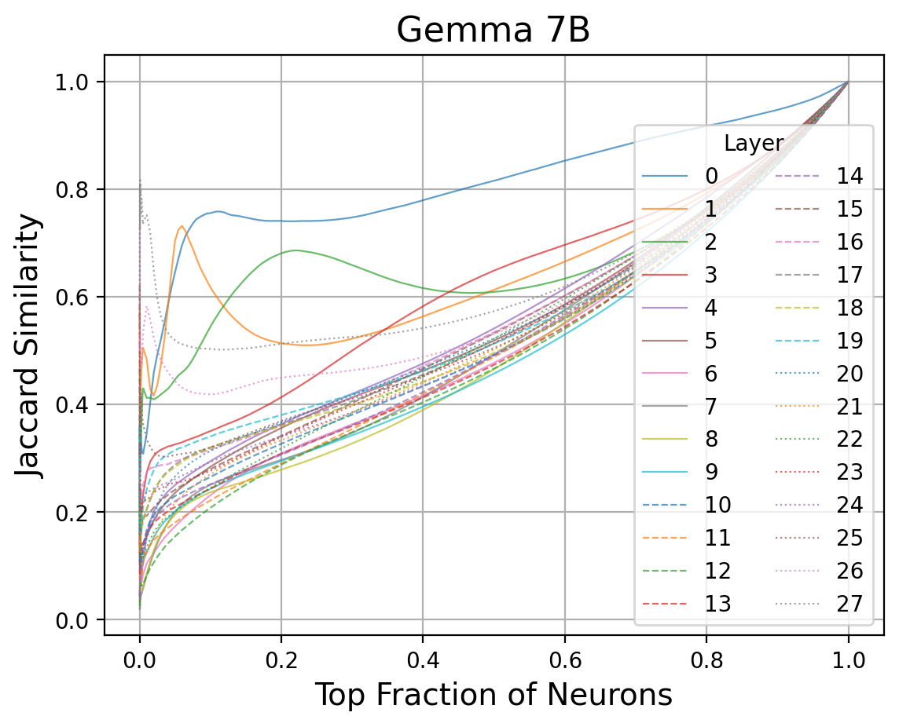
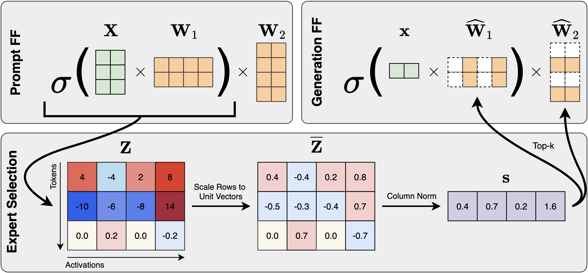
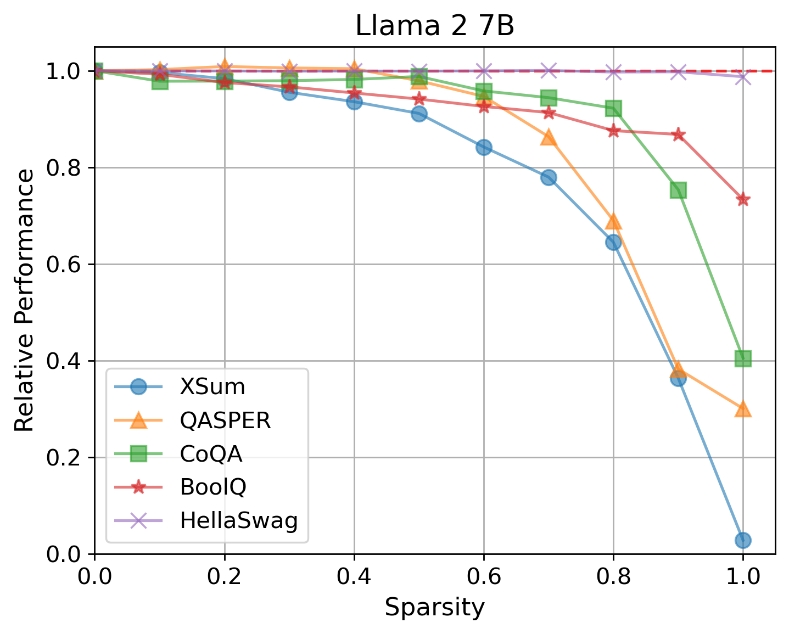
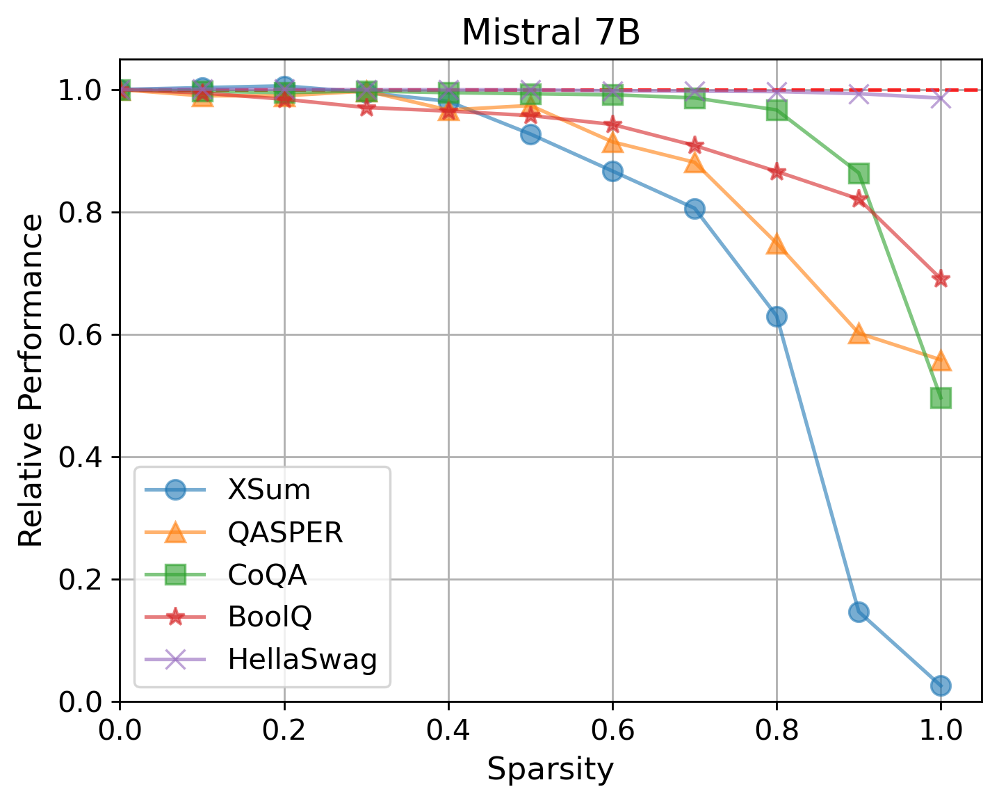
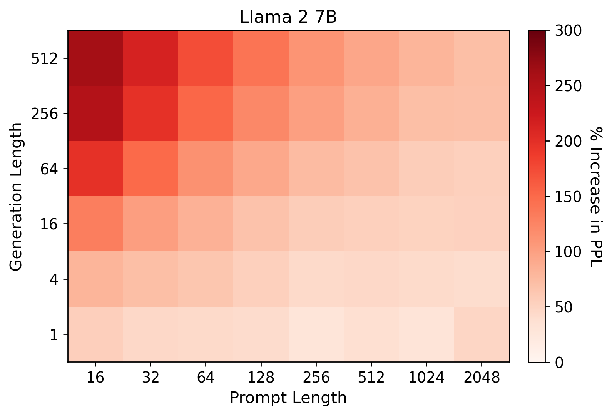
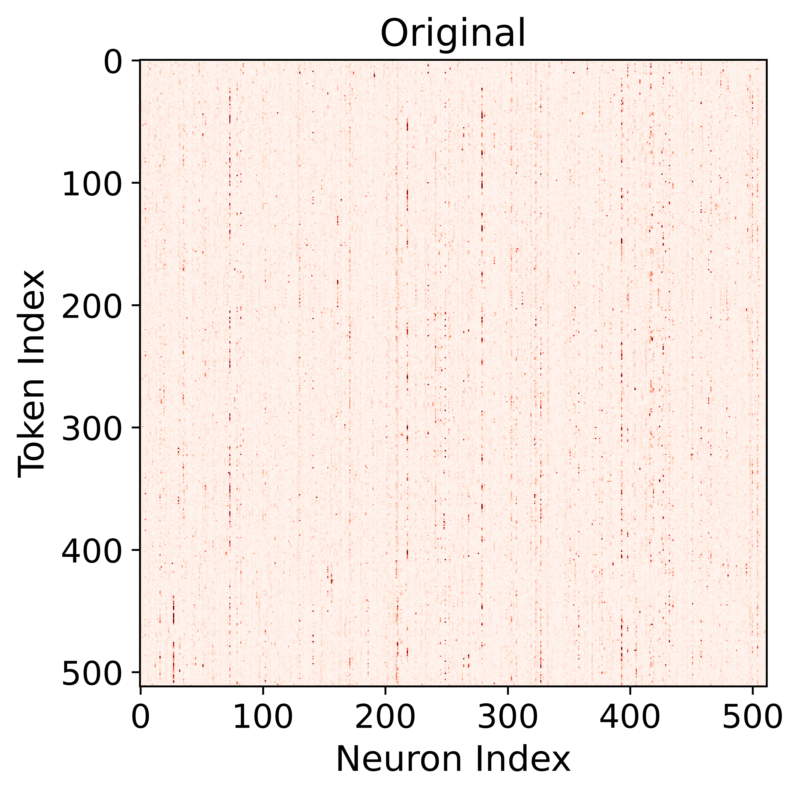
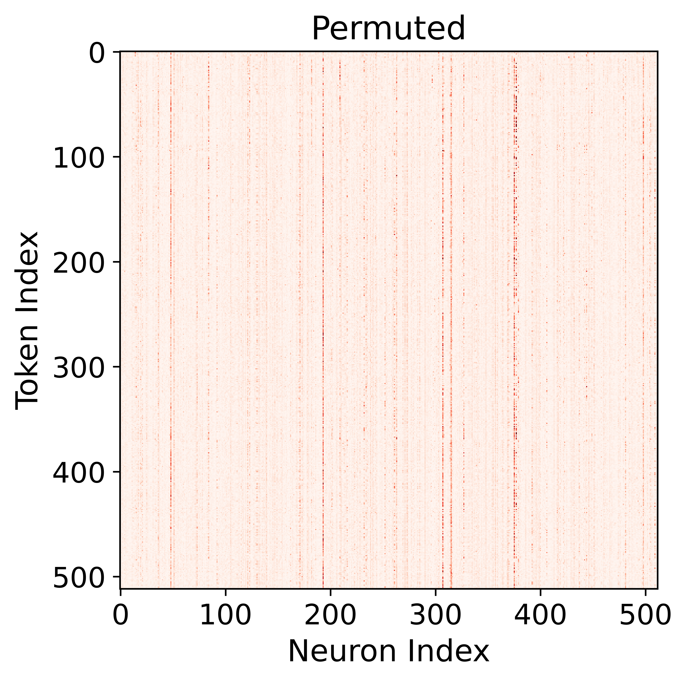

# 通过专家混合的提示-提示策略，我们能够有效地生成大型语言模型。

发布时间：2024年04月01日

`LLM应用` `计算机科学` `模型优化`

> Prompt-prompted Mixture of Experts for Efficient LLM Generation

# 摘要

> 随着变换器驱动的大型语言模型（LLMs）的兴起，它们已广泛应用于多个领域，展现出卓越的多功能性，但这往往伴随着显著的计算成本。幸运的是，一些策略，比如剪枝或构建专家混合（MoE），通过在变换器的前馈（FF）层引入稀疏性，旨在提升运算速度和降低内存需求。然而，这些技术往往因需要特定训练或受限于某些架构而显得成本高昂且缺乏灵活性。为了克服这些限制，我们推出了GRIFFIN——一种创新的无需训练的MoE，它能够在序列层面精准挑选FF专家，实现跨多种LLMs的高效生成，这些LLMs采用多种非ReLU激活函数。这一成就得益于一个重要发现：许多经过训练的LLMs在序列中自然形成高度有序的FF激活模式，我们称之为“群体效应”。尽管GRIFFIN方法简单，我们证明了它在减少50% FF参数的情况下，仍能保持原有模型的性能，且在多项分类和生成任务中几乎没有性能损失，同时显著提升了处理速度（例如，在NVIDIA L40上，Llama 2 13B的速度提升了1.25倍）。相关代码将发布于 https://github.com/hdong920/GRIFFIN。

> With the development of transformer-based large language models (LLMs), they have been applied to many fields due to their remarkable utility, but this comes at a considerable computational cost at deployment. Fortunately, some methods such as pruning or constructing a mixture of experts (MoE) aim at exploiting sparsity in transformer feedforward (FF) blocks to gain boosts in speed and reduction in memory requirements. However, these techniques can be very costly and inflexible in practice, as they often require training or are restricted to specific types of architectures. To address this, we introduce GRIFFIN, a novel training-free MoE that selects unique FF experts at the sequence level for efficient generation across a plethora of LLMs with different non-ReLU activation functions. This is possible due to a critical observation that many trained LLMs naturally produce highly structured FF activation patterns within a sequence, which we call flocking. Despite our method's simplicity, we show with 50\% of the FF parameters, GRIFFIN maintains the original model's performance with little to no degradation on a variety of classification and generation tasks, all while improving latency (e.g. 1.25$\times$ speed-up in Llama 2 13B on an NVIDIA L40). Code will be available at https://github.com/hdong920/GRIFFIN.

[Arxiv](https://arxiv.org/abs/2404.01365)